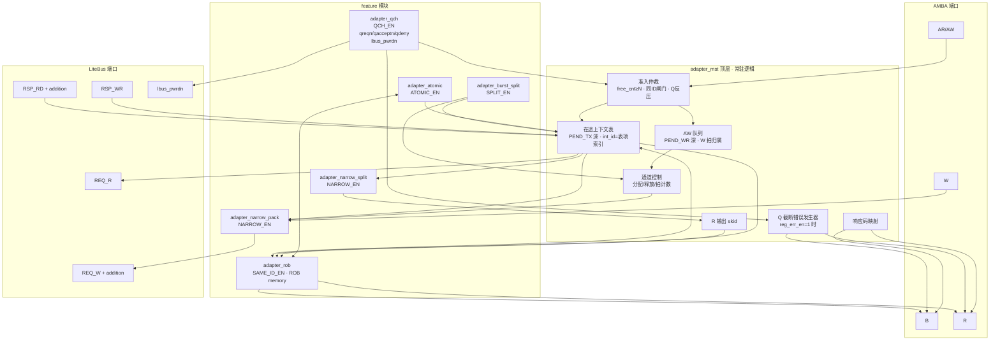
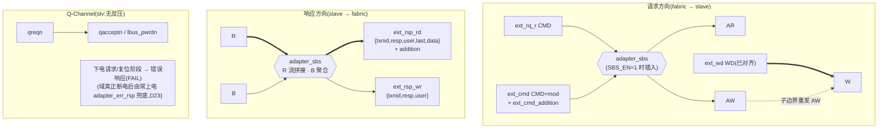
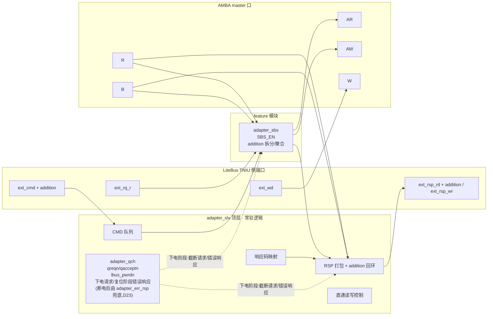

# AMBA(AXI4/AXI5/APB)↔ LiteBus 适配器 RTL 设计文档

版本:v0.9
日期:2026-09-07
范围:适配器 RTL 详细方案(Phase 1 实现依据)。LiteBus 接口以 `litebus_rtl/` RTL 为准;本设计不修改 `litebus_rtl/`。

> v0.3 变更:新增同 ID 重映射(Reorder 语义)、burst 拆包、按 IP 能力组合裁剪(feature 开关)。
> v0.4 变更:按适配器位置拆分 adapter_mst / adapter_slv 两类组件;adapter_slv 提供两个版本(有/无 Simple burst split);系统拓扑与 mst/slv 职责矩阵。
> v0.5 变更:所有文件名带 `adapter` 前缀;所有可选 feature 独立成模块,由 adapter 顶层选择性例化。
> v0.6 变更:架构图重构为数据流图与原理图两组(mermaid),mst/slv 各一对。
> v0.7 变更:WRAP 窄带适配;ROB 响应数据 memory 化(`ROB_DEPTH`/`ROB_DATA_W`);Addition 信号(尾部无效字节数,随 REQ_W 下发、随 RSP_RD 回环)。
> v0.8 变更:**Q-Channel 电源管理**(D22):
>   - adapter_mst 新增 `qreqn/qacceptn/qdeny` + `reg_qdeny_en`/`reg_err_en` 接口;quiesce 流程支持"拒绝 / 反压等待回收 / 截断+错误响应"三种行为;
>   - 新增 `lbus_pwrdn` 状态信号给 LiteBus,通知跨异步 BCA 清除对侧指针,防止只复位 IP 侧 BCA 造成指针失配;
>   - adapter_slv 不支持反压(无法预知 AXI outstanding),下电态收到的请求一律回错误响应。
> v0.9 变更:
>   - **数据通路顺序显式化**(§2.12):burst_split 提供"界"(子事务边界,准入时一次性算好几何),narrow_pack/split 提供"形"(子事务内的字节流对齐变换),ROB 提供"序"(请求发放与响应递交闸门);写数据流 = 界内整形、不经过 ROB;B/R 才经过 ROB;读数据流 = 序先行(REQ_R 发放顺序 = 响应回收顺序),形在序间(拆分器按子事务串行重建上下文)。子边界"干净复位"与 lane 上下文取自子事务是 RTL 易错点(见 tb_adapter_mst_axi4 test 8 已修复缺陷);
>   - **下电错误响应独立化**(D23):adapter_slv 断电源后自身无法回错,新增完全独立于适配器的常上电模块 `adapter_err_rsp`(位于 LiteBus 与从属域 BCA 之间),接收 adapter_slv 的 `intercept` 拦截信号,自锁后拦截后续请求、在响应通道回 FAIL;adapter_slv 内嵌错误逻辑仅覆盖"仍上电但处于下电请求/复位"阶段。

---

## 1. 概述与目标

### 1.1 定位与系统拓扑

适配器位于 **IP 与 LiteBus 互联之间**,按位置分两类。完整数据流(用户视角链路命名):

```
   [可下电的主域]                     [harden 界限]                [常上电]
   ip_master ─► adapter_mst ─► bca_slv ────────┤├───────► bca_mst ─► LiteBus 互联
   (AXI4/5/APB)                                                          (INIU/Switch/Link/TNIU)

   [可下电的从域]                     [harden 界限]                [常上电]
   ip_slave ◄── adapter_slv ◄── bca_mst ────────┤├◄────── bca_slv ◄── adapter_err_rsp ◄── LiteBus 互联
   (AXI4/5/APB)                                                     (D23: 独立常上电,透传/拦截回错)
```

- 每个可下电域(主域 / 从域)= **IP + 适配器 + 面向互联的一侧 BCA**(图左侧),可独立上下电/开关时钟复位;适配器通过 Q-Channel 接口(§3.6)接受外部电源控制器管理;
- **`adapter_err_rsp`(D23)是唯一常驻 LiteBus 侧的辅助模块**,不属于任何可下电域、不依赖适配器电源/时钟,职责只有两个:**透传**(从域上电)或 **拦截回错**(从域下电,§10.7)。它位于 `LiteBus 互联 → 从域 bca_slv` 之间,保证"请求在被下电域吞掉之前"先被截住并回 FAIL;
- 两者对接的都是 LiteBus IP 侧 valid-ready 接口(INIU 侧与 TNIU 侧为镜像关系);
- 对应 LiteBus 文档 EXTENDED-CORE 规划:"AXI/APB-to-LiteBus Adaptor、LiteBus-to-AXI/APB Adaptor、Narrow burst merge、Reorder Buffer/One-trans-fly、Burst split、Simple burst split"。

### 1.2 设计目标

| 目标 | 含义 |
|---|---|
| 协议完整 | AXI4 full(INCR + WRAP 窄带)、AXI5(+原子)、APB4,双向(mst/slv);窄带、非对齐、多 outstanding、读响应交织、同 ID 保序、大突发拆包 |
| **电源管理** | **Q-Channel 接口支持 IP harden 域安全上下电:quiesce 等待在途回收、可拒绝/反压/错误响应三种模式、BCA 对侧指针清除状态输出;域断电后由常上电 `adapter_err_rsp`(D23)拦截请求并回 FAIL,保证发起方永远得到确定性应答** |
| 模块化 | 所有可选 feature 独立成模块;adapter 顶层按参数选择性例化;基础直通逻辑 + 在途表常驻顶层 |
| 面积裁剪 | 未例化的 feature 模块零面积;mst 四档组合、slv 两版本;ROB 缓冲深度/宽度参数化 |
| 轻量 | 与 BASIC-CORE 解耦;ROB 缓冲容量按需配置;slv 侧零重排器 |
| 精确对齐 | 末拍不对齐由 **Addition 信号**显式表达,从设备可见数据范围精确,不依赖"多读无害"假设 |
| 参数化 | 位宽、深度、feature 开关、ROB memory 配置全部参数化 |
| 可验证 | feature 模块单元 TB + 组件 TB + 共享模型 + mst↔slv 回环 + 配置矩阵 |

### 1.3 文件结构(全部带 `adapter` 命名,D17)

```
rtl/
├── adapter_ip_defs.vh           # 共享:位域、参数派生、opcode/响应码、重排/拆包公式
├── adapter_mst_axi4.v           # adapter_mst 顶层:AXI4 → LiteBus(选择性例化 feature;Q-Channel)
├── adapter_mst_axi5.v           # adapter_mst 顶层:AXI5 → LiteBus
├── adapter_mst_apb.v            # adapter_mst 顶层:APB  → LiteBus(Q-Channel)
├── adapter_slv_axi4.v           # adapter_slv 顶层:LiteBus → AXI4(Q-Channel)
├── adapter_slv_axi5.v           # adapter_slv 顶层:LiteBus → AXI5
├── adapter_slv_apb.v            # adapter_slv 顶层:LiteBus → APB
├── adapter_qch.v                # [feature] Q-Channel 电源管理控制器(QCH_EN;mst/slv 共用核心)
├── adapter_narrow_pack.v        # [feature] mst 写侧字节流打包器(NARROW_EN;INCR+WRAP)
├── adapter_narrow_split.v       # [feature] mst 读侧拆分器(NARROW_EN;INCR+WRAP)
├── adapter_rob.v                # [feature] mst 同 ID 重映射/组内顺序器 + 响应数据 memory(SAME_ID_EN)
├── adapter_burst_split.v        # [feature] mst 大突发拆包(SPLIT_EN)
├── adapter_atomic.v             # [feature] mst AXI5 原子:AWATOP 解码 + B+R 收集(ATOMIC_EN)
├── adapter_sbs.v                # [feature] slv Simple burst split(SBS_EN)
└── adapter_err_rsp.v            # [D23 独立常上电模块] 从域下电拦截:接收 adapter_slv 的
                                 #   intercept 信号,拦截发往从域的请求,响应通道回 FAIL(§10.7)
sim/
├── adapter_slv_model.v          # LiteBus 从设备模型(INIU 侧镜像)
├── adapter_mst_model.v          # LiteBus 主设备模型(TNIU 侧镜像)
├── tb_adapter_mst_axi4.v / tb_adapter_mst_axi5.v / tb_adapter_mst_apb.v
├── tb_adapter_slv_axi4.v / tb_adapter_slv_axi5.v / tb_adapter_slv_apb.v
├── tb_adapter_narrow.v          # feature 单元:打包/拆分(含 WRAP 用例)
├── tb_adapter_rob.v             # feature 单元:组内顺序/按序递交(含 memory 深度配置)
├── tb_adapter_qch.v             # feature 单元:Q-Channel 下电/拒绝/反压/错误/上电
├── tb_adapter_sbs.v             # feature 单元:SBS
├── tb_adapter_err_rsp.v         # 单元:adapter_err_rsp 透传/拦截回错/置位清除
└── tb_adapter_mst_slv_loopback.v# mst 适配器 ↔ slv 适配器 直连回环(含 guard 下电拦截)
```

### 1.4 设计决策(已确认)

| # | 决策 |
|---|---|
| D1 | 窄带合并集成进 adapter_mst;与 D2 共用字节流重排器 |
| D2 | 支持非对齐起始地址;相位模型 len+1 多覆盖尾部;多覆盖量由 Addition 信号显式传递 |
| D3 | mst 写路径多 outstanding:AW 队列 + W 拍按序匹配 + 响应按 txnid 匹配 |
| D4 | AXI5 原子全支持(STORE/LOAD/SWAP/COMPARE),B+R 双响应(mst 与 slv 两侧) |
| D5 | APB 单事务 FSM(mst);APB slv 侧 v1 约束 len=0 |
| D6 | 每协议独立 RTL 文件,位宽全部参数化 |
| D7 | mst/slv 均对接 LiteBus IP 侧接口(INIU 侧 / TNIU 侧) |
| D8 | 突发支持 INCR + WRAP(窄带),FIXED 断言报错 |
| D9 | 读响应交织支持 → mst 读侧按事务上下文拆分 |
| D10 | 同 ID 保序(adapter_mst):ROB 式 ID 重映射(ext_id→int_id),响应按原顺序递交 |
| D11 | 大突发拆包(adapter_mst,SPLIT_EN):与 ROB 共生(依赖 D10) |
| D12 | adapter_mst 组合版本:NARROW_EN / SAME_ID_EN / SPLIT_EN 开关 |
| D13 | 组件划分:adapter_mst(IP→LiteBus)与 adapter_slv(LiteBus→IP)两类 |
| D14 | adapter_slv 双版本:`SBS_EN=0` 直接转换 / `SBS_EN=1` 带 Simple burst split |
| D15 | slv 侧零重排器:TNIU 已把数据对齐到 slave 位宽(lane_pack) |
| D16 | 拆包职责矩阵:slv 有 SBS 则 mst 不需拆包;slv 无 SBS 则 mst 需 SPLIT_EN(或 IP 约束) |
| D17 | 所有文件名带 `adapter` 前缀 |
| D18 | 所有可选 feature 独立成模块,adapter 顶层按参数选择性例化;常驻逻辑(在途表/准入/AW 队列/直通/响应映射)留在顶层 |
| D19 | WRAP 窄带适配:打包/拆分器按"拍地址→流位置"映射合并,支持 WRAP 突发(地址回绕) |
| D20 | ROB 响应数据 memory 化:`adapter_rob` 内置 memory,宽度 `ROB_DATA_W`、每条目深度 `ROB_DEPTH` 参数化;深度>1 支持全并发同 ID 读 |
| D21 | Addition 信号:事务尾部无效字节数,随 REQ_W 下发、随 RSP_RD 回环;适配器写入 over_cover,读侧按 addition 精确切分末拍 |
| **D22** | **Q-Channel 电源管理**:mst 侧 `qreqn/qacceptn/qdeny + reg_qdeny_en/reg_err_en`;quiesce 等待在途回收;`lbus_pwrdn` 通知 LiteBus 清除 BCA 对侧指针;slv 侧无反压(无法预知 AXI outstanding),下电态请求回错误响应 |
| **D23** | **下电错误响应独立化**:适配器(slv)断电源后自身无法回错,故新增**完全独立于适配器的常上电模块 `adapter_err_rsp`**,位于 LiteBus 互联与从域 `bca_slv` 之间(§1.1);它接收来自 adapter_slv 的 `intercept` 拦截信号并**自锁**,拦截期间吞掉发往从域的全部请求、在响应通道回 FAIL;adapter_slv 内嵌错误逻辑仅覆盖"域仍上电但处于下电请求/复位阶段"(§10.4/§10.7) |

---

## 2. 设计思路与关键权衡

### 2.1 为什么用"字节流重排"统一窄带与非对齐(adapter_mst)

LiteBus 无 Size 信号,事务仅由 `(addr, len, addition)` 描述,数据落在对齐的 `W_BYTES` 宽拍上,有效范围由 `[Lane, Lane+Total_bytes−Addition)` 界定。AXI 窄带/非对齐事务若逐拍映射为独立 LiteBus 事务,有三个问题:事务碎片化(Switch 事务级仲裁,碎片放大 HOL)、同 ID 约束冲突、读响应重组(等价简易 ROB)。因此选字节流重排:**一笔 AXI 事务 = 一段字节流,重排成对齐拍后仍以一笔 LiteBus 事务发出**。

- **INCR**:拍地址 `A+k·size` 连续,字节流 = `[A, A+(len+1)×size)`,流位置 `p = k×size + 偏移` 顺序递增,重排是纯流水拼接;
- **WRAP 窄带**(D19):拍地址回绕 `addr_k = wrap_base + ((start + k·size) mod total_bytes)`,字节流顺序 = 拍发送顺序,但**每个字节的流位置由其地址决定**:`p = addr − aligned_base`。打包器从"顺序位置合并(cnt 递增)"扩展为"**按位置合并**":每拍携带其首字节流位置 `i_pos`,字节放入 `[i_pos, i_pos+size)`;INCR 是 `i_pos` 恒递增的特例。WRAP 要求 `(len+1)×size ≤ 一个回绕窗口`(由 AXI 规范保证:WRAP 总字节 = 2^N,且起始地址对齐到总字节),回绕后每个对齐拍内的字节位置互不冲突,合并无需重排缓冲。

### 2.2 末拍不对齐:Addition 显式传递(D21),替代隐式多覆盖

LiteBus 的 Total_bytes 公式固定:`Total_bytes = (len'+1)×W − Lane`。AXI 字节数 `(len+1)×size` 通常无整数解(len' 非整数),因此取 `len' = len+1` 多覆盖 `over_cover = (len+2)×W − Lane − bytes_total` 字节。v0.6 之前,多覆盖依赖 LiteBus 文档的隐式机制(写 wstrb 屏蔽、读多读无害)。

**v0.7 引入 Addition 信号把无效位置显式化**:

```
Addition 语义:事务数据流末端的无效字节数(0 ≤ addition < W_BYTES)
有效数据流范围 = [Lane, Lane + Total_bytes − Addition)
Lane + Total_bytes − Addition = 事务实际字节数 + Lane  → 精确对齐
```

- 适配器下发时:`req_w_addition = over_cover`(REQ_W 每拍与 CMD 同拍携带);
- LiteBus 内部:Addition 随 CMD 路由,在 TNIU cmd table 中与 Lane/Total_bytes 一同锁存,并随 RSP_RD 回环(与 Lane/Total_bytes 同生命周期);
- 适配器读侧:从 `rsp_rd_addition` 取回 addition,拆分器按 `W − addition` 确定末拍有效字节,末拍尾部精确丢弃;
- 从设备侧:末拍数据范围精确,写末拍 wstrb 精确、读不多读——**支持 Read-Clear 副作用从设备**,消除"多读无害"假设。

> 注:`litebus_rtl`(INIU/TNIU/switch/unify 链路)需同步支持 addition 信号的携带与回环;该部分修改属 LiteBus 项目,不在本适配器交付范围内。适配器按"addition 随 CMD/随 RSP_RD 回环"的新接口对接,`ADDITION_EN=0` 时退回 v0.6 隐式多覆盖行为。

### 2.3 为什么写事务用 AW 队列而非 CAM 匹配 W 拍

AXI4 的 W 通道无 ID 且禁止写数据交织 → W 拍与事务的归属由到达顺序唯一确定,FIFO 顺序的 AW 队列即可,无需 CAM。

### 2.4 为什么同 ID 需要 ROB 而不是简单反压(D10 的动机)

LiteBus 文档 §1.4:网络内不允许同 ID 并发。但很多 IP master 会发同 ID 事务且依赖 AXI 的同 ID 保序语义。若简单反压 AR/AW,master 被卡在接口上,且一旦 master 不等前一笔完成就发同 ID 第二笔,接口即死锁。因此需要 Reorder 语义:

- 适配器**立即接受**同 ID 事务(不反压 master),为每笔在途事务分配**唯一的内部 ID(int_id = 表项索引)** 作为下发 LiteBus 的 txnid;
- 响应按 int_id 直接索引回表项,读回表项记录的 **ext_id(原始 AXI ID)** 返回 master;
- 同一 ext_id 的响应**按原始顺序递交**(组内顺序器,§9),满足 AXI 同 ID 保序;
- LiteBus 网络中恒无同 ID 并发,master 视角完全符合 AXI 语义。

### 2.5 为什么拆包必须与 ROB 共生(D11 与 D10 的依赖)

一笔 AXI 大突发拆成 N 笔子事务,子事务必须**各有唯一的 txnid** 下发(否则违反 LiteBus 同 ID 禁止)。若适配器没有 ID 重映射能力(D10 未开),子事务只能沿用 ext_id → 必然同 ID 并发 → 非法。因此:**SPLIT_EN=1 强制要求 SAME_ID_EN=1**。反之,SAME_ID_EN=1 时拆包几乎零额外成本:子事务天然是"同一 ext_id 的一组条目",组内顺序器自动给出子事务间的响应次序。

### 2.6 ROB 响应缓冲的 memory 化与深度权衡(D20)

响应按序递交的前提是:同 ext_id 组内,后完成事务的响应必须先缓冲。缓冲成本:

| 响应 | 数据量 | v0.6 策略 | v0.7 策略(ROB memory 化) |
|---|---|---|---|
| 写 B(resp+id) | 极小 | 组内并发下发,表项 b_q 缓冲 | 存 ROB memory(1 槽) |
| 原子 R(单拍) | 1 拍 | 组内并发下发,表项 ar_q 缓冲 | 存 ROB memory(1 槽) |
| 读 R(最多整笔突发) | 可达 burst 全量 | 组内串行下发,零数据缓冲 | **ROB_DEPTH 可配**:=1 串行下发(零缓冲);>1 时每条目可缓冲多拍,组内并发下发 |

- `adapter_rob` 内置 memory:`ROB_DEPTH × PEND_TX` 条目 × `ROB_DATA_W` 位宽;`ROB_DATA_W` 默认 = 单拍响应载荷宽(rid/rdata/rresp/rlast 打包),`ROB_DEPTH` 默认 1(与 v0.6 等价);
- 组头递交后,memory 中该组的缓冲数据按序读出,由递交器送回 AXI;
- 面积 = `ROB_DEPTH × PEND_TX × ROB_DATA_W`,深度/宽度按目标 master 画像配置(§5.2);
- 读组内串行(AXI 同 ID 读本就按序完成)仍为低面积默认;需要同 ID 读并发预取的 master 配置深度>1。

### 2.7 为什么按 feature 组合出多个版本(D12/D14 的动机)

不同 IP 能力差异大:有窄带的(PCIE/vdec/scp)、强依赖同 ID 保序的、max burst 超下游上限的。全功能适配器会让每个实例背满全部面积。因此:

- **adapter_mst**:`NARROW_EN / SAME_ID_EN / SPLIT_EN` 三个开关组合(§5.4);
- **adapter_slv**:`SBS_EN` 两版本——无 SBS 直接转换;有 SBS 增加 Simple burst split(§15)。

### 2.8 为什么 adapter_slv 无需字节流重排器(D15)

TNIU 交付到 IP 边界的数据**已经对齐到 slave 位宽**:写侧 `lb_tniu_lane_pack` 完成"目标写命令转换、写数据相位对齐、STRB 补齐";读侧 TNIU 用 `addr_lo + total_bytes` 反推 slave 侧 len(`lb_tniu_cmd_conv`),并对小位宽 slave 部署 Assembly Buffer。因此 adapter_slv 拿到的 CMD(addr 已是 local、len 已是 slave 侧 len)与 WD(已对齐)可以直接 1:1 映射到 AMBA 通道——**slv 侧不存在窄带/非对齐问题,零重排器**。Addition 信号在 slv 侧由 TNIU 消费(末拍精确),adapter_slv 透传即可。

### 2.9 为什么 Simple burst split 放在 slv 侧而不是 mst 侧(D16 的权衡)

大突发拆包有两个可选位置(Litebus_principle §1.5):

| 位置 | 机制 | 代价 | 前提 |
|---|---|---|---|
| mst 侧(SPLIT_EN) | 拆分 + 唯一 int_id + 响应重排 | 需要 ROB(D10),复杂 | 无 |
| slv 侧(Simple burst split) | 请求侧切分 len、响应侧合并多笔响应 | 简单 | **slave IP 支持同 ID** |

slv 侧 SBS 的巧妙之处:子事务沿用一个 txnid(LID),而 LID 直接索引上下文表,无需 CAM;写侧 WD 流连续,仅在子边界重发 AW;读侧子事务串行、R 流连续拼接。职责矩阵见 §16。

### 2.10 为什么 feature 独立成模块(D18 的动机)

feature 逻辑(重排器、ROB、拆包、原子、SBS、Q-Channel)与常驻逻辑(在途表、准入、AW 队列、直通、响应映射)边界清晰:
- **可测性**:每个 feature 模块可独立单元验证(有自己的 TB),不需要凑齐整个适配器;
- **复用性**:同一 feature 模块被多个协议顶层例化(如 `adapter_rob` 同时被 AXI4/AXI5 顶层使用;`adapter_qch` 被 mst/slv 顶层复用);
- **裁剪性**:generate 不例化即零面积,顶层代码不做 ifdef 内联堆积;
- **接口稳定**:feature 模块与顶层之间是标准化的数据流/查询接口,后续新增 feature 不改顶层。

### 2.11 为什么 Q-Channel 放在适配器(D22 的动机)

IP harden 域(IP + 适配器 + 一侧 BCA)需要独立上下电。上下电必须**安全**(quiesce):适配器是 AMBA 与 LiteBus 之间的唯一关卡,天然知道"在途事务"状态——由它执行"等待在途回收再接受下电"是唯一正确的断点。同时:

- **为什么需要 `lbus_pwrdn`**:只复位 IP 侧 BCA 会使其指针归零,而对侧(常上电域)BCA 指针仍指向旧位置 → 异步 FIFO 指针失配、数据错乱。下电态输出 `lbus_pwrdn`,通知 LiteBus 的对侧 BCA 清除指针,是跨电源域 BCA 安全复位的必要条件;
- **为什么 slv 不能反压**:adapter_slv 是纯透传(TNIU 已界定在途数,slv 侧无上下文表),无法预知 AXI 侧 outstanding 何时回收;反压 REQ_R/CMD 会卡住 fabric 且无"回收完成"判据。因此 slv 下电态**只回错误响应**;
- **为什么需要 reg_qdeny_en / reg_err_en 两种兜底**:有的域必须立即下电(reg_qdeny_en=0,不可拒绝),此时若在途事务未完成,只能等(反压)或让后续事务失败(截断+错误)——两种策略由系统按 IP 特性配置。

**为什么"下电态回错误响应"不能只靠适配器自己(D23 的动机)**:回错误响应也需要时钟与电源。"域已下电"有两种程度:

1. **域仍上电、仅下电请求/复位阶段**(时钟仍在):adapter_slv 自身的 Q-Channel 错误逻辑可以回 FAIL(§10.4),这覆盖从 `qreqn=0` 到断电之间的窗口;
2. **域已真正断电/断时钟**(IP + adapter_slv + 一侧 BCA 全部关停):此时任何"在适配器内回错"的方案都失效——请求一旦越过 harden 界限进入从域,就无人应答,会永久挂起发起方(fabric/主域)。

因此 FAIL 应答点必须放在**常上电的 LiteBus 侧、请求进入从域 BCA 之前**:新增 `adapter_err_rsp`(D23)。它与适配器无任何电源/时钟依赖,只接收一根来自 adapter_slv 的异步 `intercept` 电平,自锁后拦截请求并回错;adapter_slv 在断电前负责把 `intercept` 置位(其 Q-Channel `qacceptn=0` 前后),上电复位后再清除。这同时把"断电期间 LiteBus 仍可能向该域发起请求"的情况从**挂起**降级为**确定性 FAIL**。

### 2.12 数据通路经过顺序:narrow_pack/split、burst_split、ROB 的先后(adapter_mst)

三个模块作用于数据流的不同层面,先明确分工再谈顺序:

| 模块 | 作用面 | 一句话职责 | 何时介入 |
|---|---|---|---|
| `adapter_burst_split` | **界**(事务/子事务几何) | 把一笔大突发切成 N 个子事务,`addr_k/len'_k/addition_k/axi_beats/vb_first/vb_last/lane_k` **准入时一次性组合算好**存入表项 | 仅在准入与 CMD 打包处;运行期只体现为表项中的"当前子事务"计数,不占独立数据通路 |
| `adapter_narrow_pack` / `adapter_narrow_split` | **形**(子事务内的字节流) | 同一子事务字节流的对齐变换:W 拍(窄/非对齐)→ 对齐 WD 拍;对齐 RSP_RD 拍 → AXI 拍 | 运行于**子事务内部**;子事务边界是打包器累计状态复位、拆分器上下文重建的断点 |
| `adapter_rob` | **序**(事务级发放/递交闸门) | 同 ID 组内:何时允许发 REQ_R(读)、何时按序递交 B/R | 请求发放闸门 + 响应递交闸门;**不插入写数据流** |

**写方向(adapter_mst)实际经过顺序**:

```
AW ─► 准入(表项几何一次算好;SPLIT 时 N 个子事务一次入 AW 队列)
    ─► AWQ(FIFO,队头事务的 W 拍按子事务顺序消费)
    ─► [界] 子事务边界推进(cur_sub/cur_beat;边界拍重发 CMD、换 addition_k)
    ─► [形] adapter_narrow_pack(子事务内字节合并成对齐 WD 拍,WRAP 按位置合并)
    ─► REQ_W 逐子事务下发(LiteBus)
    ─► RSP_WR ─► [序] adapter_rob(模式 B 组内排序)/ 直通(模式 A)──► B
```

- **界先于形**:W 拍到达 packer 前已被"当前子事务"标定;packer 不感知"为什么切",只感知"何处切、本子事务的 lane/几何";
- **形在界内**:packer 的累计状态(acc_cnt/acc_data)在子事务边界必须"干净复位重建",否则跨子事务错位/丢尾(已在 tb_adapter_mst_axi4 test 8 修复:边界首拍曾被旧子计数误判);
- **ROB 不入写数据流**:写按 AW 顺序经 FIFO 下发,天然保序;ROB 只对返回的 RSP_WR 做组内排序(模式 B)或直通(模式 A)。SPLIT 写每 AW 只呈现一个聚合 B,子事务条目按组释放。

**读方向(adapter_mst)实际经过顺序**:

```
AR ─► 准入(表项几何同上)
    ─► [序] adapter_rob 门控发放:同 ID 组内顺序 + ROB_DEPTH 并发上限
    ─► REQ_R(每子事务一笔)──► LiteBus
    ─► RSP_RD(子事务按发放顺序逐个回收)
    ─► [形] adapter_narrow_split(按表项 lane_k/size/addition 上下文把全宽对齐拍切回 AXI 拍)
    ─► R skid ─► [序] adapter_rob 递交(模式 B:ROB memory 按序;模式 A:直通)──► R
```

- **序先于形**:REQ_R 的发放顺序 = RSP_RD 的回收顺序(同 ID 组内由 ROB 保证不交错),这是拆分器能按"一个子事务一个上下文"串行工作的前提;
- **形在序间**:narrow_split 以子事务为粒度工作——子事务开始时按 `lane_k/emit_cnt` 重建上下文;子事务间必须互斥串行(表项读上下文串行 + skid 兜底);
- **易错点(RTL 已验证修复)**:
  1. 拆分器 `lane` 必须取自**子事务**的 `lane_k`(sub≥1 时归 0),不能取 AXI 首拍 lane(0x4004/len200 例:sub1 lane 应为 0,误用 4 会整体错位 4 字节);
  2. 子事务地址 `addr_k = align(i_addr) + sub_start_beat×W`,减去的 lane 向量必须**对齐在低位**(`{{zeros}, lane}`,不可写成 `{lane, zeros}`);
  3. addition 在每个子事务末拍计算/回环,packer/splitter 均按**子事务** addition 处理尾部,不跨子事务;
- **ROB memory 位置**:ROB_DEPTH=1 时 memory 退化为直通(无缓冲);ROB_DEPTH>1 时仅缓存"已回收、未到递交序"的响应数据,数据变换(narrow)始终在 ROB memory 之前完成。

**slv 方向**:数据已对齐(slv 无窄带问题,§2.8);SBS 拆分子事务 + addition 拆分/聚合与 mst 镜像;无 ROB(slv 侧顺序由 TNIU/Switch 保序 + slave 同 ID 能力承接)。

---

## 3. LiteBus IP 侧接口

### 3.1 INIU 侧(adapter_mst 对接)

| 通道 | 信号 | 方向(mst 适配器视角) | 说明 |
|---|---|---|---|
| REQ_R | `req_r_data[EXT_CMD_W-1:0]` | 出 | 读请求,单拍 CMD |
| REQ_R | `req_r_valid` / `req_r_ready` | 出/入 | valid-ready 握手 |
| REQ_W | `req_w_data[EXT_REQ_W-1:0]` | 出 | 写请求,每拍 `{CMD \| MOD \| WD}`,CMD 每拍重复 |
| REQ_W | `req_w_valid` / `req_w_ready` | 出/入 | valid-ready 握手 |
| REQ_W | `req_w_addition[ADDITION_W-1:0]` | 出 | 事务尾部无效字节数,每拍与 CMD 同拍携带(D21) |
| RSP_RD | `rsp_rd_data/last/resp/txnid/user` | 入 | 读响应(逐拍,独立命名信号) |
| RSP_RD | `rsp_rd_addition[ADDITION_W-1:0]` | 入 | 回环的 addition(与 last 同拍有效,D21) |
| RSP_RD | `rsp_rd_valid` / `rsp_rd_ready` | 入/出 | valid-ready 握手 |
| RSP_WR | `rsp_wr_resp/txnid/user` | 入 | 写响应 |
| RSP_WR | `rsp_wr_valid` / `rsp_wr_ready` | 入/出 | valid-ready 握手 |

`ADDITION_W = LANE_W + 1`(0..W_BYTES−1),`ADDITION_EN=0` 时端口退化为 1-bit 占位并绑 0。

### 3.2 TNIU 侧(adapter_slv 对接)

TNIU 侧为 INIU 侧的镜像,且 REQ_W 拆成 **CMD/WD 两通道**,RSP 为**打包载荷**:

| 通道 | 信号 | 方向(slv 适配器视角) | 说明 |
|---|---|---|---|
| REQ_R | `ext_rq_r_data[EXT_CMD_W-1:0]`, valid/ready | 入 | 读请求 CMD(fabric → slave) |
| CMD | `ext_cmd_data[EXT_CMD_W+MOD_W-1:0]`, valid/ready | 入 | 写请求 CMD(+mod 在 LSB) |
| CMD | `ext_cmd_addition[ADDITION_W-1:0]` | 入 | 写事务 addition,与 CMD 同拍(D21) |
| WD | `ext_wd_data[EXT_WD_W-1:0]`, valid/ready | 入 | 写数据(逐拍,已对齐 slave 位宽) |
| RSP_RD | `ext_rsp_rd_data[EXT_RSP_RD_W-1:0]`, valid/ready | 出 | 打包读响应 |
| RSP_RD | `ext_rsp_rd_addition[ADDITION_W-1:0]` | 出 | 回环 addition,与 RSP_RD 末拍同拍(D21) |
| RSP_WR | `ext_rsp_wr_data[EXT_RSP_WR_W-1:0]`, valid/ready | 出 | 打包写响应 |

### 3.3 位域布局(MSB→LSB,两侧通用)

```
EXT_CMD_W = EXT_QOS_W + 4 + ADDR_W + LEN_W + ID_W + USER_CMD_W
CMD       = { qos, opcode[3:0], addr, len, txnid, user_cmd }        // mst:addr=全局;slv:addr=local
EXT_WD_W  = DATA_W + DATA_W/8 + 1 + ID_W
WD        = { data, strb, last, txnid }
EXT_REQ_W = EXT_CMD_W + EXT_MOD_W + EXT_WD_W
REQ_W     = { CMD, mod, WD }
addition  = 独立引脚(不改 CMD 打包),宽度 ADDITION_W
```

### 3.4 opcode(`lb_defines.vh` 权威值)

| 宏 | 值 | bit3 | 说明 |
|---|---|---|---|
| `LB_OP_RD` | 4'h1 | 0 | 普通读 |
| `LB_OP_WR` | 4'h8 | 1 | 普通写 |
| `LB_OP_ATOMIC_STORE` | 4'hC | 1 | 原子存,B only |
| `LB_OP_ATOMIC_LOAD` | 4'hD | 1 | 原子取,B+R |
| `LB_OP_ATOMIC_SWAP` | 4'hE | 1 | 原子交换,B+R |
| `LB_OP_ATOMIC_COMPARE` | 4'hF | 1 | 原子比较,B+R |

### 3.5 响应码(`lb_defines.vh` 权威值;design 文档表格 FAIL=2'b10 为笔误)

| LiteBus 宏 | 值 | 含义 |
|---|---|---|
| `LB_RESP_OK` | 2'b00 | 正常完成 |
| `LB_RESP_FAIL` | 2'b01 | SLAVE 报告失败 |
| `LB_RESP_ATOMIC_FAIL` | 2'b10 | 原子比较失败(SLAVE 生成,总线透传) |

**mst 侧映射**(LiteBus→AXI,组合逻辑,常驻顶层):

```verilog
axi_resp = (lb_resp == OK)   ? 2'b00 :     // OKAY
           (lb_resp == FAIL)  ? 2'b10 :     // SLVERR
                                ATOMIC_FAIL_RESP; // 默认 EXOKAY 2'b01
```

**slv 侧映射**(AXI→LiteBus,组合逻辑,常驻顶层):

```verilog
lb_resp = (axi_resp == 2'b00) ? `LB_RESP_OK :   // OKAY→OK
          (axi_resp == 2'b01) ? `LB_RESP_OK :   // EXOKAY→OK(原子成功)
                                `LB_RESP_FAIL;  // SLVERR/DECERR→FAIL
```

### 3.6 Q-Channel 电源管理接口(D22)

#### 3.6.1 adapter_mst(与 adapter_slv 共有的引脚)

| 信号 | 方向(适配器视角) | 说明 |
|---|---|---|
| `qreqn` | in | 外部电源控制器的上电/下电请求:1=上电,0=下电 |
| `qacceptn` | out | 下电应答:0=已进入下电态 |
| `qdeny` | out | 拒绝下电(仅 mst;有在途事务且 `reg_qdeny_en=1` 时拉高) |
| `reg_qdeny_en` | in | 配置(外部寄存器):1=允许拒绝;0=不可拒绝(必须接受下电) |
| `reg_err_en` | in | 配置:不可拒绝时的行为,0=反压等待在途回收;1=截断后续请求并回错误响应 |
| `lbus_pwrdn` | out | 已下电状态指示,给 LiteBus:通知跨异步 BCA 清除对侧指针 |

**状态约定**:`qreqn==1 && qacceptn==1` = 上电态;`qreqn==0 && qacceptn==0` = 下电态。

#### 3.6.2 各组件支持矩阵

| 组件 | qdeny | 反压 | 错误响应 | 说明 |
|---|---|---|---|---|
| adapter_mst(AXI4/5) | ✓ | ✓ | ✓ | 在途表可精确判断;quiesce 等表清空 |
| adapter_mst(APB) | ✓ | ✓ | ✓ | 在途 = FSM 非 IDLE;反压 = PREADY 保持 0;错误 = PSLVERR |
| adapter_slv(AXI4/5/APB) | ✗ | ✗ | ✓(域仍上电时) | 无法预知 outstanding;下电请求阶段/复位阶段由自身回错误响应(§10.4) |
| **adapter_err_rsp(D23)** | — | — | **✓(域断电后)** | **独立常上电模块,非适配器**;接收 adapter_slv `intercept`,拦截发往从域的请求并回 FAIL(§10.7) |

> 详细协议、状态机与时序见 §10。

---

## 4. 架构图

本节分两组图:**数据流图**(通路视角)与**原理图**(电路视角)。数据流图中 **粗线 `==>` 为数据(payload)通路,细线 `-->` 为命令/控制通路**。

### 4.1 adapter_mst 数据流图

```mermaid
flowchart TB
    subgraph WR["写方向"]
        direction LR
        AW["AW 命令<br/>awid/awaddr/awlen/awsize/awburst"]
        W["W 数据<br/>wdata/wstrb/wlast"]
        AWQ["AW 队列 + 在途表<br/>CMD 生成"]
        PACK{{"adapter_narrow_pack<br/>字节流打包(INCR/WRAP)"}}
        REQW["REQ_W = CMD|MOD|WD<br/>+ req_w_addition"]
        LBW["LiteBus REQ_W"]
        LBRW["LiteBus RSP_WR<br/>resp/txnid"]
        ROBW{{"adapter_rob<br/>ROB memory + 按序递交"}}
        B["B<br/>bid/bresp"]
        AW --> AWQ
        W ==> PACK
        AWQ -- "CMD 每拍重复" --> REQW
        AWQ -- "addition = over_cover" --> REQW
        PACK ==> REQW
        REQW ==> LBW
        LBRW ==> ROBW
        ROBW --> B
    end

    subgraph RD["读方向"]
        direction LR
        AR["AR 命令<br/>arid/araddr/arlen/arsize/arburst"]
        ADM["准入仲裁<br/>free≥N · ID闸门<br/>Q-Channel 反压"]
        TBL["在途表分配<br/>ext_id/int_id"]
        CMD["CMD 打包<br/>opcode/addr/len'/int_id"]
        REQR["REQ_R(单拍)"]
        LBR["LiteBus REQ_R"]
        LBRD["LiteBus RSP_RD<br/>data/last/resp/txnid/addition"]
        SPLIT{{"adapter_narrow_split<br/>字节流拆分(INCR/WRAP)"}}
        SKID["R 输出 skid"]
        ROBR{{"adapter_rob<br/>按序递交(ROB_DEPTH 可配)"}}
        R["R<br/>rid/rdata/rresp/rlast"]
        AR --> ADM --> TBL --> CMD --> REQR ==> LBR
        LBRD ==> SPLIT ==> SKID ==> ROBR ==> R
        LBRD -. "txnid 直索引表项" .-> SKID
    end
```



### 4.2 adapter_mst 原理图



要点:Q-Channel 控制器输出三路控制——准入反压、截断错误发生器、`lbus_pwrdn`;`reg_qdeny_en/reg_err_en` 为顶层配置输入。

### 4.3 adapter_slv 数据流图



> 注:本图是 adapter_slv 内部;`adapter_err_rsp` 位于 LiteBus 侧(图外左侧),断电后的请求在进入本模块前即被其拦截回错(§10.7)。

### 4.4 adapter_slv 原理图



### 4.5 feature 模块接口一览(原理图连线依据)

| 模块 | 开关 | 例化点 | 与顶层的接口 |
|---|---|---|---|
| `adapter_qch` | QCH_EN | 电源管理 | **Q 引脚**:qreqn/qacceptn/qdeny 直连;**配置**:reg_qdeny_en/reg_err_en 入;**状态输出**:quiesce/下电态指示、lbus_pwrdn;**控制输出**:准入反压使能、截断错误使能 |
| `adapter_narrow_pack` | NARROW_EN | 写数据路径 W→REQ_W | 数据流:AXI beat 流 + REQ_W 拍流;配置边带:每拍流位置 i_pos(INCR/WRAP)、size、CMD、addition;状态:beat_done、事务结束 |
| `adapter_narrow_split` | NARROW_EN | 读数据路径 RSP_RD→R | 数据流:RSP_RD 拍流(+addition)+ R 拍流;条目状态接口:rd_acc/beats_left/lane/size/每拍流位置(WRAP) |
| `adapter_rob` | SAME_ID_EN | 准入 + B/R 递交 | 查询接口:valid[]/ext_id[]/issued[]/b_vld[] 入;issuable[]/presentable[] 出;数据接口:响应数据入(ROB_DATA_W),按序读出;内部 memory ROB_DEPTH×PEND_TX×ROB_DATA_W |
| `adapter_burst_split` | SPLIT_EN | 准入 + CMD 生成 | 几何接口:事务 addr/size/len 入;N、sub 几何、addition_k、free≥N、边界推进出 |
| `adapter_atomic` | ATOMIC_EN | AW 解码 + 响应收集 | AWATOP → opcode/mod;rsp_b/rsp_r 收集控制 |
| `adapter_sbs` | SBS_EN | slv 请求/响应路径 | REQ_R/CMD/WD 入,RSP 出;SBS 上下文表(LID 直索引);addition 拆分/聚合 |
| `adapter_err_rsp` | 常上电必配(从域断电兜底,D23) | **独立于适配器**,位于 LiteBus 与从域 bca_slv 之间 | 上游(接 LiteBus):TNIU 侧 REQ_R/CMD(+addition)/WD 入 + RSP_RD(+addition)/RSP_WR 出;下游(接 bca_slv):同名通道透传;**控制**:`intercept` 入(异步,自锁)、`intercept_on` 出(§10.7) |

**接口原则**:feature 模块不做协议顶层仲裁,只提供数据通路变换或纯查询/判定;所有事务上下文常驻顶层表,feature 模块按需读写其条目状态。

---

## 5. 参数化设计

### 5.1 adapter_mst 通用参数

| 参数 | 默认 | 范围 | 说明 |
|---|---|---|---|
| `ADDR_W` | 32 | 8~64 | 地址位宽 |
| `DATA_W` | 64 | 8~1024(2^n) | 数据位宽 = LiteBus EXT_DATA_WIDTH |
| `LEN_W` | 8 | 1~12 | len 位宽 |
| `ID_W` | 8 | 1~16 | AXI ID 位宽 = EXT_TXNID_WIDTH |
| `USER_CMD_W` / `USER_RSP_RD_W` / `USER_RSP_WR_W` | 8/8/8 | 0~64 | user 位宽 |
| `QOS_W` | 0 | 0~4 | qos 位宽 |
| `MOD_W` | 0 | 0~7 | 原子修饰符位宽 |
| `ATOMIC_EN` | 0 | 0/1 | 原子开关(仅 AXI5) |
| `PEND_TX` | 8 | 2^n,≤2^ID_W | 在途上下文表深度 |
| `PEND_WR` | 4 | 2^n,≤PEND_TX | AW 队列深度 |
| `R_SKID_DEPTH` | 8 | ≥2 | R 通道输出 skid 深度 |
| `ATOMIC_FAIL_RESP` | 2'b01 | — | 原子比较失败映射 |
| `PACK_PIPE_EN` | 0 | 0/1 | 重排器输出打拍开关 |

### 5.2 feature 开关与模块映射

| 参数 | 默认 | 例化模块 | 关闭后行为 |
|---|---|---|---|
| `NARROW_EN` | 1 | `adapter_narrow_pack` + `adapter_narrow_split` | size 必须 = W_BYTES(断言);顶层走直通;len'=len |
| `SAME_ID_EN` | 1 | `adapter_rob` | 同 ID 新事务被反压(§9 模式 A) |
| `SPLIT_EN` | 0 | `adapter_burst_split` | 断言 bytes_total ≤ LB_MAX_BURST_BYTES;N 恒 1 |
| `ATOMIC_EN` | 0 | `adapter_atomic` | AWATOP 出现即断言报错 |
| `SBS_EN` | 0 | `adapter_sbs`(slv 顶层) | slv 直接转换 |
| `ADDITION_EN` | 1 | addition 引脚 + over_cover 生成 | 引脚退化绑 0;读侧用 vb_last 推算 |
| `ROB_DEPTH` | 1 | rob memory 每条目深度 | 1:组内读串行下发;>1:组内读并发下发 |
| `ROB_DATA_W` | 派生 | rob memory 宽度 | 默认 = 单拍响应载荷宽(rid+rdata+rresp+rlast) |
| **`QCH_EN`** | 1 | `adapter_qch` | Q 引脚退化为常上电(qreqn 绑 1,qacceptn 绑 1,其余绑 0) |

**依赖约束(参数断言)**:

```
SPLIT_EN=1 ⇒ SAME_ID_EN=1
PEND_TX ≤ 2^ID_W; PEND_WR ≤ PEND_TX
LB_MAX_BURST_BYTES 为 W_BYTES 整数倍(SPLIT_EN=1 时)
ROB_DEPTH ≥ 1; ROB_DATA_W ≥ ID_W + DATA_W + 2 + 1
ADDITION_EN=1 ⇒ LiteBus 侧需支持 addition 携带(配置对齐)
QCH_EN=1 ⇒ 系统需提供 qreqn 驱动与 litebus 侧 lbus_pwrdn 消费(配置对齐)
```

### 5.3 adapter_slv 参数

| 参数 | 默认 | 说明 |
|---|---|---|
| `ADDR_W` | 32 | 地址位宽(local) |
| `DATA_W` | 64 | 数据位宽 = 该 slave 的 EXT_DATA_WIDTH |
| `LEN_W` | 8 | slave 侧 len 位宽 |
| `ID_W` | 8 | txnid 位宽(= LID 宽) |
| `USER_*_W` / `QOS_W` / `MOD_W` | 同 mst | user/qos/mod |
| `ATOMIC_EN` | 0 | 原子开关(仅 AXI5 slv) |
| `PENDING_TRANS` | 8 | 在途事务上限(= TNIU cmd table 深度) |
| `SBS_EN` | 0 | Simple burst split 开关(两个版本) |
| `SLV_MAX_LEN` | 15 | slave 支持的最大 len |
| `CMD_Q_DEPTH` | 2 | 写 CMD 队列深度 |
| `ADDITION_EN` | 1 | addition 引脚透传/回环 |
| **`QCH_EN`** | 1 | Q-Channel(无 qdeny,无反压;下电态回错误) |

派生:`W_BYTES = DATA_W/8`,`ADDITION_W = adp_clog2(W_BYTES) + 1`。

### 5.4 组合版本(面积档位)

**adapter_mst 四档**:

| 组合 | NARROW_EN | SAME_ID_EN | SPLIT_EN | 例化模块 | 适用 master 画像 |
|---|---|---|---|---|---|
| **C1 基础** | 0 | 0 | 0 | (无 feature) | 整宽、唯一 ID、突发 ≤ 下游上限 |
| **C2 +窄带** | 1 | 0 | 0 | narrow_pack+split | 有窄带,无同 ID |
| **C3 +同ID** | 0/1 | 1 | 0 | rob(+narrow) | 有同 ID 保序需求 |
| **C4 全功能** | 1 | 1 | 1 | 全部 | 全部能力 |

**adapter_slv 两版(D14)**:

| 版本 | SBS_EN | 例化模块 | 适用 slave 画像 |
|---|---|---|---|
| **S1 直接转换** | 0 | (无 feature) | slave max burst ≥ 上游事务 |
| **S2 +SBS** | 1 | adapter_sbs | slave max burst 小于上游事务且 slave 支持同 ID |

**ROB 配置档位(正交)**:`ROB_DEPTH=1` 最小 / `2~16` 全并发同 ID 读(面积 = DEPTH×PEND_TX×ROB_DATA_W)。

**Q-Channel 档位(正交)**:mst = {拒绝+反压+错误}三模式;slv(域有电)= 仅错误响应;**断电兜底 = 常上电 `adapter_err_rsp`(D23,独立于适配器例化)**;`QCH_EN=0` 时零开销(guard 视部署需要仍可保留)。

### 5.5 派生参数

```
W_BYTES    = DATA_W/8
LANE_W     = log2(W_BYTES)
ADDITION_W = LANE_W + 1
IDX_W      = log2(PEND_TX)
EXT_CMD_W  = QOS_PW + 4 + ADDR_W + LEN_W + ID_W + USER_CMD_PW
EXT_WD_W   = DATA_W + W_BYTES + 1 + ID_W
EXT_REQ_W  = EXT_CMD_W + MOD_PW + EXT_WD_W
ROB_DATA_W(默认) = ID_W + DATA_W + 2 + 1
```

---

## 6. adapter_mst:在途事务上下文表(常驻顶层)

### 6.1 表项结构

| 字段 | 位宽 | 说明 |
|---|---|---|
| `valid` | 1 | 条目占用 |
| `ext_id` | ID_W | 原始 AXI ID |
| `int_id` | IDX_W | 内部唯一 ID = 表项索引 |
| `is_wr` / `is_atomic` | 1/1 | 写 / 原子标记 |
| `addr` / `size` / `lane` / `len` | ADDR_W / SZB / LANE_W / LEN_W | AXI 侧事务几何 |
| `burst` | 2 | INCR / WRAP(FIXED 断言) |
| `len_p` | LEN_W+1 | LiteBus len' |
| `addition` | ADDITION_W | 事务 addition(= over_cover) |
| `beats_left` | LEN_W+1 | 剩余拍数 |
| `issued` | 1 | 已下发 |
| `rsp_b` / `rsp_r` | 1 | 已收到 B / R(原子) |
| `opcode` / `mod` / `user` / `qos` | 4 / MOD_PW / USER_CMD_PW / QOS_PW | CMD 载荷 |
| `b_q` / `b_vld` | 2+1 | 写 B 缓冲(或 ROB memory) |
| `ar_q` / `ar_vld` | DATA_W+1 | 原子 R 缓冲(或 ROB memory) |
| `sub_idx` / `is_last_sub` | SUB_IDX_W / 1 | 拆包 |
| `rd_acc` / `rd_acc_v` / `rd_pos` | W_BYTES×8 / W_BYTES / LANE_W+1 | 读拆分 carry + 回放位置(WRAP) |

- **Q-Channel 判据**:"未完成事务" = `(|e_valid) || !awq_empty || (APB FSM 非 IDLE)`;在途表是所有 outstanding 的权威记录(拆包子事务、原子 B+R 均在其中);
- 条目按环形表顺序分配;SAME_ID_EN=0 时下发 ID 用 ext_id。

### 6.2 准入与分配(顶层)

```
free_cnt = PEND_TX − popcount(valid)
N = SPLIT_EN ? ceil(beats / J) : 1
ar_accept = (free_cnt ≥ N) && (SAME_ID_EN ? 1 : !id_hit) && !q_quiesce
aw_accept = ar_accept && (写队列未满) && !q_quiesce
```

- `q_quiesce` = Q-Channel 反压使能(§10:不可拒绝模式;错误模式时不反压而是截断);
- 分配:一次原子地占用 N 个空闲条目;每条目登记 addition(§7.1/§10);
- 释放:该条目响应全部递交后清 valid;同拍释放先于分配。

---

## 7. adapter_mst:字节流重排器(`adapter_narrow_pack` / `adapter_narrow_split`,NARROW_EN=1)

### 7.1 相位模型与数学推导

```
Lane        = A mod W_BYTES
Total_bytes = (len'+1) × W_BYTES − Lane
Addition    = 事务数据流末端的无效字节数(0 ≤ addition < W_BYTES)
有效字节范围 = [Lane, Lane + Total_bytes − Addition)

bytes_total = (len+1) × size
beats       = ceil((Lane + bytes_total) / W_BYTES)
len'        = beats − 1
total_bytes'= beats × W_BYTES − Lane
over_cover  = total_bytes' − bytes_total ∈ [0, W_BYTES)
addition    = over_cover
```

退化:`size==W_BYTES && Lane==0` → `len'=len`、`addition=0`、1:1 直通。

**INCR 流位置**:`p_k = Lane + k×size`(递增)。
**WRAP 流位置**(D19):`addr_k = wrap_base + ((A + k×size) mod (len+1)×size)`,`p_k = addr_k − aligned_base`,其中 `aligned_base = A − Lane`。

### 7.2 `adapter_narrow_pack`:写侧打包器电路

内部寄存器:`acc_data[DATA_W]`、`acc_strb[W_BYTES]`、`acc_cnt[LANE_W+1:0]`。

每 AXI 拍握手,配置边带给出本拍流位置 `i_pos`(INCR 递增 / WRAP 按回绕地址):

```
place = i_pos mod W_BYTES
place + size <= W : 合并进 acc[place +: size](按 valid 掩码,WRAP 非顺序填充)
place + size >  W : 跨对齐拍:前半填充当前 acc 高位并发出,后半进入新 acc 低位
事务末拍消耗完: acc 有剩余 → 发尾拍(addition = W − 有效字节数,wlast=1)
               acc 空   → 末拍已发(wlast=1)
```

- 数据/strb 按位置拼接 = 桶形移位器(移位量 = place);WRAP 下以 valid 掩码维护非连续填充;
- REQ_W 拍载荷:CMD 每拍来自顶层,WD=`{acc_data, acc_strb, wlast, int_id}`;`req_w_addition` 每拍与 CMD 同拍输出;
- `beat_done`/事务结束状态输出回顶层。

### 7.3 `adapter_narrow_split`:读侧拆分器电路(状态在表项)

拍级函数:输入 RSP_RD 拍(+addition)与表项状态(`rd_acc/rd_acc_v/beats_left/lane/size/rd_pos`),输出:

1. 本拍字节与 `rd_acc` 按字节位置拼接(INCR 顺序;WRAP 按 `rd_pos` 回放);
2. 按 `size` 切出 AXI 拍,放到 `[lane + k×size mod W, +size)` 车道,送 R 拍流;
3. 末拍有效字节 = `W − rsp_rd_addition`(ADDITION_EN=1;否则 vb_last 推算),尾部 addition 字节丢弃;
4. `rlast=(k==len)`、`rresp=映射`、`rid=ext_id`;
5. 更新状态写回;事务完成标志输出;
6. 输出速率:`rsp_rd_ready = 内部 skid 空位 ≥ ceil(W_BYTES/size)`,无死锁。

### 7.4 读响应交织下的多事务上下文

RSP_RD 携带 txnid,不同事务响应可交织 → 顶层按 int_id 索引各自表项上下文;R 输出统一经 skid 与 ROB;同 ext_id 组内由 ROB 按序递交。

### 7.5 时序示例:非对齐窄带写(INCR)

`W_BYTES=8, size=4, Lane=4, len=3` → `beats=3, len'=2, addition=4`:

```
clk   : | 0 | 1 | 2 | 3 | 4 | 5 |
wdata : |B0[4:7]|B1[4:7]|B2[4:7]|B3[4:7]|   |   |
req_w : |   |   |A0(strb=0xF0:B0)|A1(strb=0xFF:B1,B2)|A2(strb=0x0F:B3,wlast)|
addition = 4(每拍随 CMD 携带)
```

### 7.6 时序示例:窄带读(同上事务)

```
REQ_R : CMD{opcode=RD, addr, len'=2, txnid=int_id}
rsp_rd: | R0 | R1 | R2(addition=4) |
R 通道 : |B0=R0[4:7]|B1=R1[0:3]|B2=R1[4:7]|B3=R2[0:3](rlast)|   // R2[4:7] 按 addition 丢弃
```

### 7.7 时序示例:WRAP 窄带写(地址回绕)

`W_BYTES=8, size=4, wrap 窗口 16B, start=0x10, len=3`:拍地址 0x10, 0x14, 0x10(回绕), 0x14 → 流位置 0, 4, 0, 4:

```
addr_k : |0x10|0x14|0x10|0x14|
pos_k  : | 0  | 4  | 0  | 4  |
合并   : A0 = 拍0@[0:4] + 拍1@[4:8]    // 按位置合并,不按拍序
         A1 = 拍2@[0:4] + 拍3@[4:8]
```

---

## 8. adapter_mst:同 ID 处理(`adapter_rob`,SAME_ID_EN=1;模式 A 闸门常驻顶层)

### 8.1 模式 A:`SAME_ID_EN = 0`

- 同 ID 新事务**反压**:`id_hit` → ready=0;下发 txnid = ext_id 直通;响应直通。

### 8.2 模式 B:`SAME_ID_EN = 1`(`adapter_rob` 例化)

**下发**:
- 接受时分配唯一 `int_id`,下发 txnid = int_id,无同 ID 反压;
- 组内下发策略:写、原子并发下发;读按 `ROB_DEPTH` 串行(=1)或并发(>1);
- 读的 `issued` 判定(组内顺序器核心,组合):

```verilog
issuable[i] = !issued[i] && valid[i]
            && !(∃ j: valid[j] && ext_id[j]==ext_id[i] && ring_older(j,i) && !done[j]);
```

**ROB memory(D20)**:`rob_mem[PEND_TX][ROB_DEPTH] × ROB_DATA_W`;写端口按 txnid 索引,读端口组头按序读出;写 B、原子 R、读 R 统一入 memory。

**递交(响应转回 ext_id 且按序)**:

```verilog
presentable_b[i] = b_vld[i] && !(∃ j: b_vld[j] && ext_id[j]==ext_id[i] && ring_older(j,i));
```

- 递交握手当拍:`bid = ext_id[i]`、`bresp = 映射` → 释放条目;
- 正确性论证与 v0.7 一致;缓冲上限 = `ROB_DEPTH × PEND_TX × ROB_DATA_W`。

### 8.3 / 8.4 时序示例(同 ID 写乱序 B;同 ID 读串行/并发)

与 v0.7 相同,略(见 §2.6 策略表;ROB memory 行为:非组头响应入 memory,组头递交后按序读出)。

---

## 9. adapter_mst:拆包(`adapter_burst_split`,SPLIT_EN=1)

### 9.1 子事务几何(组合计算)

```
bytes_total = (len+1) × size
beats       = ceil((Lane + bytes_total) / W_BYTES)
J           = LB_MAX_BURST_BYTES / W_BYTES
N           = ceil(beats / J)

sub k: addr_k   = (k==0) ? A : (A − Lane + k·J·W_BYTES)
       lane_k   = (k==0) ? Lane : 0
       beats_k  = min(J, beats − k·J)
       len'_k   = beats_k − 1
       total_k  = beats_k × W_BYTES − lane_k
       addition_k = (k == N−1) ? over_cover : 0
```

- 末子事务尾部多覆盖由 addition 显式表达;子事务间响应次序由 rob 组内顺序器保证;
- 模块输出:free≥N 判定、sub 几何(addr_k/len'_k/addition_k)、边界推进。

### 9.2 / 9.3 / 9.4 写侧拆包 / 读侧拆包 / 准入与容量

与 v0.7 相同(写 W 流连续、子边界切 CMD;读按 ROB_DEPTH 串行/并发,末子事务 rlast + addition;`free_cnt ≥ N` 原子分配)。

---

## 10. Q-Channel 电源管理(`adapter_qch`,QCH_EN=1;D22;断电兜底 D23)

### 10.1 目标与协议

外部电源控制器通过 Q-Channel 对 IP harden 域(IP + 适配器 + 一侧 BCA)做上下电、时钟/复位管理。Q-Channel 握手(ARM Q-Channel 简化):

| 状态 | qreqn | qacceptn | qdeny | 含义 |
|---|---|---|---|---|
| 上电态 | 1 | 1 | 0 | 常规运行 |
| 下电请求中 | 0 | 1 | 0/1 | quiesce 进行中(qdeny=1 时被拒绝) |
| 下电态 | 0 | 0 | 0 | 已安全下电,lbus_pwrdn=1;此后进入断电阶段,请求由常上电 `adapter_err_rsp` 拦截回错(D23,§10.7) |

- 复位默认上电态;`qreqn==0 && qacceptn==0` = 下电态;`qreqn==1 && qacceptn==1` = 上电态;
- 下电请求(`qreqn` 1→0)后,适配器检查在途事务:
  - **无在途** → 立即 `qacceptn=0`;
  - **有在途**:
    - `reg_qdeny_en=1`(可拒绝)→ `qdeny=1`;控制器撤销请求(`qreqn=1`)后适配器撤销 `qdeny`;
    - `reg_qdeny_en=0`(不可拒绝)→ 进入 quiesce:按 `reg_err_en` 选择行为,等待所有**已下发**事务的响应回收后 `qacceptn=0`。

### 10.2 adapter_mst 状态机

```
QP_UP   ──(qreqn=0, 在途=0)──────────► QP_DOWN(qacceptn=0)
QP_UP   ──(qreqn=0, 在途≠0, qdeny_en=1)► QP_DENY(qdeny=1) ──(qreqn=1)──► QP_UP
QP_UP   ──(qreqn=0, 在途≠0, qdeny_en=0)► QP_QUIESCE(反压/错误模式) ──(在途=0)──► QP_DOWN
QP_DOWN ──(qreqn=1)──────────────────► QP_UP(qacceptn=1, 解除反压, 清 lbus_pwrdn)
```

- **在途判据(mst)**:`|e_valid || !awq_empty`(AXI4/5);APB:`FSM != IDLE`;
- **quiesce 期间**:
  - `reg_err_en=0`(反压):新 AR/AW 不 ready(APB:PREADY 保持 0);已接受事务的 W/R/B 通道照常,响应正常回收;
  - `reg_err_en=1`(错误):新 AR/AW **接受并截断**——不分配条目、不发 LiteBus 请求;读回 1 拍 R(rlast=1, rresp=SLVERR, rid=arid, data=0);写接受 AW/W 丢弃数据,回 B(bresp=SLVERR);
- **在途清零后**进入 QP_DOWN:`qacceptn=0`,`lbus_pwrdn=1`;
- **上电恢复**:`qreqn=1` → `qacceptn=1`,清除反压与 `lbus_pwrdn`,恢复正常运行(复位期间的表结构由域复位重建)。

### 10.3 `lbus_pwrdn` 与 BCA 指针清除

- `lbus_pwrdn` 在下电态(`qreqn=0 && qacceptn=0`)为 1,随域时钟域输出给 LiteBus;
- LiteBus 侧跨异步 BCA(常上电侧)在检测到 `lbus_pwrdn` 时**清除对侧(IP 侧)指针/信用计数**,保证 IP 侧 BCA 复位后两侧指针一致,防止指针失配导致的数据错乱;
- 上电流程:控制器先复位 IP 域(此时 `lbus_pwrdn` 已让对侧指针归零)→ 置 `qreqn=1` → 适配器 `qacceptn=1` → 域恢复;
- 注:该信号需 LiteBus 侧 bca/link 支持消费(属 LiteBus 协作改动,随 addition 一并规划)。

### 10.4 adapter_slv 行为(不支持反压;错误响应职责划分见 D23)

**适用范围澄清**:adapter_slv 的内嵌错误逻辑只在**域仍上电、时钟仍有效**时可用。下电分两个阶段:

1. **下电请求/复位阶段**(域有电,时钟在):`qreqn=0` → `qacceptn=0`;本阶段(以及上电复位释放前)到达的请求由 adapter_slv 自身回错误响应(本节);
2. **断电阶段**(电源/时钟已关断):任何请求都不可能进入 adapter_slv——它们在**常上电侧**就被 `adapter_err_rsp` 拦截回错(§10.7)。adapter_slv 在断电前将 `intercept` 置位,上电后再清除。

本阶段(域有电)行为:

- slv 无 `qdeny/reg_qdeny_en`:收到 `qreqn=0` 直接 `qacceptn=0`(无在途判据——slv 纯透传,无法预知 AXI 侧 outstanding 何时回收);
- 下电请求/复位阶段收到的请求**一律回错误响应**,不产生 AXI 事务:
  - REQ_R → RSP_RD 单拍 `{txnid, resp=FAIL, last=1, data=0}`;
  - CMD+WD → 接收并丢弃 WD,回 RSP_WR `{txnid, resp=FAIL}`;
  - 原子(LOAD/SWAP/COMPARE,opcode D/E/F)→ 先 RSP_RD 单拍 FAIL,后 RSP_WR FAIL;
  - APB slv:PSLVERR=1;
- `lbus_pwrdn` 输出与 mst 相同,同时用作 `intercept` 的派生源(见 §10.7);
- `reg_err_en` 对 slv 无意义(slv 总是错误响应),不设该引脚。

### 10.5 时序示例:mst 不可拒绝 + 反压模式

```
qreqn     :  1 1 1 0 0 0 0 0 0 0 0 1 1
qacceptn  :  1 1 1 1 1 1 1 1 1 1 0 0 1
qdeny     :  0 0 0 0 0 0 0 0 0 0 0 0 0
arready   :  1 1 1 0 0 0 0 0 0 0 0 1 1     // quiesce 期间反压新请求
在途数     :  0 1 2 2 2 2 1 1 0 0 0 0 0
lbus_pwrdn:  0 0 0 0 0 0 0 0 0 1 1 1 0
```

### 10.6 时序示例:mst 可拒绝模式

```
qreqn  : 1 1 0 0 0 1 1
qacceptn:1 1 1 1 1 1 1
qdeny  : 0 0 0 1 1 0 0      // 在途≠0 且 qdeny_en=1 → 拒绝;控制器撤销请求
```

### 10.7 下电态错误响应模块(`adapter_err_rsp`,常上电,D23)

**定位与设计要点**:

- **物理位置**:LiteBus 互联(常上电)与**从域** `bca_slv` 之间(§1.1)。请求方向:LiteBus → guard → bca_slv →(harden)→ bca_mst → adapter_slv;
- **完全独立于适配器**:guard 不带任何 Q-Channel 逻辑、不例化 adapter 功能模块,位于常上电域,只依赖常上电复位/时钟;与 adapter_slv 之间唯一的电气联系是**一根异步 `intercept` 电平**;
- **职责**:从域上电 = 纯透传(零状态);从域下电(intercept 自锁)= 拦截发往从域的全部请求,在响应通道回 FAIL,保证 LiteBus 发起方永远得到确定性应答、不会因越过界限后无人应答而挂死。

**端口**:

| 信号 | 方向(guard 视角) | 说明 |
|---|---|---|
| `ext_rq_r_data/valid/ready` | 上游入(接 LiteBus)/ 下游出(接 bca_slv) | 读请求 CMD 通道,透传或拦截 |
| `ext_cmd_data/valid/ready` + `ext_cmd_addition` | 上游入 / 下游出 | 写请求 CMD(+addition),透传或拦截 |
| `ext_wd_data/valid/ready` | 上游入 / 下游出 | 写数据 WD 通道,透传或吸收丢弃 |
| `ext_rsp_rd_data(+addition)/valid/ready` | 上游出(回 LiteBus)/ 下游入(来自 adapter_slv) | 读响应通道;拦截时由 guard 自己驱动 |
| `ext_rsp_wr_data/valid/ready` | 上游出 / 下游入 | 写响应通道;拦截时由 guard 自己驱动 |
| `intercept` | in(来自 adapter_slv,异步电平) | 1=请拦截;adapter_slv 在断电前拉高并保持,上电复位后拉低(自锁,见状态机) |
| `intercept_on` | out | 自锁后的拦截状态(给电源控制器/测试观测) |
| `rst_n` | in | 常上电域异步复位(与 adapter_slv 的域复位无关) |

**状态机(两态)**:

```
IDLE ────(intercept 同步后=1,自锁)───────────► INTERCEPT
INTERCEPT ─(intercept 同步后=0 且 无拦截中请求)─► IDLE(恢复透传)
```

- **置位自锁**:`intercept` 是跨域异步电平,guard 先 2 级同步再采沿/电平;**一旦进入 INTERCEPT 即自锁**,之后 `intercept` 因域断电而悬空/失效也不影响状态;
- **清除**:仅当从域重新上电、adapter_slv 复位释放并把 `intercept` 驱动回 0(同步后连续为 0)才退出;清除时若有尚未回完的拦截请求,先回完再透传(避免把响应通道状态带回 IDLE);
- **上电纪律(约束)**:域断电前 `intercept` 必须已拉高(adapter_slv 在其 Q-Channel `qacceptn=0` 前后置位);域上电复位释放后 adapter_slv 必须立刻把 `intercept` 驱动到确定电平(0),guard 在复位期间把输入当未知处理,不改变已自锁状态。

**INTERCEPT 态行为**(与 §10.4 错误响应语义保持一致):

| 上游到达 | guard 行为 |
|---|---|
| REQ_R(读 CMD) | 不转发;**照常握手接收**;回 RSP_RD 单拍 `{txnid=CMD.txnid, resp=FAIL, last=1, data=0}`,`rsp_rd_addition=0` |
| CMD(写)+ WD 流 | CMD 不转发;WD 每拍照常 ready **吸收丢弃**直到 WD.last;回 RSP_WR 单拍 `{txnid, resp=FAIL}` |
| 原子写(CMD opcode D/E/F) | WD 吸收后:先回 RSP_RD 单拍 FAIL(txnid),再回 RSP_WR FAIL |
| 拦截断言前已透传、仍驻留在从域侧的请求 | 不归 guard 管:由 §10.3 的域间排空(quiesce + `lbus_pwrdn` 指针清除)保证断电前已回收/清除 |

- **无缓冲需求**:WD 吸收走握手(valid-ready 回 ready),不建 FIFO;响应只回单拍,无需计数 RSP 拍数;仅需能识别 CMD opcode(读/写/原子)与 WD.last;
- **APB 从属说明**:APB slave 侧数据也走 REQ_R/CMD/WD 通道,拦截行为相同;
- **参数**:通道位宽与 adapter_slv 完全一致(`EXT_CMD_W/EXT_REQ_W/ADDR_W/DATA_W/LEN_W/ID_W/...`,建议 `include adapter_ip_defs.vh` 派生);`SYNC_FF=2` 可配;无其他可配项(刻意保持最小,便于常上电域的可靠性与验证)。

**时序示例(下电-拦截-上电)**:

```
域电源   : UP  UP  UP  DN  DN  DN  DN  DN  DN  UP  UP  UP
intercept: 0   0   1   1   x   x   x   1   0   0   0   0   // x=悬空,guard 自锁不受影响
guard态  : IDLE IDLE IDLE INT INT INT INT INT INT INT IDLE
REQ_R    : —— 透传 ——  |  拦 截(回 FAIL 单拍) |   —— 透传 ——
```

**与 `lbus_pwrdn` 的关系**:`intercept` 建议由 adapter_slv 从其 Q-Channel 下电态指示派生(`qreqn=0 && qacceptn=0` 时拉高,即与 `lbus_pwrdn` 同源或直接复用其派生逻辑),但 `intercept` 的**提前量**必须覆盖"断电动作本身":guard 自锁先于断电完成。`lbus_pwrdn` 的 BCA 指针清除职责不变(§10.3)。

---

## 11. adapter_mst:写事务管理电路(常驻顶层)

- **AW 队列**:深 `PEND_WR` 环形 FIFO,存表项索引;入队 = 表项分配(拆包时一次入队 N 项);
- **W 拍匹配**:W 拍归属队头写事务;子事务边界切换 CMD;WRAP 时每拍流位置由回绕地址计算;
- **B 响应**:`rsp_wr.txnid` 直接索引表项 → ROB memory/缓冲 → 组内按序递交器输出 B,递交握手释放条目;
- **SAME_ID_EN=0 时**:无重映射、无缓冲,响应即递交(直通 + 同 ID 闸门);
- **Q-Channel 交互**:quiesce 反压模式下不接受新 AW;错误模式下 AW/W 接受并丢弃、回 SLVERR。

---

## 12. adapter_mst:读路径电路(常驻顶层 + narrow_split + rob)

1. `arready = 准入`;握手分配条目;
2. 下发:`issued` 由 rob 门控(ROB_DEPTH 决定串行/并发);REQ_R 一拍,CMD 携带 `len'`、`int_id` 与 `addition`;
3. 响应:RSP_RD 按 int_id 索引上下文 → 直通或 narrow_split → R 输出 skid → ROB 按序递交;
4. `rid = ext_id`、`rlast` 末拍、`rresp = 映射`;末拍递交释放条目;
5. NARROW_EN=0 时无 splitter,直通 + skid;ADDITION_EN=0 时读侧按 vb_last 推算;
6. **Q-Channel 交互**:quiesce 反压模式下不接受新 AR;错误模式下 AR 接受并回 1 拍 SLVERR(截断)。

---

## 13. adapter_mst:AXI5 原子(`adapter_atomic`,ATOMIC_EN=1)

与 v0.7 相同(AWATOP 解码表、单拍 REQ_W、B+R 经 ROB 按序递交、R 通道仲裁、ATOMIC_FAIL→ATOMIC_FAIL_RESP);约束 `awlen==0`、`awsize==W_BYTES`、`addition=0`。

---

## 14. adapter_mst:APB 设计(`adapter_mst_apb.v`)

- 端口:APB4 slave + Q-Channel 引脚(§3.6);单事务 FSM:SETUP → ACCESS(发 LiteBus 请求,PREADY=0 挂起)→ RSP → PREADY=1;
- 读:REQ_R{opcode=RD, addr=PADDR, len=0, txnid=0};写:REQ_W{CMD(WR,PADDR,0,0), WD(PWDATA, PSTRB|全1, last=1, 0)};`req_w_addition = 0`(strb 已精确表达);
- **Q-Channel**:在途判据 = FSM 非 IDLE;反压 = PREADY 保持 0(APB 天然挂起);错误模式 = PSLVERR;
- 参数 `ADDR_W, DATA_W, PSTRB_EN, QCH_EN`。

---

## 15. adapter_slv 设计(LiteBus → AMBA master 口)

### 15.1 总体结构

架构图见 §4.3/4.4。SBS_EN=1 时在请求/响应路径上插入 `adapter_sbs`;Q-Channel 见 §10.4。

### 15.2 读路径 / 15.3 写路径 / 15.4 Simple burst split / 15.5 AXI5 原子 / 15.6 APB

与 v0.7 相同(直通翻译、CMD 队列、SBS 拆分子事务 + addition 拆分/聚合、原子 AWATOP 逆映射、APB 单事务)。**Q-Channel 交互**:域有电阶段下电请求回错误响应(§10.4),不产生 AXI 事务;域断电后由常上电 `adapter_err_rsp` 拦截回错(§10.7,D23),adapter_slv 侧仅负责 `intercept` 置位/清除。

---

## 16. mst/slv 职责矩阵与版本组合

**拆包职责分配**(D16):

| 场景 | mst 配置 | slv 配置 |
|---|---|---|
| slave 有 SBS(支持同 ID) | 无需拆包:`SPLIT_EN=0` | `SBS_EN=1`(S2) |
| slave 无 SBS,且 IP 突发 ≤ slave 上限 | `SPLIT_EN=0` | `SBS_EN=0`(S1) |
| slave 无 SBS,IP 突发可能超限 | `SPLIT_EN=1`(依赖 `SAME_ID_EN=1`) | `SBS_EN=0`(S1) |

**完整组合空间**:

| | adapter_mst | adapter_slv |
|---|---|---|
| 版本 | C1/C2/C3/C4 | S1/S2 |
| 协议 | AXI4 / AXI5 / APB | AXI4 / AXI5 / APB |
| ROB 档位 | ROB_DEPTH=1 ~ N | — |
| Addition | ADDITION_EN=0/1 | ADDITION_EN=0/1 |
| Q-Channel | 拒绝/反压/错误 三模式 | 仅错误响应(域有电);断电后由 `adapter_err_rsp` 兜底(D23) |

**电源域配置对齐**:Addition、`lbus_pwrdn`、`intercept`(D23)需 mst/slv/LiteBus/常上电 guard 各侧配置一致;上下电顺序由外部电源控制器编排(§10.3/§10.7)。

---

## 17. 共享头文件(`adapter_ip_defs.vh`)

与 v0.7 相同,另加:Q-Channel 状态编码定义、quiesce 控制宏、参数依赖断言(§5.2)。

---

## 18. 验证计划

### 18.1 共享模型

- `sim/adapter_slv_model.v`:INIU 侧镜像从设备;addition 校验;**Q-Channel 模拟**(模型侧 qreqn 输入,qacceptn/qdeny 检查);
- `sim/adapter_mst_model.v`:TNIU 侧镜像主设备;addition 回环;**下电态注入请求**(slv 错误响应验证)。

### 18.2 模块单元 TB

| TB | 被测模块 | 覆盖 |
|---|---|---|
| `tb_adapter_narrow` | narrow_pack / narrow_split | INCR/WRAP 位置合并、跨拍、addition 切分 |
| `tb_adapter_rob` | rob | 组内顺序、RR 仲裁、环序、ROB memory 配置 |
| `tb_adapter_qch` | adapter_qch | **下电无在途(qacceptn)、在途+可拒绝(qdeny 握手)、在途+不可拒绝+反压(ready=0 直至在途清零)、在途+不可拒绝+错误模式(SLVERR 截断)、下电态请求回错、lbus_pwrdn 时序、上电解除反压** |
| `tb_adapter_sbs` | sbs | 子事务几何、B 聚合、addition 拆分/聚合 |
| `tb_adapter_err_rsp` | adapter_err_rsp(D23) | 透传零状态、intercept 置位自锁/清除(含悬空期间状态保持)、拦截读/写/原子回 FAIL 拍形正确、WD 吸收至 last、拦截中不转发、恢复透传前响应收尾 |

### 18.3 组件 TB

**tb_adapter_mst_axi4**(C1~C4 参数矩阵):
| 类别 | 用例 |
|---|---|
| 直通/窄带/WRAP/多 outstanding/同 ID/拆包/addition | 同 v0.7 |
| **Q-Channel** | 四种模式流程 + quiesce 期间在途回收正确性(下电前数据完整性)+ 上电恢复后正常收发 |
| 异常 | 同 ID 反压(模式 A);FIXED 断言;size>W 断言 |

**tb_adapter_mst_axi5 / tb_adapter_mst_apb / tb_adapter_slv_axi4(S1/S2)/ tb_adapter_slv_axi5 / tb_adapter_slv_apb / tb_adapter_mst_slv_loopback**:同 v0.7;slv 侧 TB 增加**下电请求阶段回错**用例(域有电,§10.4);APB TB 增加 Q-Channel(反压=PSEL 挂起 / 错误=PSLVERR)。

**tb_adapter_mst_slv_loopback 增补(D23)**:回环中插入 `adapter_err_rsp`,用例 = 正常透传 ↔ mst 读写一致;intercept 置位后 mst 发起读/写/原子 → 收到确定性 FAIL 且不越过 guard;intercept 清除后恢复透传;断言 guard 拦截期间下游(bca_slv 侧)零活动。

### 18.4 手段与标准

Verilator(`--binary --timing --trace -Wall -Wno-fatal`)、BFM + 黄金 byte 数组自检、失败计数、`ALL TESTS PASSED / N FAILED`、VCD;Phase 2 接入真实 INIU/Switch/TNIU 端到端。

---

## 19. 约束与限制(写入 README 与代码头)

- 突发支持 INCR(全部)与 WRAP(窄带);FIXED 断言;WRAP 窗口由 AXI 规范保证;
- `size ≤ W_BYTES`;原子 `size==W_BYTES && len==0`;
- mst:SAME_ID_EN=0 同 ID 反压;SAME_ID_EN=1 组内递交严格按序;读下发串行(ROB_DEPTH=1)或并发(ROB_DEPTH>1);
- mst SPLIT_EN=1:子事务数 ≤ 表余量;依赖 SAME_ID_EN=1;
- slv SBS_EN=1:slave 必须支持同 ID;子事务沿用一个 txnid;
- slv 侧假定 TNIU 数据已对齐 slave 位宽;
- addition 语义:尾部无效字节数;ADDITION_EN=0 退化为隐式多覆盖;
- **Q-Channel**:下电必须走 quiesce(mst)或直接进入下电态(slv);下电态不产生新的 LiteBus 事务;`lbus_pwrdn` 依赖 LiteBus 侧 BCA 消费;QCH_EN=0 时 Q 引脚绑常上电;
- **adapter_err_rsp(D23)**:属于常上电域,只依赖常上电复位/时钟;`intercept` 必须在从域断电前拉高、上电复位释放后立即驱动到确定电平;断电期间 `intercept` 悬空不改变 guard 自锁状态;guard 拦截期间不向从域转发任何请求(含 WD);清除(退出拦截)只能发生在 `intercept` 同步为 0 且无未回完的拦截响应之后;
- 复位:active-low `rst_n`,异步置位、同步释放。

---

## 20. 待定 / 后续

- Q-Channel 与 LiteBus bca 的 `lbus_pwrdn` 消费握手确认(指针清除时序、信用复位);
- **D23 `intercept` 电气/时序细节确认**:断电期间线态(悬空 vs 下拉)与 guard 自锁的清除语义;是否需要在常上电侧加弱上下拉/专用"上电完成"清除线;`intercept` 由 adapter_slv 直接驱动还是经电源控制器转发(目前文档按"直接驱动 + guard 自锁"设计);
- **拦截回错的拍形确认**:REQ_R 单拍 FAIL / 原子 R+B 双 FAIL 与真实 LiteBus(TNIU/发起方)语义对齐(读 FAIL 是否需要完整拍数、RSP 与 addition 的伴随规则);
- 时钟/复位管理:Q-Channel 只负责"安全断点";域内时钟关断与复位顺序由外部电源控制器编排,适配器约定 qacceptn 之前时钟不得关断;
- ROB_DEPTH>1 全并发同 ID 读的面积/收益评估;
- WRAP + SPLIT_EN 组合(子事务地址回绕)是否支持;
- slv 侧原子比较失败 → `LB_RESP_ATOMIC_FAIL` 的生成规则确认;
- APB slv 的突发展开是否进入 v1;
- `PEND_TX/PEND_WR/R_SKID_DEPTH/SLV_MAX_LEN/CMD_Q_DEPTH/ROB_DEPTH/ROB_DATA_W` 深度按目标 IP pattern 评估;
- `PACK_PIPE_EN` 打拍位置与关键路径收敛;
- Phase 2:与 INIU/Switch/TNIU 端到端集成与全参数扫描(含 addition 与 Q-Channel 全链路)。
