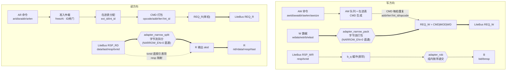
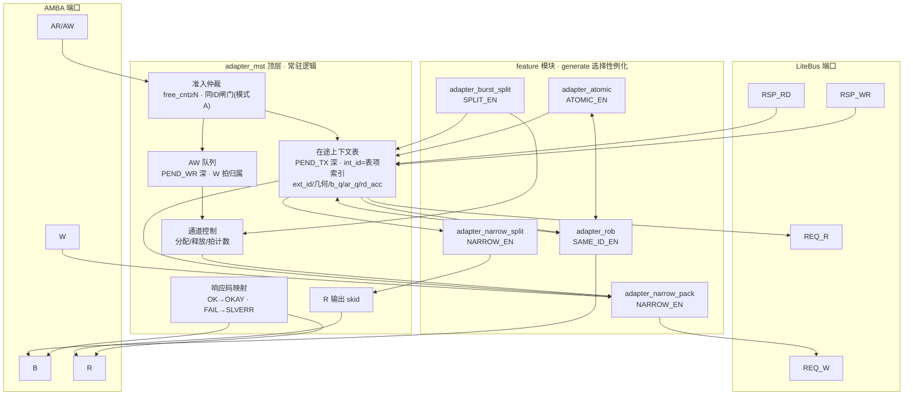
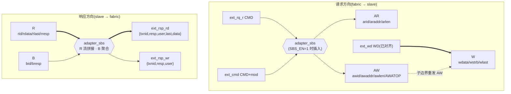
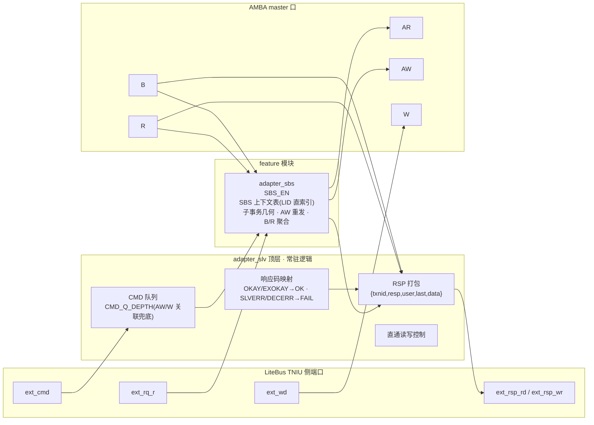

# AMBA(AXI4/AXI5/APB)↔ LiteBus 适配器 RTL 设计文档

版本:v0.6
日期:2026-09-02
范围:适配器 RTL 详细方案(Phase 1 实现依据)。LiteBus 接口以 `litebus_rtl/` RTL 为准;本设计不修改 `litebus_rtl/`。

> v0.3 变更:新增同 ID 重映射(Reorder 语义)、burst 拆包、按 IP 能力组合裁剪(feature 开关)。
> v0.4 变更:按适配器位置拆分 adapter_mst / adapter_slv 两类组件;adapter_slv 提供两个版本(有/无 Simple burst split);系统拓扑与 mst/slv 职责矩阵。
> v0.5 变更:所有文件名带 `adapter` 前缀;所有可选 feature 独立成模块,由 adapter 顶层选择性例化。
> v0.6 变更:架构图重构为**数据流图**与**原理图**两组(mermaid),mst/slv 各一对;数据流图区分数据通路(粗线)与命令/控制通路(细线)。

---

## 1. 概述与目标

### 1.1 定位与系统拓扑

适配器位于 **IP 与 LiteBus 互联之间**,按位置分两类:

```
 ip_master ──► adapter_mst ──► ┌─────────────┐ ──► adapter_slv ──► ip_slave
 (AXI4/5,APB)                  │  LiteBus 互联 │                  (AXI4/5,APB)
                               │ INIU/Switch/ │
                               │ Link/TNIU    │
                               └─────────────┘
```

| 组件 | 位置 | AMBA 侧端口 | LiteBus 侧 | 转换方向 |
|---|---|---|---|---|
| **adapter_mst** | master 与 INIU 之间 | AMBA **slave** 口(接收 master 事务) | INIU 外部接口(REQ_R/REQ_W 出,RSP 入) | AMBA → LiteBus |
| **adapter_slv** | TNIU 与 slave 之间 | AMBA **master** 口(驱动 slave) | TNIU 外部接口(REQ_R/CMD/WD 入,RSP 出) | LiteBus → AMBA |

- 两者对接的都是 LiteBus IP 侧 valid-ready 接口(INIU 侧与 TNIU 侧为镜像关系);
- 对应 LiteBus 文档 EXTENDED-CORE 规划:"AXI/APB-to-LiteBus Adaptor、LiteBus-to-AXI/APB Adaptor、Narrow burst merge、Reorder Buffer/One-trans-fly、Burst split、Simple burst split"。

### 1.2 设计目标

| 目标 | 含义 |
|---|---|
| 协议完整 | AXI4 full(INCR)、AXI5(+原子)、APB4,双向(mst/slv);窄带、非对齐、多 outstanding、读响应交织、同 ID 保序、大突发拆包 |
| 模块化 | 所有可选 feature 独立成模块;adapter 顶层按参数选择性例化;基础直通逻辑 + 在途表常驻顶层 |
| 面积裁剪 | 未例化的 feature 模块零面积;mst 四档组合、slv 两版本 |
| 轻量 | 与 BASIC-CORE 解耦;ROB 不引入大容量数据缓冲;slv 侧零重排器 |
| 参数化 | 位宽、深度、feature 开关全部参数化 |
| 可验证 | feature 模块单元 TB + 组件 TB + 共享模型 + mst↔slv 回环 + 配置矩阵 |

### 1.3 文件结构(全部带 `adapter` 命名,D17)

```
rtl/
├── adapter_ip_defs.vh           # 共享:位域、参数派生、opcode/响应码、重排/拆包公式
├── adapter_mst_axi4.v           # adapter_mst 顶层:AXI4 → LiteBus(选择性例化 feature)
├── adapter_mst_axi5.v           # adapter_mst 顶层:AXI5 → LiteBus
├── adapter_mst_apb.v            # adapter_mst 顶层:APB  → LiteBus
├── adapter_slv_axi4.v           # adapter_slv 顶层:LiteBus → AXI4
├── adapter_slv_axi5.v           # adapter_slv 顶层:LiteBus → AXI5
├── adapter_slv_apb.v            # adapter_slv 顶层:LiteBus → APB
├── adapter_narrow_pack.v        # [feature] mst 写侧字节流打包器(NARROW_EN)
├── adapter_narrow_split.v       # [feature] mst 读侧拆分器(NARROW_EN)
├── adapter_rob.v                # [feature] mst 同 ID 重映射/组内顺序器(SAME_ID_EN)
├── adapter_burst_split.v        # [feature] mst 大突发拆包(SPLIT_EN)
├── adapter_atomic.v             # [feature] mst AXI5 原子:AWATOP 解码 + B+R 收集(ATOMIC_EN)
└── adapter_sbs.v                # [feature] slv Simple burst split(SBS_EN)
sim/
├── adapter_slv_model.v          # LiteBus 从设备模型(INIU 侧镜像)
├── adapter_mst_model.v          # LiteBus 主设备模型(TNIU 侧镜像)
├── tb_adapter_mst_axi4.v / tb_adapter_mst_axi5.v / tb_adapter_mst_apb.v
├── tb_adapter_slv_axi4.v / tb_adapter_slv_axi5.v / tb_adapter_slv_apb.v
├── tb_adapter_narrow.v          # feature 单元:打包/拆分
├── tb_adapter_rob.v             # feature 单元:组内顺序/按序递交
├── tb_adapter_sbs.v             # feature 单元:SBS
└── tb_adapter_mst_slv_loopback.v# mst 适配器 ↔ slv 适配器 直连回环
```

### 1.4 设计决策(已确认)

| # | 决策 |
|---|---|
| D1 | 窄带合并集成进 adapter_mst;与 D2 共用字节流重排器 |
| D2 | 支持非对齐起始地址;相位模型 len+1 多覆盖尾部(写 wstrb 屏蔽/读多读无害) |
| D3 | mst 写路径多 outstanding:AW 队列 + W 拍按序匹配 + 响应按 txnid 匹配 |
| D4 | AXI5 原子全支持(STORE/LOAD/SWAP/COMPARE),B+R 双响应(mst 与 slv 两侧) |
| D5 | APB 单事务 FSM(mst);APB slv 侧 v1 约束 len=0 |
| D6 | 每协议独立 RTL 文件,位宽全部参数化 |
| D7 | mst/slv 均对接 LiteBus IP 侧接口(INIU 侧 / TNIU 侧) |
| D8 | 突发仅 INCR(WRAP/FIXED 断言报错) |
| D9 | 读响应交织支持 → mst 读侧按事务上下文拆分 |
| D10 | 同 ID 保序(adapter_mst):ROB 式 ID 重映射(ext_id→int_id),响应按原顺序递交 |
| D11 | 大突发拆包(adapter_mst,SPLIT_EN):与 ROB 共生(依赖 D10) |
| D12 | adapter_mst 组合版本:NARROW_EN / SAME_ID_EN / SPLIT_EN 开关 |
| D13 | 组件划分:adapter_mst(IP→LiteBus)与 adapter_slv(LiteBus→IP)两类 |
| D14 | adapter_slv 双版本:`SBS_EN=0` 直接转换 / `SBS_EN=1` 带 Simple burst split |
| D15 | slv 侧零重排器:TNIU 已把数据对齐到 slave 位宽(lane_pack) |
| D16 | 拆包职责矩阵:slv 有 SBS 则 mst 不需拆包;slv 无 SBS 则 mst 需 SPLIT_EN(或 IP 约束) |
| D17 | 所有文件名带 `adapter` 前缀 |
| D18 | 所有可选 feature 独立成模块,adapter 顶层按参数选择性例化;常驻逻辑(在途表/准入/AW 队列/直通/响应映射)留在顶层 |

---

## 2. 设计思路与关键权衡

### 2.1 为什么用"字节流重排"统一窄带与非对齐(adapter_mst)

LiteBus 无 Size 信号,事务仅由 `(addr, len)` 描述,数据落在对齐的 `W_BYTES` 宽拍上。AXI 窄带/非对齐事务若逐拍映射为独立 LiteBus 事务,有三个问题:事务碎片化(Switch 事务级仲裁,碎片放大 HOL)、同 ID 约束冲突、读响应重组(等价简易 ROB)。因此选字节流重排:**一笔 AXI 事务 = 连续字节流 `[A, A+(len+1)×size)`,重排成对齐拍后仍以一笔 LiteBus 事务发出**。AXI INCR 拍地址连续、size 为 2^n 整除 W_BYTES,每拍字节道恒为 `[Lane, Lane+size)`,重排是纯流水拼接。

### 2.2 为什么 `len' = len+1` 多覆盖,而不是精确重构

LiteBus 的 Total_bytes 公式固定:`(len'+1)×W − Lane`。AXI 字节数 `(len+1)×size` 通常无整数解(len' 非整数)。欠覆盖(`len'=len`)丢尾部字节是功能错误;多覆盖(`len'=len+1`)多出的 `W−Lane` 字节,写用 wstrb 屏蔽、读丢弃,是 LiteBus 文档明确支持的机制。唯一例外:size=W 且对齐 → len'=len、零多覆盖,重排器退化为直通。

### 2.3 为什么写事务用 AW 队列而非 CAM 匹配 W 拍

AXI4 的 W 通道无 ID 且禁止写数据交织 → W 拍与事务的归属由到达顺序唯一确定,FIFO 顺序的 AW 队列即可,无需 CAM。

### 2.4 为什么同 ID 需要 ROB 而不是简单反压(D10 的动机)

LiteBus 文档 §1.4:网络内不允许同 ID 并发。但很多 IP master 会发同 ID 事务且依赖 AXI 的同 ID 保序语义。若简单反压 AR/AW,master 被卡在接口上,且一旦 master 不等前一笔完成就发同 ID 第二笔,接口即死锁。因此需要 Reorder 语义:

- 适配器**立即接受**同 ID 事务(不反压 master),为每笔在途事务分配**唯一的内部 ID(int_id = 表项索引)** 作为下发 LiteBus 的 txnid;
- 响应按 int_id 直接索引回表项,读回表项记录的 **ext_id(原始 AXI ID)** 返回 master;
- 同一 ext_id 的响应**按原始顺序递交**(组内顺序器,§8),满足 AXI 同 ID 保序;
- LiteBus 网络中恒无同 ID 并发,master 视角完全符合 AXI 语义。

### 2.5 为什么拆包必须与 ROB 共生(D11 与 D10 的依赖)

一笔 AXI 大突发拆成 N 笔子事务,子事务必须**各有唯一的 txnid** 下发(否则违反 LiteBus 同 ID 禁止)。若适配器没有 ID 重映射能力(D10 未开),子事务只能沿用 ext_id → 必然同 ID 并发 → 非法。因此:**SPLIT_EN=1 强制要求 SAME_ID_EN=1**。反之,SAME_ID_EN=1 时拆包几乎零额外成本:子事务天然是"同一 ext_id 的一组条目",组内顺序器自动给出子事务间的响应次序。

### 2.6 为什么读/写/原子在 ROB 中采用不同的下发策略(面积折中)

响应按序递交的前提是:同 ext_id 组内,后完成事务的响应必须先缓冲。缓冲成本:

| 响应 | 成本 | 策略 |
|---|---|---|
| 写 B(resp 2bit + id) | 极小 | **组内并发下发**,B 按条目缓冲,组内按序递交 |
| 原子 R(单拍) | 小(1 拍数据/条目) | **组内并发下发**,R 按条目缓冲(1 拍),组内按序递交 |
| 读 R(最多整笔突发) | 大(可达 burst 全量) | **组内串行下发**(前一笔的 R 全部递交后才发下一笔的 REQ_R)→ 响应天然按序,**零数据缓冲** |

读组内串行不损失语义:AXI 同 ID 读本来就是按序完成的。全并发同 ID 读留作后续增强(§19)。

### 2.7 为什么按 feature 组合出多个版本(D12/D14 的动机)

不同 IP 能力差异大:有窄带的(PCIE/vdec/scp)、强依赖同 ID 保序的、max burst 超下游上限的。全功能适配器会让每个实例背满全部面积。因此:

- **adapter_mst**:`NARROW_EN / SAME_ID_EN / SPLIT_EN` 三个开关组合(§5.4);
- **adapter_slv**:`SBS_EN` 两版本——无 SBS 直接转换;有 SBS 增加 Simple burst split(§14)。

### 2.8 为什么 adapter_slv 无需字节流重排器(D15)

TNIU 交付到 IP 边界的数据**已经对齐到 slave 位宽**:写侧 `lb_tniu_lane_pack` 完成"目标写命令转换、写数据相位对齐、STRB 补齐";读侧 TNIU 用 `addr_lo + total_bytes` 反推 slave 侧 len(`lb_tniu_cmd_conv`),并对小位宽 slave 部署 Assembly Buffer。因此 adapter_slv 拿到的 CMD(addr 已是 local、len 已是 slave 侧 len)与 WD(已对齐)可以直接 1:1 映射到 AMBA 通道——**slv 侧不存在窄带/非对齐问题,零重排器**。这解释了窄带合并为何天然只属于 mst 侧。

### 2.9 为什么 Simple burst split 放在 slv 侧而不是 mst 侧(D16 的权衡)

大突发拆包有两个可选位置(Litebus_principle §1.5):

| 位置 | 机制 | 代价 | 前提 |
|---|---|---|---|
| mst 侧(SPLIT_EN) | 拆分 + 唯一 int_id + 响应重排 | 需要 ROB(D10),复杂 | 无 |
| slv 侧(Simple burst split) | 请求侧切分 len、响应侧合并多笔响应 | 简单 | **slave IP 支持同 ID** |

slv 侧 SBS 的巧妙之处:子事务沿用一个 txnid(LID),而 LID 直接索引上下文表,无需 CAM;写侧 WD 流连续,仅在子边界重发 AW;读侧子事务串行、R 流连续拼接。职责矩阵见 §15。

### 2.10 为什么 feature 独立成模块(D18 的动机)

feature 逻辑(重排器、ROB、拆包、原子、SBS)与常驻逻辑(在途表、准入、AW 队列、直通、响应映射)边界清晰:
- **可测性**:每个 feature 模块可独立单元验证(有自己的 TB),不需要凑齐整个适配器;
- **复用性**:同一 feature 模块被多个协议顶层例化(如 `adapter_rob` 同时被 AXI4/AXI5 顶层使用);
- **裁剪性**:generate 不例化即零面积,顶层代码不做 ifdef 内联堆积;
- **接口稳定**:feature 模块与顶层之间是标准化的数据流/查询接口,后续新增 feature(如全并发读 ROB)不改顶层。

---

## 3. LiteBus IP 侧接口

### 3.1 INIU 侧(adapter_mst 对接)

| 通道 | 信号 | 方向(mst 适配器视角) | 说明 |
|---|---|---|---|
| REQ_R | `req_r_data[EXT_CMD_W-1:0]` | 出 | 读请求,单拍 CMD |
| REQ_R | `req_r_valid` / `req_r_ready` | 出/入 | valid-ready 握手 |
| REQ_W | `req_w_data[EXT_REQ_W-1:0]` | 出 | 写请求,每拍 `{CMD \| MOD \| WD}`,CMD 每拍重复 |
| REQ_W | `req_w_valid` / `req_w_ready` | 出/入 | valid-ready 握手 |
| RSP_RD | `rsp_rd_data/last/resp/txnid/user` | 入 | 读响应(逐拍,独立命名信号) |
| RSP_RD | `rsp_rd_valid` / `rsp_rd_ready` | 入/出 | valid-ready 握手 |
| RSP_WR | `rsp_wr_resp/txnid/user` | 入 | 写响应 |
| RSP_WR | `rsp_wr_valid` / `rsp_wr_ready` | 入/出 | valid-ready 握手 |

### 3.2 TNIU 侧(adapter_slv 对接)

TNIU 侧为 INIU 侧的镜像,且 REQ_W 拆成 **CMD/WD 两通道**,RSP 为**打包载荷**:

| 通道 | 信号 | 方向(slv 适配器视角) | 说明 |
|---|---|---|---|
| REQ_R | `ext_rq_r_data[EXT_CMD_W-1:0]`, valid/ready | 入 | 读请求 CMD(fabric → slave) |
| CMD | `ext_cmd_data[EXT_CMD_W+MOD_W-1:0]`, valid/ready | 入 | 写请求 CMD(+mod 在 LSB) |
| WD | `ext_wd_data[EXT_WD_W-1:0]`, valid/ready | 入 | 写数据(逐拍,已对齐 slave 位宽) |
| RSP_RD | `ext_rsp_rd_data[EXT_RSP_RD_W-1:0]`, valid/ready | 出 | 打包读响应 |
| RSP_WR | `ext_rsp_wr_data[EXT_RSP_WR_W-1:0]`, valid/ready | 出 | 打包写响应 |

```
EXT_RSP_RD_W = ID_W + 2 + USER_RSP_RD_W + 1 + DATA_W
ext_rsp_rd_data = { txnid, resp[1:0], [user], last, data }      // MSB→LSB

EXT_RSP_WR_W = ID_W + 2 + USER_RSP_WR_W
ext_rsp_wr_data = { txnid, resp[1:0], [user] }                  // MSB→LSB
```

### 3.3 位域布局(MSB→LSB,两侧通用)

```
EXT_CMD_W = EXT_QOS_W + 4 + ADDR_W + LEN_W + ID_W + USER_CMD_W
CMD       = { qos, opcode[3:0], addr, len, txnid, user_cmd }        // mst:addr=全局;slv:addr=local
EXT_WD_W  = DATA_W + DATA_W/8 + 1 + ID_W
WD        = { data, strb, last, txnid }
EXT_REQ_W = EXT_CMD_W + EXT_MOD_W + EXT_WD_W
REQ_W     = { CMD, mod, WD }
```

### 3.4 opcode(`lb_defines.vh` 权威值)

| 宏 | 值 | bit3 | 说明 |
|---|---|---|---|
| `LB_OP_RD` | 4'h1 | 0 | 普通读 |
| `LB_OP_WR` | 4'h8 | 1 | 普通写 |
| `LB_OP_ATOMIC_STORE` | 4'hC | 1 | 原子存,B only |
| `LB_OP_ATOMIC_LOAD` | 4'hD | 1 | 原子取,B+R |
| `LB_OP_ATOMIC_SWAP` | 4'hE | 1 | 原子交换,B+R |
| `LB_OP_ATOMIC_COMPARE` | 4'hF | 1 | 原子比较,B+R |

### 3.5 响应码(`lb_defines.vh` 权威值;design 文档表格 FAIL=2'b10 为笔误)

| LiteBus 宏 | 值 | 含义 |
|---|---|---|
| `LB_RESP_OK` | 2'b00 | 正常完成 |
| `LB_RESP_FAIL` | 2'b01 | SLAVE 报告失败 |
| `LB_RESP_ATOMIC_FAIL` | 2'b10 | 原子比较失败(SLAVE 生成,总线透传) |

**mst 侧映射**(LiteBus→AXI,组合逻辑,常驻顶层):

```verilog
axi_resp = (lb_resp == OK)   ? 2'b00 :     // OKAY
           (lb_resp == FAIL)  ? 2'b10 :     // SLVERR
                                ATOMIC_FAIL_RESP; // 默认 EXOKAY 2'b01
```

**slv 侧映射**(AXI→LiteBus,组合逻辑,常驻顶层):

```verilog
lb_resp = (axi_resp == 2'b00) ? `LB_RESP_OK :   // OKAY→OK
          (axi_resp == 2'b01) ? `LB_RESP_OK :   // EXOKAY→OK(原子成功)
                                `LB_RESP_FAIL;  // SLVERR/DECERR→FAIL
```

---

## 4. 架构图

本节分两组图:**数据流图**(通路视角:数据/命令怎么流动)与**原理图**(电路视角:存储/逻辑/feature 模块及接口)。数据流图中 **粗线 `==>` 为数据(payload)通路,细线 `-->` 为命令/控制通路**。

### 4.1 adapter_mst 数据流图



要点:
- 读方向命令路径(AR→REQ_R)与数据路径(RSP_RD→R)**分离**,天然支持多 outstanding 与响应交织;
- 写方向命令(AW)与数据(W)在 REQ_W 处**合并**:CMD 每拍重复、WD 经打包器对齐;
- `NARROW_EN=0` 时打包/拆分退化为 1:1 直通,粗线路径不变;
- B 响应要过 rob 按序递交器(同 ID 保序),读 R 因组内串行下发无需重排。

### 4.2 adapter_mst 原理图



要点:
- **存储单元**(表/队列/skid/缓冲)全部在顶层;feature 模块是**数据变换**(pack/split)或**纯查询/判定**(rob/bs/atomic)逻辑;
- feature 模块与表的关系:pack 读取 CMD 边带(来自表)与拍计数(来自 CTRL);split 按拍读写表项 `rd_acc`;rob 输入 valid[]/ext_id[]/done[] 数组、输出 issuable/presentable 与仲裁选择;bs 输出子事务几何给 CTRL 与表;
- 响应匹配走"txnid 直索引表项",全图无响应侧 CAM。

### 4.3 adapter_slv 数据流图



要点:
- WD **直通**(TNIU 已对齐 slave 位宽,零重排);SBS 只重发 AW/AR 命令(子事务几何);
- SBS_EN=1 时:读子事务的 R 流无缝拼接为单一 ext_rsp_rd 流;多笔子事务 B 聚合为一笔 ext_rsp_wr;
- SBS_EN=0 时图中两个 `adapter_sbs` 节点消失,纯直通。

### 4.4 adapter_slv 原理图



要点:
- 顶层只含轻量结构:CMD 队列、RSP 打包、响应映射、直通控制;**无表**(在途数由 TNIU cmd table 界定);
- `adapter_sbs` 内部带 LID 直索引上下文表,是 slv 侧唯一的"存储型"feature;未例化时(S1 版)请求/响应全直通。

### 4.5 feature 模块接口一览(原理图连线依据)

| 模块 | 开关 | 例化点 | 与顶层的接口 |
|---|---|---|---|
| `adapter_narrow_pack` | NARROW_EN | 写数据路径 W→REQ_W | **数据流**:AXI beat 流(valid/ready)+ REQ_W 拍流(valid/ready);**配置边带**:lane/size/len 拍计数、每拍 CMD(addr/len'/int_id/opcode/qos/user,由顶层从表项取);**状态**:beat_done、事务结束 |
| `adapter_narrow_split` | NARROW_EN | 读数据路径 RSP_RD→R | **数据流**:RSP_RD 拍流(valid/ready,tnxid 由顶层译码)+ R 拍流;**条目状态接口**:rd_acc/beats_left/lane/size 读入,更新后写回(模块无内部事务态,纯拍级函数) |
| `adapter_rob` | SAME_ID_EN | 准入 + B/R 递交 | **查询接口**:valid[]/ext_id[]/done[]/b_vld[] 数组入;issuable[]/presentable[] 向量与仲裁选择出;int_id 分配建议出 |
| `adapter_burst_split` | SPLIT_EN | 准入 + CMD 生成 | **几何接口**:事务 addr/size/len 入;N、sub 几何(addr_k/len'_k)、free≥N 判定、sub 边界推进出 |
| `adapter_atomic` | ATOMIC_EN | AW 解码 + 响应收集 | **解码**:AWATOP[1:0]/[4:2] → opcode/mod;**收集控制**:表项 rsp_b/rsp_r 状态交互、B+R 齐备判定 |
| `adapter_sbs` | SBS_EN | slv 请求/响应路径 | **数据流**:REQ_R/CMD/WD 入,RSP 出(插在 slv 顶层直通路径上);内部 SBS 上下文表(LID 直索引) |

**接口原则**:feature 模块不做协议顶层仲裁,只提供数据通路变换或纯查询/判定;所有事务上下文常驻顶层表,feature 模块按需读写其条目状态。

---

## 5. 参数化设计

### 5.1 adapter_mst 通用参数

| 参数 | 默认 | 范围 | 说明 |
|---|---|---|---|
| `ADDR_W` | 32 | 8~64 | 地址位宽 |
| `DATA_W` | 64 | 8~1024(2^n) | 数据位宽 = LiteBus EXT_DATA_WIDTH |
| `LEN_W` | 8 | 1~12 | len 位宽 |
| `ID_W` | 8 | 1~16 | AXI ID 位宽 = EXT_TXNID_WIDTH |
| `USER_CMD_W` / `USER_RSP_RD_W` / `USER_RSP_WR_W` | 8/8/8 | 0~64 | user 位宽 |
| `QOS_W` | 0 | 0~4 | qos 位宽 |
| `MOD_W` | 0 | 0~7 | 原子修饰符位宽 |
| `ATOMIC_EN` | 0 | 0/1 | 原子开关(仅 AXI5) |
| `PEND_TX` | 8 | 2^n,≤2^ID_W | 在途上下文表深度 |
| `PEND_WR` | 4 | 2^n,≤PEND_TX | AW 队列深度 |
| `R_SKID_DEPTH` | 8 | ≥2 | R 通道输出 skid 深度 |
| `ATOMIC_FAIL_RESP` | 2'b01 | — | 原子比较失败映射 |
| `PACK_PIPE_EN` | 0 | 0/1 | 重排器输出打拍开关 |

### 5.2 feature 开关与模块映射

| 参数 | 默认 | 例化模块 | 关闭后行为 |
|---|---|---|---|
| `NARROW_EN` | 1 | `adapter_narrow_pack` + `adapter_narrow_split` | size 必须 = W_BYTES(断言);顶层走直通;len'=len |
| `SAME_ID_EN` | 1 | `adapter_rob` | 同 ID 新事务被反压(§8 模式 A,顶层闸门) |
| `SPLIT_EN` | 0 | `adapter_burst_split` | 断言 bytes_total ≤ LB_MAX_BURST_BYTES;N 恒 1 |
| `ATOMIC_EN` | 0 | `adapter_atomic` | AWATOP 出现即断言报错 |
| `SBS_EN` | 0 | `adapter_sbs`(slv 顶层) | slv 直接转换 |

**依赖约束(参数断言)**:

```
SPLIT_EN=1 ⇒ SAME_ID_EN=1        // 子事务需唯一 int_id,依赖 ROB 重映射
PEND_TX ≤ 2^ID_W                  // int_id 需能放入 LiteBus txnid 字段
PEND_WR ≤ PEND_TX
LB_MAX_BURST_BYTES 为 W_BYTES 整数倍(SPLIT_EN=1 时)
```

### 5.3 adapter_slv 参数

| 参数 | 默认 | 说明 |
|---|---|---|
| `ADDR_W` | 32 | 地址位宽(local) |
| `DATA_W` | 64 | 数据位宽 = 该 slave 的 EXT_DATA_WIDTH(≤ 网络最大位宽) |
| `LEN_W` | 8 | slave 侧 len 位宽(= TNIU EXT_LEN_WIDTH) |
| `ID_W` | 8 | txnid 位宽(= TNIU EXT_TXNID_WIDTH = LID 宽) |
| `USER_*_W` / `QOS_W` / `MOD_W` | 同 mst | user/qos/mod |
| `ATOMIC_EN` | 0 | 原子开关(仅 AXI5 slv) |
| `PENDING_TRANS` | 8 | 在途事务上限(= TNIU cmd table 深度;SBS 上下文表索引空间) |
| **`SBS_EN`** | 0 | **Simple burst split 开关:0=直接转换,1=例化 adapter_sbs(两个版本)** |
| `SLV_MAX_LEN` | 15 | slave 支持的最大 len(SBS_EN=1 时使用) |
| `CMD_Q_DEPTH` | 2 | 写 CMD 队列深度(见 §14.3) |

派生:`W_BYTES = DATA_W/8`,`EXT_CMD_W/EXT_WD_W/EXT_RSP_*_W` 同 §3.3。

### 5.4 组合版本(面积档位)

**adapter_mst 四档**:

| 组合 | NARROW_EN | SAME_ID_EN | SPLIT_EN | 例化模块 | 适用 master 画像 |
|---|---|---|---|---|---|
| **C1 基础** | 0 | 0 | 0 | (无 feature) | 整宽、唯一 ID、突发 ≤ 下游上限 |
| **C2 +窄带** | 1 | 0 | 0 | narrow_pack+split | 有窄带,无同 ID |
| **C3 +同ID** | 0/1 | 1 | 0 | rob(+narrow) | 有同 ID 保序需求 |
| **C4 全功能** | 1 | 1 | 1 | 全部 | 全部能力 |

**adapter_slv 两版(D14)**:

| 版本 | SBS_EN | 例化模块 | 适用 slave 画像 |
|---|---|---|---|
| **S1 直接转换** | 0 | (无 feature) | slave max burst ≥ 上游事务;或上游已保证不超限 |
| **S2 +SBS** | 1 | adapter_sbs | slave max burst 小于上游事务且 slave 支持同 ID |

### 5.5 派生参数

```
W_BYTES   = DATA_W/8                  // 每拍字节数(2^n)
LANE_W    = log2(W_BYTES)             // Lane 位宽
IDX_W     = log2(PEND_TX)             // mst:int_id/表项索引位宽
EXT_CMD_W = QOS_W + 4 + ADDR_W + LEN_W + ID_W + USER_CMD_W
EXT_WD_W  = DATA_W + W_BYTES + 1 + ID_W
EXT_REQ_W = EXT_CMD_W + MOD_W + EXT_WD_W
```

---

## 6. adapter_mst:在途事务上下文表(常驻顶层)

### 6.1 表项结构

| 字段 | 位宽 | 说明 |
|---|---|---|
| `valid` | 1 | 条目占用 |
| `ext_id` | ID_W | 原始 AXI ID(组内顺序器的键;SAME_ID_EN=0 时即下发 ID) |
| `int_id` | IDX_W | 内部唯一 ID = 表项索引(下发 LiteBus 的 txnid) |
| `is_wr` / `is_atomic` | 1/1 | 写(REQ_W 族)/ 原子标记 |
| `addr` / `size` / `lane` / `len` | ADDR_W / log2(W_BYTES)+1 / LANE_W / LEN_W | AXI 侧事务几何 |
| `len_p` | LEN_W+1 | 该条目(或子事务)的 LiteBus len' |
| `beats_left` | LEN_W+1 | 剩余拍数(写:待发;读:待回) |
| `issued` | 1 | 已下发(读组内串行:WAIT_ISSUE/ISSUED) |
| `rsp_b` / `rsp_r` | 1 | 已收到 B / R(原子双响应) |
| `opcode` / `mod` / `user` / `qos` | 4 / MOD_W / USER_CMD_W / QOS_W | CMD 载荷 |
| `b_q` / `b_vld` | 2+1 | 写 B 响应缓冲(组内按序递交) |
| `ar_q` / `ar_vld` | DATA_W+1 | 原子 R 响应缓冲(单拍) |
| `sub_idx` / `is_last_sub` | SUB_IDX_W / 1 | 拆包:子事务序号 / 末子事务 |
| `rd_acc` / `rd_acc_v` | W_BYTES×8 / W_BYTES | 读拆分 carry |

- `int_id` = 表项索引固定,响应到达时 txnid 直接译码为表地址,**响应匹配是表直读,不是 CAM**;
- 条目按环形表顺序分配;SAME_ID_EN=0 时下发 ID 用 ext_id;
- `rd_acc/rd_acc_v` 由 `adapter_narrow_split` 按拍读写(§4.5 接口);`b_q/ar_q` 由顶层写、`adapter_rob` 判定递交。

### 6.2 准入与分配(顶层)

```
free_cnt = PEND_TX − popcount(valid)
N = SPLIT_EN ? ceil(beats / J) : 1        // 由 adapter_burst_split 组合计算
ar_accept = (free_cnt ≥ N) && (SAME_ID_EN ? 1 : !id_hit)
aw_accept = ar_accept && (写队列未满)
```

- 分配:一次原子地占用 N 个空闲条目(first-fit 环扫),登记同一 ext_id、sub_idx 递增、is_last_sub 标记;
- 释放:该条目响应全部递交后清 valid;同拍释放先于分配。

---

## 7. adapter_mst:字节流重排器(`adapter_narrow_pack` / `adapter_narrow_split`,NARROW_EN=1)

### 7.1 相位模型与数学推导

```
Lane        = A mod W_BYTES
Total_bytes = (len'+1) × W_BYTES − Lane
有效字节范围 = [Lane, Lane + Total_bytes)            // 对齐拍上

bytes_total = (len+1) × size
beats       = ceil((Lane + bytes_total) / W_BYTES)
len'        = beats − 1
total_bytes'= beats × W_BYTES − Lane
over_cover  = total_bytes' − bytes_total ∈ [0, W_BYTES)
```

退化:`size==W_BYTES && Lane==0` → `len'=len`、零多覆盖、1:1 直通(顶层不例化本模块,或例化后逐拍透传,由实现选)。

### 7.2 `adapter_narrow_pack`:写侧打包器电路

内部寄存器:`acc_data[DATA_W]`、`acc_strb[W_BYTES]`、`acc_cnt[LANE_W+1:0]`。

每 AXI 拍握手(数据流端口 wvalid/wready),字节道 `[Lane, Lane+size)`(配置边带):

```
acc_cnt + size <  W : 合并进 acc[acc_cnt +: size],cnt += size,不发拍
acc_cnt + size == W : 合并,发完整拍,清零
acc_cnt + size >  W : 先发 acc(以本拍前 W−cnt 字节补满),
                      余量 (cnt+size−W) 字节进新 acc
事务末拍消耗完: cnt>0 → 发尾拍(over_cover 字节 strb=0,wlast=1)
               cnt=0 → 末拍已发(wlast=1)
```

- 数据/strb 拼接 = 桶形移位器(移位量 = cnt)或折叠为 `W_BYTES/size` 选 1 MUX;
- 可接受性:`cnt+size < 2W` 恒成立(每输入拍至多一次发拍)→ 打包器永不停等;
- REQ_W 拍载荷:CMD 每拍来自顶层配置边带(`{qos, opcode, addr(当前子事务), len', int_id, user}`),WD=`{acc_data, acc_strb, wlast, int_id}`;
- `beat_done`/事务结束状态输出回顶层(拍计数、子事务边界切换用,§9.2)。

### 7.3 `adapter_narrow_split`:读侧拆分器电路(无内部事务态,状态在表项)

模块为**拍级函数**:输入 RSP_RD 拍(顶层已按 txnid 译码出表项)与表项状态(`rd_acc/rd_acc_v/beats_left/lane/size`),输出:

1. 本拍字节与 `rd_acc` 按字节位置拼接;
2. 按 `size` 切出 AXI 拍,经移位器放到 `[Lane, Lane+size)` 车道,经内部小 skid 送 R 拍流;
3. `rlast=(k==len)`、`rresp=顶层映射(本 RSP_RD 拍 resp)`、`rid=ext_id`(顶层);
4. 更新后状态(`rd_acc/rd_acc_v/beats_left`)写回表项;
5. 事务完成标志输出(末拍切出 → 读事务 DONE,顶层据此释放条目);
6. 输出速率:`rsp_rd_ready = 内部 skid 空位 ≥ ceil(W_BYTES/size)`,无死锁;size==W && Lane==0 时 1:1 透传。

### 7.4 读响应交织下的多事务上下文

RSP_RD 携带 txnid,不同事务响应可在 IP 边界交织 → 顶层每拍按 int_id 索引各自表项上下文传给 splitter,状态互不干扰;R 输出统一经顶层 skid;同 ext_id 由 §8 串行下发保证不交织。

### 7.5 时序示例:非对齐窄带写

`W_BYTES=8, size=4, Lane=4, len=3` → `bytes_total=16, beats=3, len'=2, over_cover=4`:

```
clk   : | 0 | 1 | 2 | 3 | 4 | 5 |
wdata : |B0[4:7]|B1[4:7]|B2[4:7]|B3[4:7]|   |   |
req_w : |   |   |A0(strb=0xF0:B0)|A1(strb=0xFF:B1,B2)|A2(strb=0x0F:B3,wlast)|
```

### 7.6 时序示例:窄带读(同上事务)

```
REQ_R : CMD{opcode=RD, addr, len'=2, txnid=int_id}     // 1 拍
rsp_rd: | R0(offset0..7) | R1(8..15) | R2(16..23) |
R 通道 : |B0=R0[4:7]|B1=R1[0:3]|B2=R1[4:7]|B3=R2[0:3](rlast)|   // R2[4:7] 多覆盖,丢弃
```

---

## 8. adapter_mst:同 ID 处理(`adapter_rob`,SAME_ID_EN=1;模式 A 闸门常驻顶层)

### 8.1 模式 A:`SAME_ID_EN = 0`(顶层闸门,不例化 rob)

- 同 ID 新事务**反压**:`id_hit` → 该通道 ready=0;下发 txnid = ext_id 直通;响应直通;
- 适用"从不发同 ID"的 master。

### 8.2 模式 B:`SAME_ID_EN = 1`(`adapter_rob` 例化)

**下发**:
- 接受时分配唯一 `int_id`,下发 txnid = int_id,**无同 ID 反压**;
- 组内下发策略(§2.6):写(含子事务)并发下发;读、原子组内**串行**下发;
- 读的 `issued` 判定(rob 模块输出,组合;输入顶层 valid[]/ext_id[]/done[] 数组):

```verilog
// 条目 i 可下发(读):同 ext_id 的更早条目(环序在前)都已 done
issuable[i] = !issued[i] && valid[i]
            && !(∃ j: valid[j] && ext_id[j]==ext_id[i] && ring_older(j,i) && !done[j]);
```

  ring_older 比较:环形表按分配顺序,组合比较器网络规模 ~ PEND_TX²(封装在 rob 模块内)。

**递交(响应转回 ext_id 且按序)**:
- 写 B:`rsp_wr` 命中条目 → 顶层存 `b_q`;rob 在"B 就绪"条目中按 ext_id 组内环序输出可递交者与仲裁选择(多组头 round-robin):

```verilog
presentable_b[i] = b_vld[i] && !(∃ j: b_vld[j] && ext_id[j]==ext_id[i] && ring_older(j,i));
```

  递交握手当拍:顶层输出 `bid = ext_id[i]`、`bresp = 映射(b_q)` → 释放条目。
- 原子 R:`ar_q` 缓冲单拍,同 B 的按序递交;
- 读 R:组内串行下发保证数据到达即按序,末拍递交后释放条目。

**正确性论证**:int_id 全局唯一 → LiteBus 同 ID 约束满足;同 ext_id 组 B/R 递交严格按分配顺序 → AXI 同 ID 保序满足;不同 ext_id 随意乱序(符合 AXI)。缓冲上限:写 B 每条目 3bit、原子 R 每条目 1 拍,读零缓冲。

### 8.3 时序示例:两笔同 ID 写 + 乱序 B

```
AW(id=0x5, 写0) → 条目0 {ext=5,int=0}, ISSUED
AW(id=0x5, 写1) → 条目1 {ext=5,int=1}, ISSUED(写并发)
W 流: 写0 数据 → REQ_W{txnid=0} ...;写1 数据 → REQ_W{txnid=1} ...
RSP_WR{txnid=1,OK} → 条目1 b_q=OK(就绪,不可递交:组内前序条目0未递交)
RSP_WR{txnid=0,OK} → 条目0 b_q=OK → 递交 B{bid=0x5,OK} → 释放0
                      → 条目1 变组头 → 递交 B{bid=0x5,OK} → 释放1
```

### 8.4 时序示例:同 ID 读的组内串行下发

```
AR(id=0x3, 读0) → 条目0 {ext=3,int=0}, 组头 → ISSUED → REQ_R{txnid=0}
AR(id=0x3, 读1) → 条目1 {ext=3,int=1}, WAIT_ISSUE(前序未 done)
RSP_RD{txnid=0} 数据全部递交(末拍 rlast) → 条目0 释放
                 → 条目1 issuable → ISSUED → REQ_R{txnid=1}
```

---

## 9. adapter_mst:拆包(`adapter_burst_split`,SPLIT_EN=1)

### 9.1 子事务几何(组合计算,burst_split 模块输出)

```
bytes_total = (len+1) × size
beats       = ceil((Lane + bytes_total) / W_BYTES)   // 总对齐拍数
J           = LB_MAX_BURST_BYTES / W_BYTES           // 每子事务最大拍数
N           = ceil(beats / J)

sub k 覆盖对齐拍 [k·J, min((k+1)·J, beats)):
  addr_k   = (k==0) ? A : (A − Lane + k·J·W_BYTES)    // k≥1 恒对齐
  lane_k   = (k==0) ? Lane : 0
  beats_k  = min(J, beats − k·J)
  len'_k   = beats_k − 1
  total_k  = beats_k × W_BYTES − lane_k
```

- sub 0 携带原地址与原 Lane;后续子事务对齐起点;末子事务尾部多覆盖与 §7 一致;
- 每子事务一个表项:`{ext_id 相同, int_id 唯一, sub_idx, len'_k, addr_k}`;子事务间响应次序由 rob 组内顺序器保证;
- 模块输出:准入 `free_cnt ≥ N` 判定、sub 几何(addr_k/len'_k 供 CMD 生成)、子事务边界推进(拍计数比较)。

### 9.2 写侧拆包

- W 拍流连续进入 narrow_pack,顶层在子事务边界切换 CMD 来源(addr_k/len'_k/int_id_k)并置 wlast;
- 写组内并发:前一个子事务的 B 未回也不阻塞下一个子事务的数据流(B 缓冲 + 按序递交兜底);
- 边界判定:burst_split 模块按拍计数输出切换信号。

### 9.3 读侧拆包

- 读组内串行下发:sub k+1 的 REQ_R 在 sub k 的 R 全部递交后发出;
- narrow_split 跨子事务边界无缝连续:R 拍流 = 原 AXI 突发的完整按序重放,`rlast` 仅末子事务末拍。

### 9.4 准入与容量

- `free_cnt ≥ N` 原子分配 N 条目,不足反压;
- 容量建议:`PEND_TX ≥ PEND_WR × MAX_SUB_TX` 并留读/原子余量。

---

## 10. adapter_mst:写事务管理电路(常驻顶层)

- **AW 队列**:深 `PEND_WR` 环形 FIFO,存表项索引;入队 = 表项分配(拆包时一次入队 N 项,按序);
- **W 拍匹配**:W 拍归属队头写事务(AW 顺序);子事务边界切换 CMD(§9.2);
- **B 响应**:`rsp_wr.txnid` 直接索引表项 → `b_q/b_vld` → rob 按序递交器输出 B,递交握手释放条目;
- **SAME_ID_EN=0 时**:无重映射、无 b_q,响应即递交(直通 + 同 ID 闸门)。

---

## 11. adapter_mst:读路径电路(常驻顶层 + narrow_split)

1. `arready = 准入`;握手分配条目(读/原子 1 条目,拆包读 N 条目);
2. 下发:`issued` 由 rob 门控;REQ_R 一拍,CMD 携带 `len'` 与 `int_id`;
3. 响应:RSP_RD 按 int_id 索引上下文 → 直通或 narrow_split → R 输出 skid;
4. `rid = ext_id`、`rlast` 末拍、`rresp = 映射`;末拍递交释放条目;
5. NARROW_EN=0 时无 splitter,直通 + skid。

---

## 12. adapter_mst:AXI5 原子(`adapter_atomic`,ATOMIC_EN=1)

| AWATOP[1:0] | 操作 | LiteBus opcode | modifier(AWATOP[4:2]) | 响应 |
|---|---|---|---|---|
| 2'b00 | STORE | `LB_OP_ATOMIC_STORE` 4'hC | 0 | B only |
| 2'b01 | LOAD | `LB_OP_ATOMIC_LOAD` 4'hD | 0 | B + R |
| 2'b10 | SWAP | `LB_OP_ATOMIC_SWAP` 4'hE | 0 | B + R |
| 2'b11 | COMPARE | `LB_OP_ATOMIC_COMPARE` 4'hF | AWATOP[4:2] | B + R |

- `adapter_atomic` 职责:AWATOP → opcode/mod 组合解码(参数化映射表)+ 表项 B+R 收集控制(`rsp_b/rsp_r` 交互、B+R 齐备判定);
- 约束:`awlen==0`、`awsize==W_BYTES`(断言);单拍,不经 narrow 模块;
- 单拍 REQ_W:`WD={wdata, wstrb, last=1, int_id}`;
- B → `b_q` 缓冲;R → `ar_q` 缓冲(1 拍);两者经 rob 按序递交器输出,均递交后释放;原子组内并发下发;
- 原子 R 与普通读 R 共享 R 输出 skid,round-robin 仲裁;
- 比较失败:`LB_RESP_ATOMIC_FAIL` → `ATOMIC_FAIL_RESP`(默认 EXOKAY),比较结果由 master 对比返回数据判断。

---

## 13. adapter_mst:APB 设计(`adapter_mst_apb.v`)

- 端口:APB4 slave(`PSEL/PENABLE/PWRITE/PADDR/PWDATA/PPROT/PSTRB` → `PRDATA/PREADY/PSLVERR`);
- 单事务 FSM:SETUP → ACCESS(发 LiteBus 请求,PREADY=0 挂起)→ RSP → PREADY=1 一拍;
- 读:REQ_R{opcode=RD, addr=PADDR, len=0, txnid=0};写:REQ_W{CMD(WR,PADDR,0,0), WD(PWDATA, PSTRB|全1, last=1, 0)};
- 单事务天然满足:不例化任何 feature 模块;参数 `ADDR_W, DATA_W, PSTRB_EN`。

---

## 14. adapter_slv 设计(LiteBus → AMBA master 口)

### 14.1 总体结构

架构图见 §4.3(数据流图)与 §4.4(原理图)。SBS_EN=1 时在请求/响应路径上插入 `adapter_sbs`(§14.4)。

### 14.2 读路径(REQ_R → AR → R → RSP_RD,常驻顶层)

- REQ_R 握手:解 CMD `{opcode, addr(local), len, txnid, user}` → 发 AXI AR:`arid=txnid`、`araddr=addr`、`arlen=len`、`arsize=log2(SLV_BYTES)`、`arburst=INCR`、`aruser=user`;
- R 响应:`rid` → txnid、`rdata/rlast` 透传、`rresp` 经 slv 侧映射(§3.5)→ 打包 RSP_RD `{txnid, resp, user, last, data}`,valid-ready 直通;
- 多 outstanding:上游 TNIU cmd table 已限制在途数,适配器纯透传,无需跟踪。

### 14.3 写路径(CMD + WD → AW + W → B → RSP_WR,常驻顶层)

- CMD 握手:解 `{opcode, addr, len, txnid, user, [mod]}` → 发 AXI AW(`awid=txnid, awaddr, awlen, awsize, awburst=INCR`);
- WD 逐拍 → AXI W(`wdata/wstrb/wlast` 透传,已按 slave 位宽对齐);
- **AW/W 关联**:AXI4 主设备禁止 W 交织。若 TNIU 保证 CMD 与其 WD 流按序交付,直接透传;否则需要 **CMD 队列**(深 `CMD_Q_DEPTH`):缓存后续 CMD,待当前 W 流(wlast)结束后再发下一个 AW;v1 带断言 + 参数化队列兜底;
- B 响应:`bid` → txnid、`bresp` 经映射 → 打包 RSP_WR `{txnid, resp, user}`。

### 14.4 Simple burst split(`adapter_sbs`,SBS_EN=1,版本 S2)

**触发条件**:入向 CMD/REQ_R 的 `len > SLV_MAX_LEN`(slave 不支持该长度)。

**SBS 上下文表**(模块内部,深 `PENDING_TRANS`,**按 txnid 直接索引**,无 CAM):

| 字段 | 说明 |
|---|---|
| `valid` / `is_wr` / `is_atomic` | 占用/类型 |
| `base_addr` / `total_beats` / `beats_left` | 原事务几何与剩余 |
| `sub_sent` / `sub_done` | 已下发/已完成的子事务数 |
| `err_acc` | B/R 错误累积(任一 FAIL 即 FAIL) |
| `sub_geom` | 当前子事务的 addr/len 游标(组合重算) |

**子事务几何**(写读一致):`S = SLV_MAX_LEN+1`,`N = ceil(T/S)`,`sub k:addr = base + k·S·SLV_BYTES`,`len_k = min(S, T−k·S)−1`。子事务**沿用同一 txnid**(前提:slave 支持同 ID,Litebus_principle §1.5)。

**写侧拆分**:WD 流连续,**仅在子边界重发 AW**(新 addr/len),W 数据无缝透传;每子事务一个 B,全部 B 到齐后发**一笔** RSP_WR:`resp = err_acc ? FAIL : OK`。

**读侧拆分**:子 AR 串行下发(同一 txnid,`arlen=len_k`);各子事务 R 数据**无缝拼接**为单一 RSP_RD 流(`last` 仅在最后一个子事务的最后一拍);任一拍 resp 非 OK 则累积错误,末拍携带聚合 resp。

**约束**:SBS_EN=1 时 slave 必须支持同 ID;子事务数 N 由参数上限 `MAX_SUB_TX` 断言保护;CMD 队列与 SBS 并存时,队列中暂存的 CMD 也参与拆分。

### 14.5 AXI5 slv 原子(`adapter_slv_axi5.v`,ATOMIC_EN=1)

- 入向 CMD 携带原子 opcode + mod → 解码为 AWATOP(§12 的逆映射,参数化表),发出 AXI5 原子事务(AWATOP + 单拍 W);
- STORE:仅 B;LOAD/SWAP/COMPARE:B 与 R 都返回 → RSP_WR + RSP_RD(`last=1`,数据 = 原子返回原值);
- slv 侧原子比较失败 → `LB_RESP_ATOMIC_FAIL` 的生成方式待定(§19);
- 原子解码复用 `adapter_atomic` 的逆映射子集(或 slv 顶层内置,实现时定)。

### 14.6 APB slv(`adapter_slv_apb.v`)

- APB **master** 口:`PSEL/PENABLE/PWRITE/PADDR/PWDATA` 输出,`PRDATA/PREADY/PSLVERR` 输入;
- 单事务:REQ_R / CMD+WD(len 必须为 0,v1 断言;突发展开为背靠背 APB 访问列为未来增强)→ 发起一次 APB 传输,`PREADY && PENABLE` 完成后返回 RSP_RD / RSP_WR;`PSLVERR` → `LB_RESP_FAIL`;
- 无 SBS 需求(APB 天然单拍),SBS_EN 恒 0。

---

## 15. mst/slv 职责矩阵与版本组合

**拆包职责分配**(D16):

| 场景 | mst 配置 | slv 配置 |
|---|---|---|
| slave 有 SBS(支持同 ID) | 无需拆包:`SPLIT_EN=0` | `SBS_EN=1`(S2) |
| slave 无 SBS,且 IP 突发 ≤ slave 上限 | `SPLIT_EN=0` | `SBS_EN=0`(S1) |
| slave 无 SBS,IP 突发可能超限 | `SPLIT_EN=1`(依赖 `SAME_ID_EN=1`) | `SBS_EN=0`(S1) |

**完整组合空间**:

| | adapter_mst | adapter_slv |
|---|---|---|
| 版本 | C1/C2/C3/C4(NARROW/SAME_ID/SPLIT) | S1/S2(SBS_EN) |
| 协议 | AXI4 / AXI5 / APB | AXI4 / AXI5 / APB |

mst 与 slv 独立选型,由上游 IP 能力与下游 slave 能力决定;两侧同时开拆包属冗余配置(二选一即可)。

---

## 16. 共享头文件(`adapter_ip_defs.vh`)

- `include "lb_defines.vh"`;
- 位域布局与派生宽度(§3.3/§5.5);
- 重排公式(§7.1)与拆包公式(§9.1/§14.4);
- 响应映射(§3.5,mst 与 slv 两份);
- 参数依赖断言宏(§5.2);
- 各顶层与 feature 模块统一 `include`,位域定义只此一处。

---

## 17. 验证计划

### 17.1 共享模型

- `sim/adapter_slv_model.v`:INIU 侧镜像从设备(消费 REQ_R/REQ_W,回 RSP),支持窄带/非对齐校验、读交织、错误注入、原子、下游突发上限模拟;
- `sim/adapter_mst_model.v`:TNIU 侧镜像主设备(产生 REQ_R/CMD/WD,收 RSP),用于 slv 适配器验证,支持交织/拆分激励。

### 17.2 feature 模块单元 TB

| TB | 被测模块 | 覆盖 |
|---|---|---|
| `tb_adapter_narrow` | narrow_pack / narrow_split | 打包三分支合并、边界跨拍、wstrb 重算、尾拍、拆分切拍/跨拍 carry、输出速率反压 |
| `tb_adapter_rob` | rob | 组内顺序判定(issuable/presentable)、多组 RR 仲裁、环序比较边界(表回绕) |
| `tb_adapter_sbs` | sbs | 子事务几何、写子边界 AW 重发、B 聚合、读子事务串行拼接、错误聚合 |

### 17.3 组件 TB

**tb_adapter_mst_axi4**(C1~C4 参数矩阵):
| 类别 | 用例 |
|---|---|
| 直通 | 对齐整宽单拍/突发(len=0/3/255) |
| 窄带 | size=1/2/4(对齐);非对齐(Lane=1/4/7);字节使能 |
| 多 outstanding | 4 笔写乱序 B;读并发;读响应交织 |
| 同 ID(ROB) | 同 ID 两笔写乱序 B 按序;同 ID 读组内串行;同 ID 混合读写 |
| 拆包 | len 超限读写(整宽/窄带/非对齐);跨子事务字节流连续;多子事务 B 乱序按序递交 |
| 异常 | 同 ID 反压(模式 A);WRAP/FIXED/size 断言 |

**tb_adapter_mst_axi5**:AXI4 全部用例 + 四种原子(COMPARE 失败映射、B+R 乱序、R 通道仲裁、同 ID 原子组序)。

**tb_adapter_mst_apb**:单读/单写、背靠背、PSTRB、PSLVERR、长 fabric 延迟。

**tb_adapter_slv_axi4**(S1/S2 两版):单拍/突发透传、多 outstanding、写 CMD 队列(交织 CMD 激励)、**S2:SBS 拆分(读写、跨子边界数据连续、B 聚合、错误聚合)**;slv 侧 resp 映射(OKAY/EXOKAY/SLVERR/DECERR)。

**tb_adapter_slv_axi5**:+ 原子反向解码、B+R 返回。

**tb_adapter_slv_apb**:单事务往返、PSLVERR→FAIL 映射、len=0 断言。

**tb_adapter_mst_slv_loopback**:adapter_mst(AXI4)↔ adapter_slv(AXI4) 直连回环,覆盖 C×S 组合核心路径,作为真实 fabric 集成前的等效闭环。

### 17.4 手段与标准

Verilator(`--binary --timing --trace -Wall -Wno-fatal`)、BFM + 黄金 byte 数组自检、失败计数、`ALL TESTS PASSED / N FAILED`、VCD;Phase 2 接入真实 INIU/Switch/TNIU 端到端。

---

## 18. 约束与限制(写入 README 与代码头)

- 突发仅 INCR;`size ≤ W_BYTES`;原子 `size==W_BYTES && len==0`;
- mst:SAME_ID_EN=0 同 ID 反压;SAME_ID_EN=1 组内读/原子串行下发(写并发 + B 缓冲),组内递交严格按序;
- mst SPLIT_EN=1:子事务数 ≤ 表余量(准入反压);依赖 SAME_ID_EN=1;
- slv SBS_EN=1:slave 必须支持同 ID;子事务沿用一个 txnid;子事务数 ≤ MAX_SUB_TX;
- slv 侧假定 TNIU 数据已对齐 slave 位宽(lane_pack),适配器不做重排;
- 非对齐/窄带多覆盖尾部(写 wstrb 屏蔽/读丢弃);
- 复位:active-low `rst_n`,异步置位、同步释放。

---

## 19. 待定 / 后续

- 全并发同 ID 读(mst,每条目 R 数据缓冲)作为性能增强选项(可作新 feature 模块插入,不动顶层);
- slv 侧原子比较失败 → `LB_RESP_ATOMIC_FAIL` 的生成规则确认(AXI5 返回语义);
- APB slv 的突发展开(len>0 → 背靠背 APB)是否进入 v1;
- `PEND_TX/PEND_WR/R_SKID_DEPTH/SLV_MAX_LEN/CMD_Q_DEPTH` 深度按目标 IP pattern 评估;
- `PACK_PIPE_EN` 打拍位置与关键路径收敛(rob 的 PEND_TX² 比较网络是否打拍);
- Phase 2:与 INIU/Switch/TNIU 端到端集成与全参数扫描。
