# Simple Adapter 设计方案

版本: **simple-1.8**  
日期: 2026-09-11  
对照: `docs/adapter_rtl_design.md` v0.9（§1.1 拓扑，D7/D13/D22/D23，§3 打包，§10 上下电，§13–15 AXI5/APB）  
可视化: 同目录 [`设计方案.html`](设计方案.html)（与本文同结构）

本目录是全功能树的 **并行裁剪实现**，不修改 `litebus_rtl/`，不替换 `rtl/adapter_*.v`。模块名与全功能树相同，**只编 `rtl/simple/`，不可与 `rtl/adapter_*.v` 混编**。

---

## Revision History

| Date | Revision | Author | Description |
|------|----------|--------|-------------|
| 2026-09-09 | V1.0 | xucw | AXI4 + QCH + FAIL / err_rsp |
| 2026-09-09 | V1.1 | xucw | AXI5 AWATOP 与 APB 双向；电路/数据流/HTML |
| 2026-09-09 | V1.2 | xucw | 系统链路改为 IP Master → … → adapter_err → … → IP Slave；图下说明 |
| 2026-09-09 | V1.3 | xucw | HTML 按规格书目录重排 |
| 2026-09-10 | V1.4 | xucw | `rtl/simple` 文件/模块名去掉 `simple` 前缀；与全功能树同名、分目录，不可混编 |
| 2026-09-10 | V1.5 | xucw | Markdown 与 HTML 目录对齐；文件表、编译、读时序双向同步 |
| 2026-09-10 | V1.6 | xucw | slv `lbus_pwrdn` 接到从域对侧 `bca_slv` 清指针；AXI 多 outstanding；QCH 等 AXI 在途完成后再 DOWN |
| 2026-09-10 | V1.7 | xucw | QCH 握手超时上报 `irq_qch_to`；outstanding 由例化参数设定；各接口章附 parameter 表 |
| 2026-09-11 | V1.8 | xucw | AXI4 与 AXI5 顶层解耦；去掉对照性描述；ost 默认 256；超时改为接口+宏；WAIT/ERR 双模式；加长附图说明 |

---

## Terminology

| No. | Term | Full Name | Description |
|-----|------|-----------|-------------|
| 1 | adapter_mst | Master-side adapter | AMBA slave → LiteBus INIU 侧（`adapter_mst_*`） |
| 2 | adapter_slv | Slave-side adapter | LiteBus TNIU 侧 → AMBA master（`adapter_slv_*`） |
| 3 | BCA | Bus Converter Async | 成对：`bca_slv`（可下电写侧）+ `bca_mst`（常上电读侧） |
| 4 | INIU / TNIU | Initiator / Target NIU | 适配器只对接 IP 侧 REQ/RSP |
| 5 | QCH | Q-Channel | `qreqn/qacceptn/qdeny/qactive` |
| 6 | lbus_pwrdn | LiteBus power-down | `st==DOWN`（须先等 AXI/APB 在途为 0）。mst → 主域对侧 `bca_mst` 清指针；slv → 从域对侧 `bca_slv` 清指针，并派生 `intercept` |
| 7 | adapter_err | Error response guard | RTL `adapter_err_rsp`。常上电，LiteBus 与从域 `bca_slv` 之间（D23） |
| 8 | ip_fail | In-domain FAIL mux | 从域仍有电时回 FAIL；断电后由 adapter_err 兜底 |
| 9 | CMD / WD / REQ_W | LiteBus packing | 见第 3 章 |
| 10 | AWATOP | AXI5 Atomic operations | 仅 AXI5。5-bit；[1:0]→opcode，[4:2]→mod |
| 11 | `ADP_QCH_TO` | QCH timeout compile switch | 宏。未定义则超时逻辑与端口均为 0 面积 |
| 12 | qch_to_en | Timeout enable | 接口。1=允许 QUIESCE 计数 |
| 13 | qch_to_lim | Timeout limit | 接口，宽 `QCH_TO_W`（默认 16）。计数达到该值即超时 |
| 14 | qch_to_mode | Timeout action | 接口。0=WAIT（继续等在途）；1=ERR（本地回错以结束在途） |
| 15 | irq_qch_to | Timeout IRQ | QUIESCE 超时置位；电平、粘滞 |

---

## 1. Overview

### 1.1 Purpose

本文档供 DE / DV 使用。描述 `rtl/simple/` 裁剪适配器的功能与 RTL。

- **第 2 章**：共用接口（时钟复位、Q-Channel、LiteBus REQ/RSP）。
- **第 3 章**：LiteBus 描述符（CMD / WD / REQ_W）。
- **第 4–5 章**：约束与 feature。
- **第 7 章**：AXI4 / AXI5 / APB 以及 QCH、atomic、ip_fail、err_rsp 的 I/O、功能与电路。AXI4 顶层不含任何 AXI5 端口或参数。

本 IP 做 **协议转换**；跨时钟/电源异步由链路 **BCA** 完成。

| 文件 | 模块 | 电路角色 |
|------|------|----------|
| `adapter_defs.vh` | — | 引入 `rtl/adapter_ip_defs.vh`；可选 `` `define ADP_QCH_TO `` |
| `adapter_qch.v` | `adapter_qch` | 4 态 Q-Channel + `lbus_pwrdn`；超时逻辑由 `ADP_QCH_TO` 隔离 |
| `adapter_atomic.v` | `adapter_atomic` | **仅 AXI5** 例化。AWATOP 组合译码 |
| `adapter_ip_fail.v` | `adapter_ip_fail` | 同域 FAIL 多路 |
| `adapter_err_rsp.v` | `adapter_err_rsp` | 常上电 2FF 同步 + 自锁 FAIL |
| `adapter_mst_axi4.v` | `adapter_mst_axi4` | **纯 AXI4** slave → LiteBus。无 `awatop` / 原子 / `AXI5_EN` |
| `adapter_slv_axi4.v` | `adapter_slv_axi4` | **纯 AXI4** LiteBus → AXI master |
| `adapter_mst_axi5.v` | `adapter_mst_axi5` | **独立 AXI5** 顶层（AWATOP + atomic），不复用 axi4 源文件开关 |
| `adapter_slv_axi5.v` | `adapter_slv_axi5` | **独立 AXI5** 顶层 |
| `adapter_mst_axi_core.v` | `adapter_mst_axi_core` | 内部 datapath（`HAS_ATOMIC`）。**不是**对外顶层，禁止当 AXI5_EN 开关用 |
| `adapter_slv_axi_core.v` | `adapter_slv_axi_core` | 内部 datapath。axi4/axi5 顶层各自包装，端口不含对方协议信号 |
| `adapter_mst_apb.v` | `adapter_mst_apb` | APB slave FSM + QCH |
| `adapter_slv_apb.v` | `adapter_slv_apb` | LiteBus→APB + QCH + FAIL |

AXI4 与 AXI5 **不得**通过 `AXI5_EN` 共用同一份 **axi4 顶层**源文件。`adapter_mst_axi4` / `adapter_slv_axi4` 的端口、参数中均不允许出现 `awatop` / `AXI5_EN` / `ATOMIC_FAIL_RESP`。实现可将公共 datapath 放在 `*_axi_core.v`（`HAS_ATOMIC`），但 axi4 顶层不得把该开关暴露给用户，也不得例化 `adapter_atomic`。

### 1.2 Top Diagram

请求方向固定如下。BCA 成对出现：`bca_slv` 在可下电域，`bca_mst` 在常上电域。`adapter_err` 插在 LiteBus 与从域 `bca_slv` 之间。

```
IP Master → adapter_mst → bca_slv → bca_mst → LiteBus → adapter_err → bca_slv → bca_mst → adapter_slv → IP Slave
```

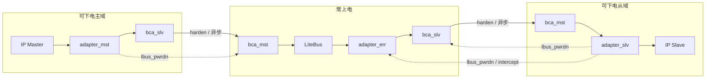

**图 1-2 说明**

本图只画 **请求方向**（Master → Slave）。响应方向完全相反，见段末。颜色/子图表示电源域，不是时钟域。

1. **可下电主域**（左）：`IP Master`、`adapter_mst`、主域 `bca_slv` 同一套时钟/复位/电源。IP 主机只看见适配器的 AMBA **slave** 口（AXI 的 AR/AW/W/R/B，或 APB 的 PSEL 等）。适配器把事务打成 LiteBus `REQ_R`/`REQ_W`，并跑本域 Q-Channel。
2. **主域 `bca_slv`**：异步桥的写侧，与适配器同电。下电前必须由 QCH 收到 `lbus_pwrdn` 的对侧读指针已处理完，否则对侧 `bca_mst` 会看到指针失配。
3. **常上电 `bca_mst`（主域对侧）**：读出主域写下的请求，送给 LiteBus。`adapter_mst.lbus_pwrdn=1` 时 **清读指针**，表示主域即将失电，不要再认旧指针。
4. **LiteBus**：INIU / Switch / Link / TNIU。本目录不实现，只规定对接的 IP 侧 valid/ready。
5. **`adapter_err`（常上电）**：插在 LiteBus **之后**、从域 `bca_slv` **之前**（D23）。从域还活着时透传；`intercept` 自锁后拦截新 REQ，本地回 `LB_RESP_FAIL`，避免请求写进已下电的从域桥。
6. **常上电从域对侧 `bca_slv`**：接 err 下游。`adapter_slv.lbus_pwrdn` 在此清指针。
7. **可下电从域**（右）：`bca_mst` + `adapter_slv` + `IP Slave` 同电。适配器把 `REQ_*` 展开成 AMBA **master** 口去访问 IP。
8. **虚线 `lbus_pwrdn`**：只在 QCH 进入 DOWN（`qacceptn=0`）后为 1。mst 只打到主域对侧 `bca_mst`；slv 同时打到从域对侧 `bca_slv` **和** `adapter_err.intercept`。
9. **配对约束**：主域 axi4 对从域 axi4，axi5 对 axi5，apb 对 apb。不要跨协议对接。

响应路径：`IP Slave → adapter_slv → bca_mst → bca_slv → adapter_err → LiteBus → bca_mst → bca_slv → adapter_mst → IP Master`。若 `adapter_err` 已拦截，RSP 由它本地产生，从域侧不再出现该事务。

每个可下电域 = **IP + 适配器 + 该域一侧 BCA**。常上电 = 对侧 BCA + LiteBus + `adapter_err`。

| 主域 | 从域 |
|------|------|
| `adapter_mst_axi4` | `adapter_slv_axi4` |
| `adapter_mst_axi5` | `adapter_slv_axi5` |
| `adapter_mst_apb` | `adapter_slv_apb` |

### 1.3 Workflow

工作流分两类：**AMBA↔LiteBus 数据流**与 **Q-Channel 控制流**。二者共用同一套 outstanding 计数：QCH 的 `busy` 来自协议侧“AXI/APB 尚未完成的事务”。

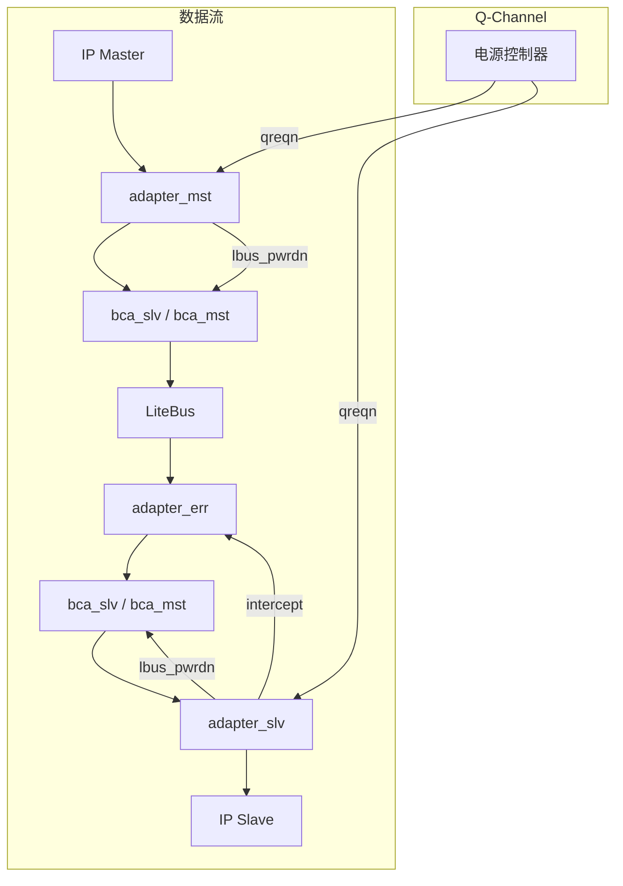

**图 1-3 说明**

上半是数据，下半是电源握手。电源控制器（PPU）**不**进 LiteBus，只拉各域适配器的 `qreqn`。

1. **一次写事务（数据流）**：IP Master 在 mst 上完成 AW+W → mst 按拍发 `REQ_W` → 过 BCA → LiteBus →（上电时）err 透传 → slv 发 AW+W 给 IP Slave → B 沿相反路径变成 `RSP_WR` → mst 出 B。读事务把 AW/W/B 换成 AR/`REQ_R`/R/`RSP_RD`。
2. **mst 下电（控制流）**：PPU 拉低 `qreqn`。若当前无在途且允许，立即 DOWN（`qacceptn=0`，`lbus_pwrdn=1` 清主域对侧 BCA）。若有在途：可 DENY（`qdeny=1`，业务继续），或进入 QUIESCE（停接新请求，等 ost=0）。定义了 `ADP_QCH_TO` 时，QUIESCE 过久会拉 `irq_qch_to`，再按 `qch_to_mode` 选择等待或本地回错（见 7.4.4）。
3. **slv 下电**：`HAS_QDENY=0`，不能 DENY。有在途则 QUIESCE（停接新 `REQ_*`），ost 清零后 DOWN。`lbus_pwrdn` 清从域对侧 `bca_slv`，并作为 `intercept`：域内仍有电时 `ip_fail` 回 FAIL；断电后由常上电 `adapter_err` 回 FAIL。
4. **为何 err 必须在从域 BCA 之前**：从域断电后 `bca_slv` 写口不可用。若请求先写进该 BCA 再拦截，数据会丢且指针错乱。所以拦截点在常上电侧。

---

## 2. Interfaces

协议专用 AMBA 口见第 7 章。本章为各顶层**共用**时钟、Q-Channel、LiteBus IP 侧口及其 parameter。

### 2.1 Parameters

例化时传入（Verilog `parameter`，非运行时寄存器）。各协议顶层在第 7 章 I/O 再列本模块专用项。

| 参数 | 默认 | 适用范围 | 说明 |
|------|------|----------|------|
| `ADDR_W` | 32 | 全部顶层 | 地址位宽 |
| `DATA_W` | 64 / APB 32 | 全部顶层 | 等于 LiteBus 数据宽 |
| `LEN_W` | 8 | 全部顶层 | AXI / LiteBus len |
| `ID_W` | 8 / APB 1 | 全部顶层 | AXI ID；LiteBus txnid 位宽 |
| `QOS_PW` | 1 | 全部顶层 | CMD qos |
| `USER_CMD_PW` | 1 | 全部顶层 | CMD user |
| `USER_RSP_PW` | 1 | slv | RSP user |
| `MOD_PW` | 1 / AXI5 为 3 | 全部顶层 | REQ_W 中 mod。AXI4/APB 为 1-bit dummy，**不是** AXI5 功能 |
| `W_BYTES` | `DATA_W/8` | 全部顶层 | 派生 |
| `EXT_CMD_W` / `EXT_REQ_W` | 由上式展开 | 全部顶层 | CMD / REQ_W 宽度 |
| `MAX_RD_OST` | 256 | AXI 顶层 | 读 outstanding 表深；**例化传入**（APB 无） |
| `MAX_WR_OST` | 256 | AXI 顶层 | 写 outstanding 表深；**例化传入** |
| `HAS_QDENY` | mst 1 / slv 0 | qch / 顶层 | slv 不 DENY |
| `QCH_TO_W` | 16 | 仅 `ADP_QCH_TO` | 超时计数器 / `qch_to_lim` 位宽 |

无 `QCH_TO_CYCLES`。超时阈值走接口 `qch_to_lim`，开关走 `qch_to_en`。

### 2.2 Signals

| Signal | Width | Dir | Description |
|--------|-------|-----|-------------|
| **时钟与复位** |||
| `clk` | 1 | in | mst/slv 各自域；err_rsp 用常上电时钟 |
| `rst_n` | 1 | in | 异步置位、同步释放 |
| **Q-Channel** |||
| `qreqn` | 1 | in | 0：请求下电 |
| `qacceptn` | 1 | out | 0：已 DOWN |
| `qdeny` | 1 | out | 仅 mst 且 `HAS_QDENY=1` |
| `qactive` | 1 | out | busy 或 QUIESCE |
| `reg_qdeny_en` | 1 | in | mst：1=允许 DENY |
| `reg_err_en` | 1 | in | QUIESCE 时：1=对新请求本地回错；0=反压。不回收已在途事务 |
| `lbus_pwrdn` | 1 | out | DOWN。mst → 主域对侧 `bca_mst`；slv → 从域对侧 `bca_slv` |
| `intercept` | 1 | out/in | slv 出；err_rsp / ip_fail 入。接 slv `lbus_pwrdn` |
| **QCH 超时（仅 `` `ifdef ADP_QCH_TO ``）** |||
| `qch_to_en` | 1 | in | 1=QUIESCE 内启动超时计数 |
| `qch_to_lim` | `QCH_TO_W` | in | 超时周期上限。计数 `== qch_to_lim` 触发。`0` 表示进入 QUIESCE 后下一拍即超时 |
| `qch_to_mode` | 1 | in | 0=WAIT；1=ERR。在超时拍采样，QUIESCE 期间保持稳定 |
| `irq_qch_to` | 1 | out | 超时中断（电平、粘滞） |
| **LiteBus IP 侧** |||
| `req_r_data/valid/ready` | EXT_CMD_W / 1 | * | 读 CMD。mst 为 out |
| `req_w_data/valid/ready` | EXT_REQ_W / 1 | * | `{CMD,mod,WD}` |
| `rsp_rd_*` | — | * | data/last/resp/txnid/valid/ready（slv 另有 user） |
| `rsp_wr_*` | — | * | resp/txnid/valid/ready |

未定义 `ADP_QCH_TO` 时，上表超时四根线不存在，qch 只保留四态握手。跨时钟由 BCA 承担，本模块无双时钟口。

---

## 3. Descriptors

LiteBus 描述符与 v0.9 §3 相同。从 REQ_W 取 CMD **必须先跳过 `MOD_PW`**。

```
CMD   = { qos, opcode[4], addr, len, txnid, user }
WD    = { data, strb, last, txnid }
REQ_W = { CMD, mod, WD }
REQ_R = CMD
live_cmd = req_w[WD +: CMD+MOD][MOD +: CMD]
```

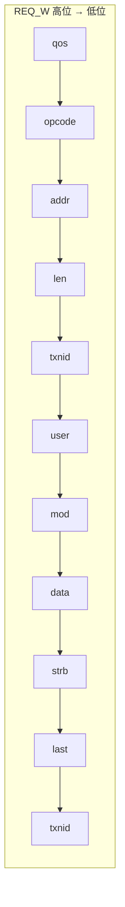

**图 3 说明**

图从左到右是 `REQ_W` 从高位到低位。前 6 段拼成 **CMD**（也就是整包 `REQ_R`）；`mod` 之后是 **WD**。

- **为什么必须跳过 mod**：若按“整包就是 CMD+WD”去切片，`addr/len/txnid` 会左移 `MOD_PW` 位，下游解出的地址全错。正确做法是先去掉 WD，再从 `{CMD,mod}` 里丢掉 `MOD_PW`。
- **mod 含义**：AXI4 / APB 填 1-bit dummy，只为与打包格式对齐，**不是**原子旁带。AXI5 的 3-bit mod 才是 `AWATOP[4:2]`，只出现在 axi5 顶层。
- **WD.last**：AXI 写对应 `wlast`；APB 单拍恒 1。
- **txnid（1.8 起读/写通道独立编号）**：
  - 读：`REQ_R`/`RSP_RD` 的 txnid = 读表项 `0 .. MAX_RD_OST-1`
  - 写：`REQ_W`/`RSP_WR` 的 txnid = 写表项 `0 .. MAX_WR_OST-1`
  - 读、写可以出现相同数值；靠通道（RD vs WR）区分，**不再**把写表项编到 `MAX_RD_OST` 之后。这样默认 256+256 在 `ID_W=8` 下合法。
  - APB 两侧 txnid 绑 0。

| opcode | 值 | 方向 | 谁使用 |
|--------|----|------|--------|
| `LB_OP_RD` | `4'h1` | REQ_R | AXI4 / AXI5 / APB |
| `LB_OP_WR` | `4'h8` | REQ_W | AXI4 / AXI5 / APB |
| ATOMIC_STORE / LOAD / SWAP / COMPARE | C / D / E / F | REQ_W | **仅 AXI5** |

响应：`LB_RESP_OK`→OKAY；AXI5 的 `ATOMIC_FAIL`→`ATOMIC_FAIL_RESP`（默认 EXOKAY）；其余→SLVERR / `LB_RESP_FAIL`。AXI4 不解码原子响应。

---

## 4. Design Constraints

- 未与适配器完成 Q-Channel 握手就单独复位/下电一侧 BCA，可能导致对侧指针失配。须先握手，再靠 `lbus_pwrdn` 清指针。
- `reg_qdeny_en` / `reg_err_en` /（若存在）`qch_to_en` / `qch_to_lim` / `qch_to_mode` 不应在 `qreqn` 拉低与握手完成之间翻转。
- AXI：仅整宽 INCR，`*size=log2(DATA_W/8)`，地址按 DATA_W 对齐。禁止窄带、WRAP。`MAX_RD_OST`/`MAX_WR_OST` ≥1，且各自 `≤ 2**ID_W`。同一 AXI ID 未完成前反压（无 ROB）。
- AXI4 顶层禁止出现 `awatop`、`AXI5_EN`、原子 opcode、`adapter_atomic`。
- AXI5 原子：`awlen=0`。LOAD/SWAP/COMPARE 与普通读串行共用 R。
- APB：`len=0`。mst 只在 SETUP（`PSEL && !PENABLE`）捕获。
- 从域真正断电后，请求必须在 adapter_err 被截住，不得进入从域 `bca_slv`。
- 超时功能必须用 `` `ifdef ADP_QCH_TO `` 包起来；未定义时无超时端口、无计数器。
- ERR 模式本地回错后，迟到的 LiteBus/AXI 响应必须丢弃，且对应表项在对侧响应到达（或 DOWN/复位清表）前不得复用，见 7.4.4。
- 无内部异步 fifo。WRAP+SPLIT 均不实现。
- 与 `rtl/adapter_*.v` **不可混编**。

---

## 5. Requirements / Feature Description

适配器把 AMBA 转换成 LiteBus REQ/RSP，并允许 PPU 经 Q-Channel 安全下电。异步隔离由 BCA 完成。

### 5.1 Feature List

- AXI4、AXI5（AWATOP）、APB4 双向转换；AXI4 / AXI5 为 **独立顶层**。
- AXI 多 outstanding：`MAX_RD_OST` / `MAX_WR_OST` **例化参数传入**，默认 **256 / 256**。txnid = 本通道表项索引。QCH 查看在途计数，完成后再 DOWN。
- Q-Channel：mst 可 DENY / 反压 / 本地回错；slv 等在途完成后 DOWN。
- **QCH 握手超时**（独立 feature，宏 `ADP_QCH_TO`）：`qch_to_en` + `qch_to_lim`；超时后由 `qch_to_mode` 选择 WAIT 或 ERR；并上报 `irq_qch_to`。
- slv `lbus_pwrdn` → 从域对侧 `bca_slv` 清指针，并作 `intercept`。
- 从域断电兜底：常上电 `adapter_err_rsp`（D23）。
- ADDR/DATA/LEN/ID/USER/MOD 位宽可配。
- **不包含**：窄带、WRAP、ROB、同 ID 重映射、mst SPLIT、slv SBS、Addition。AXI4 **不包含** 原子。

### 5.2 Interface（参数）

| 参数 | 默认 | 说明 |
|------|------|------|
| `ADDR_W` | 32 | 地址 |
| `DATA_W` | 64 / APB 32 | 等于 LiteBus 数据宽 |
| `LEN_W` | 8 | AXI / LiteBus len |
| `ID_W` | 8 / APB 1 | AXI ID / LiteBus txnid |
| `MOD_PW` | 1 / AXI5 为 3 | REQ_W 中 mod。AXI4 固定 dummy 1 |
| `PSTRB_EN` | 1 | APB mst |
| `SYNC_FF` | 2 | err_rsp 同步级数 |
| `ATOMIC_FAIL_RESP` | EXOKAY | **仅 AXI5** |
| `HAS_QDENY` | mst 1 / slv 0 | qch 参数 |
| `MAX_RD_OST` | 256 | AXI 读 outstanding 上限；**例化传入**（APB 无） |
| `MAX_WR_OST` | 256 | AXI 写 outstanding 上限；**例化传入** |
| `QCH_TO_W` | 16 | 仅 `ADP_QCH_TO`；`qch_to_lim` 位宽 |

无 `NARROW_EN` / `SPLIT_EN` / `SBS_EN` / `QCH_EN` / `AXI5_EN`：本目录 QCH 常开；AXI5 用独立模块而不是开关。无 `QCH_TO_CYCLES`。

---

## 6. Open Issues

- `lbus_pwrdn` 由 LiteBus 侧 BCA 消费的握手时序属互联协作。
- 不实现 Addition；与冻结 ext_core 无 addition 针脚一致。
- ERR 模式下若对侧响应永远不来、且 PPU 又取消下电（`qreqn` 回到 1），对应表项保持占用直到 RSP 或复位，可能暂时降低有效 ost。属预期行为。

---

## 7. Hardware Implementation

协议适配见 7.1–7.3；QCH 见 7.4（超时为 7.4.4）；AXI5 原子见 7.5；从域回错见 7.6–7.7。

编译（只编本目录，勿加入 `rtl/adapter_*.v`）：

```text
iverilog -g2005 -I rtl -I rtl/simple -o t.vvp rtl/simple/adapter_*.v
iverilog -g2005 -DADP_QCH_TO -I rtl -I rtl/simple -o t.vvp rtl/simple/adapter_*.v
```

第一条：无超时端口。第二条：打开超时 feature。MSYS2 Verilator 要求路径无空格；Icarus 不受此限。

### 7.1 AXI4 Adapter

模块：`adapter_mst_axi4`、`adapter_slv_axi4`。**纯 AXI4**：无 `awatop` 端口、无 `AXI5_EN`、无 `ATOMIC_FAIL_RESP`、不例化 `adapter_atomic`、不识别原子 opcode。

#### 7.1.1 I/O

**Parameters**

| 参数 | 默认 | 说明 |
|------|------|------|
| `ADDR_W` | 32 | 地址 |
| `DATA_W` | 64 | 数据 = LiteBus 数据宽 |
| `LEN_W` | 8 | burst len |
| `ID_W` | 8 | AXI ID；txnid 位宽。默认 256 ost 要求 `ID_W≥8` |
| `MOD_PW` | 1 | dummy mod（打包对齐，非 AXI5） |
| `MAX_RD_OST` | 256 | 读 outstanding 表深度，**例化传入**，≥1 |
| `MAX_WR_OST` | 256 | 写 outstanding 表深度，**例化传入**，≥1 |
| `QOS_PW` / `USER_CMD_PW` | 1 | CMD 侧带 |
| `USER_RSP_PW` | 1 | 仅 slv RSP user |
| `QCH_TO_W` | 16 | 仅 `ADP_QCH_TO` |
| `W_BYTES` / `EXT_CMD_W` / `EXT_REQ_W` | 派生 | `W_BYTES=DATA_W/8` |

约束：`MAX_RD_OST ≤ 2**ID_W` 且 `MAX_WR_OST ≤ 2**ID_W`。例：

```text
adapter_mst_axi4 #(.MAX_RD_OST(256), .MAX_WR_OST(256), .QCH_TO_W(16)) u_mst (...);
adapter_slv_axi4 #(.MAX_RD_OST(256), .MAX_WR_OST(256), .QCH_TO_W(16)) u_slv (...);
```

**Signals**（除第 2 章外；无 `awatop`）

| Signal | Width | Dir (mst) | Dir (slv) | Description |
|--------|-------|-----------|-----------|-------------|
| `awid / awaddr / awlen` | ID_W / ADDR_W / LEN_W | in | out | — |
| `awsize / awburst` | 3 / 2 | in | out | size=native，burst=INCR |
| `awvalid / awready` | 1 | in / out | out / in | — |
| `wdata / wstrb / wlast` | DATA_W / W_BYTES / 1 | in | out | — |
| `wvalid / wready` | 1 | in / out | out / in | — |
| `bid / bresp / bvalid / bready` | — | out… / in bready | in… / out bready | — |
| `arid / araddr / arlen / arsize / arburst` | — | in | out | — |
| `arvalid / arready` | 1 | in / out | out / in | — |
| `rid / rdata / rresp / rlast / rvalid / rready` | — | out… / in rready | in… / out rready | — |

LiteBus REQ/RSP 见第 2 章。slv 另有 `rsp_*_user`、`intercept`。定义 `ADP_QCH_TO` 时另有第 2.2 节超时四线。

#### 7.1.2 Function Description

AXI4 整宽 INCR 与 LiteBus 互转。读/写各最多 `MAX_RD_OST` / `MAX_WR_OST` 笔。读 txnid = 读槽号，写 txnid = 写槽号；响应按通道+索引取回 AXI ID。同一 AXI ID 未完成前 `arready`/`awready`=0。

- `reg_qdeny_en=1` 且 busy：DENY。
- `reg_qdeny_en=0` 且 `reg_err_en=0`：新 AR/AW 反压，在途走完后 DOWN。
- `reg_err_en=1`：新请求不进 LiteBus，AXI 回 SLVERR；**已收下**的写/读仍发完 REQ（与超时 ERR 不同，见 7.4.4）。
- slv：下电时 QUIESCE，等 AXI 在途为 0 再 DOWN；之后 ip_fail / err_rsp 回 FAIL。

#### 7.1.3 Hardware Description

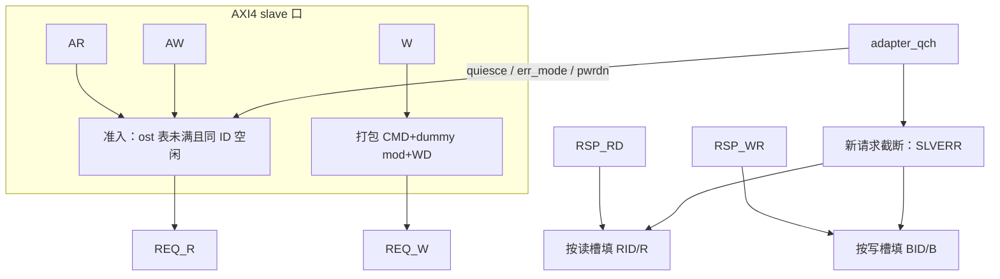

**图 7-1 说明（mst AXI4）**

这是 **主域适配器内部** 的数据通路，不是系统十级链路。左上是 AXI slave 口，右下是 LiteBus。

1. **准入 `ADM`**：同时看四件事：读/写表有空槽；该 AXI ID 没有未完成事务；QCH 不在 QUIESCE/DOWN 反压；`err_mode` 未要求截断。全部满足才 `arready`/`awready`=1。
2. **写打包**：每一拍 W 产生一拍 `REQ_W`。CMD 里的 addr/len/txnid 来自该笔 AW 占用的写槽；`mod` 为 dummy。`wlast` 只影响 WD.last，不改变“一拍 W 一拍 REQ”。
3. **读**：AR 准入后发 **一次** `REQ_R`（`len=arlen`），后续 R 拍全部来自 `RSP_RD`。
4. **响应多路**：`RSP_RD.txnid` 索引读表取出 `arid` 去驱动 `rid`；写同理。迟到且槽已“AXI 已完成、等 LiteBus”的响应走丢弃（仅 `ADP_QCH_TO` 的 ERR 模式，见 7.4.4）。
5. **截断 TR**：只服务 `reg_err_en=1` 时的 **新** AR/AW，不经过 LiteBus。已在途事务仍等 `RSP_*`。
6. **没有 `adapter_atomic`**：相对 AXI5 图，本图故意去掉 AWATOP 译码块。

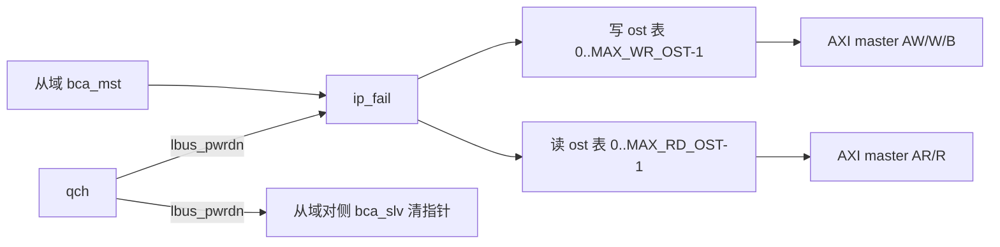

**图 7-1b 说明（slv AXI4）**

从左到右是 LiteBus → AMBA。

1. **ip_fail 在协议 FSM 之前**：DOWN 后新 `REQ_*` 被拦下回 FAIL，不会变成对 IP Slave 的 AW/AR。QUIESCE 期间 fail 尚未打开（`lbus_pwrdn` 仍 0），协议侧自己停接新 REQ，让已发出的 AXI 走完。
2. **两张独立表**：写槽与读槽编号都从 0 起。写可在上一笔 B 未回时再发下一笔 AW（W 仍按 AW 顺序）。读可在上一笔 `rlast` 前再接 `REQ_R`。
3. **busy**：读 ost 或写 ost 非 0。这是 QCH 能否 DOWN 的唯一依据（APB 则是 FSM≠IDLE）。
4. **没有“原子 R 旁路”**：AXI4 slv 不会把写通道接到 R。

下列时序为协议视角（BCA / err 上电透传省略，看成一根线）。

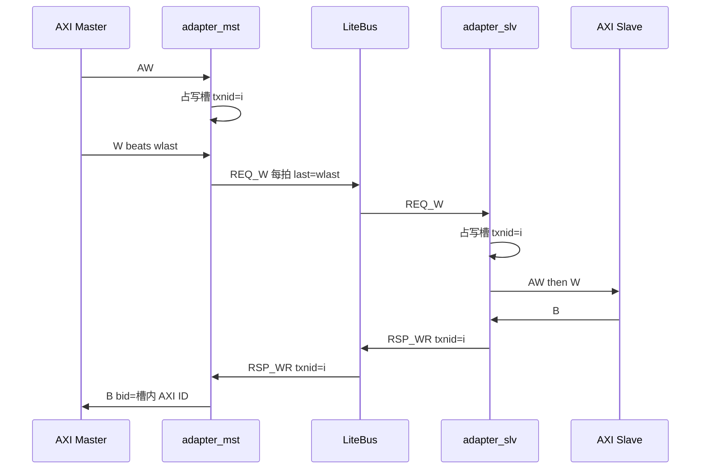

**图 7-1c 说明（写）**

1. mst 在 AW 握手成功时分配写槽 `i`，此后该笔所有 `REQ_W` 都带 `txnid=i`。
2. 无 SPLIT：LiteBus `len=awlen`，最后一拍 `last=wlast`。中间拍 CMD 重复携带同一 AW。
3. slv 用同一个 `i` 还原 AXI ID。B 只在 `RSP_WR` 握手后出现，不会提前。
4. 第二笔不同 ID 的 AW 可以在第一笔 B 之前发生，只要写表未满。

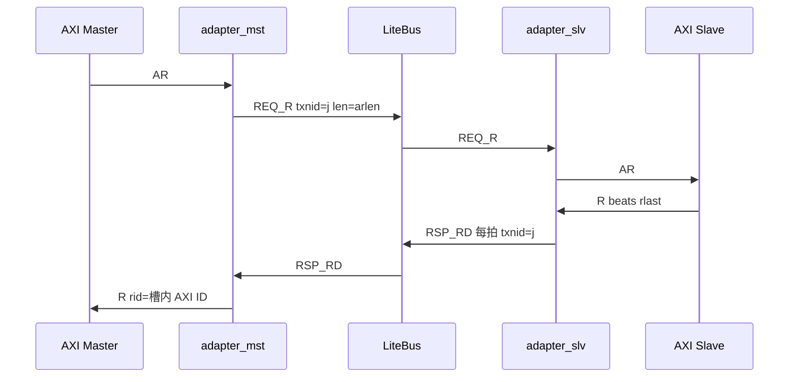

**图 7-1d 说明（读）**

1. AR 后 **只发一次** `REQ_R`，不是每拍 R 发一次请求。
2. `txnid=j` 贯穿该 burst 所有 `RSP_RD`。mst 用 `j` 查读表填 `rid`。
3. 可在上一笔未 `rlast` 时再发另一笔 AR（不同 ID，或该 ID 已完成）。
4. 读槽与写槽独立，互不占用对方的 256 深度。

### 7.2 AXI5 Adapter

独立顶层：`adapter_mst_axi5` / `adapter_slv_axi5`。含 `awatop[4:0]` 与 `adapter_atomic`。**不**通过改 axi4 的 `AXI5_EN` 实现。ost / QCH / 超时接口与 AXI4 相同（默认 ost 同样 256）。

#### 7.2.1 I/O

**Parameters**（相对 7.1.1 增加/覆盖）

| 参数 | 默认 | 说明 |
|------|------|------|
| `MOD_PW` | 3 | AWATOP[4:2] |
| `ATOMIC_FAIL_RESP` | EXOKAY | 比较失败映射 |
| `MAX_RD_OST` / `MAX_WR_OST` | 256 | 同 AXI4 语义 |
| `QCH_TO_W` | 16 | 仅 `ADP_QCH_TO` |
| 其余 | 同 7.1.1 | ADDR/DATA/LEN/ID 等 |

**Signals**：在 7.1.1 基础上增加 `awatop[4:0]`（mst 入 / slv 出）。REQ_W 因 `MOD_PW=3` 比 AXI4 宽 2 bit。本实现 AWATOP 为 5-bit。

#### 7.2.2 Function Description

STORE 仅 B；LOAD/SWAP/COMPARE 为 B+R（`rid=awid`）。QCH 与 AXI4 相同。FAIL 路径原子仍先 `RSP_RD` 再 `RSP_WR`。普通 INCR 读写与 7.1 相同。

#### 7.2.3 Hardware Description

mst 例化 `adapter_atomic`。slv：`awatop = opcode[3] ? {mod[2:0], opcode[1:0]} : 0`。原子占用 R 时不发新 AR。

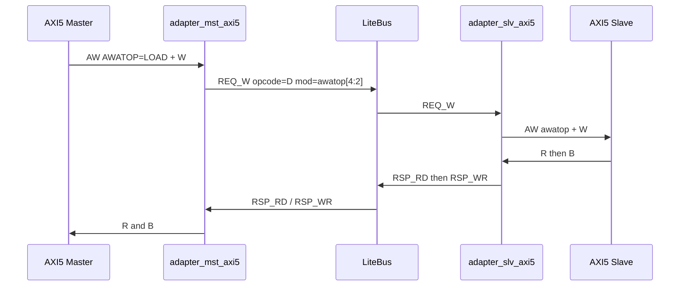

**图 7-2 说明**

1. 本序列只发生在 **axi5 顶层**。AXI4 模块既没有 `awatop` 脚，也不会发出 opcode C–F。
2. LOAD：单拍 W（`awlen=0`），LiteBus 一拍 `REQ_W`。成功时先数据 `RSP_RD` 再写应答 `RSP_WR`，AXI 侧先 R 后 B，`rid=awid`。
3. STORE：无 R。SWAP/COMPARE 与 LOAD 同序。
4. FAIL（ip_fail / err_rsp）保持“先 RD 后 WR”，避免上游 mst 卡在等 R。

### 7.3 APB Adapter

APB4（含 PSTRB）：`adapter_mst_apb` / `adapter_slv_apb`。单事务，无 ost 表。

#### 7.3.1 I/O

**Parameters**

| 参数 | 默认 | 说明 |
|------|------|------|
| `ADDR_W` | 32 | 地址 |
| `DATA_W` | 32 | APB 数据宽 |
| `LEN_W` | 8 | LiteBus len，本实现恒 0 |
| `ID_W` | 1 | txnid 绑 0 |
| `PSTRB_EN` | 1 | 仅 mst；0 则写 strb 全 1 |
| `MOD_PW` | 1 | dummy |
| `QOS_PW` / `USER_CMD_PW` / `USER_RSP_PW` | 1 | CMD / RSP user |
| `QCH_TO_W` | 16 | 仅 `ADP_QCH_TO` |
| `W_BYTES` / `EXT_*` | 派生 | `W_BYTES=DATA_W/8` |

无 `MAX_RD_OST` / `MAX_WR_OST`。

**Signals**

| Signal | Width | Dir (mst) | Dir (slv) | Description |
|--------|-------|-----------|-----------|-------------|
| `psel / penable / pwrite` | 1 | in | out | — |
| `paddr / pwdata / pstrb` | ADDR_W / DATA_W / W_BYTES | in | out | `PSTRB_EN=0` 时 mst 写 strb 全 1 |
| `prdata / pready / pslverr` | DATA_W / 1 / 1 | out | in | — |

#### 7.3.2 Function Description

单拍 `len=0`。mst SETUP 捕获后发 1 拍 LiteBus，ACCESS 上 `PREADY=0` 直到 RSP。QCH：`busy=state!=IDLE`。`reg_err_en` 时新 SETUP 本地 PSLVERR。slv 写优先；CMD 跳过 MOD；下电等当前 APB 完成后再 DOWN。

#### 7.3.3 Hardware Description

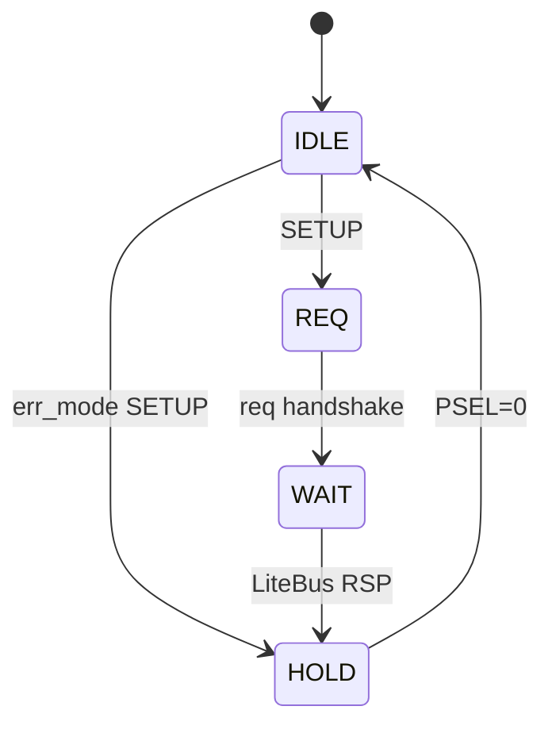

**图 7-3 说明（mst）**

1. **只在 SETUP 采样**：`PSEL && !PENABLE`。ACCESS 阶段即使 PADDR 变化也不重新发 LiteBus。
2. **REQ**：向 LiteBus 只握手 1 拍。**WAIT**：等 `RSP_*`。**HOLD**：`PREADY=1`，等主机撤 `PSEL`。
3. QUIESCE/DOWN 时停在 IDLE，不再进 REQ。超时 ERR 若发生在 WAIT：本地 `PSLVERR` 进 HOLD，迟到的 LiteBus RSP 丢弃（7.4.4）。

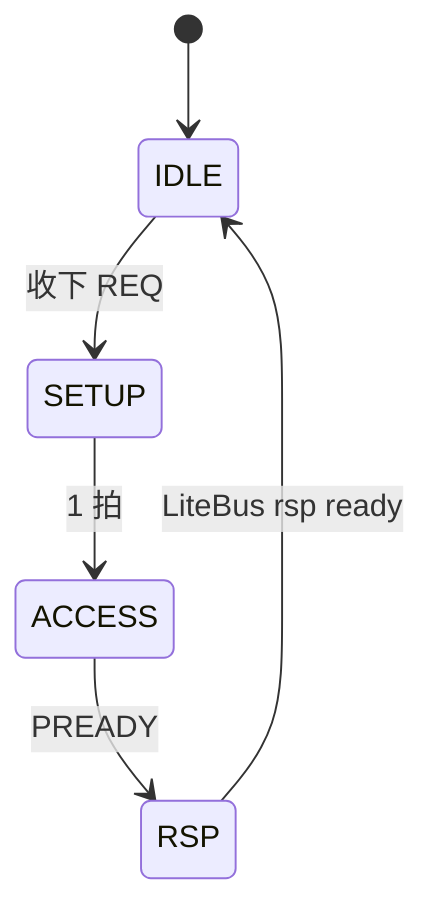

**图 7-3b 说明（slv）**

`RSP` 态把“APB 从机已经 PREADY”和“LiteBus 响应已经发出”拆开，避免 PREADY 脉冲丢失。`PSLVERR`→`LB_RESP_FAIL`。QCH busy 在离开 IDLE 后为 1。

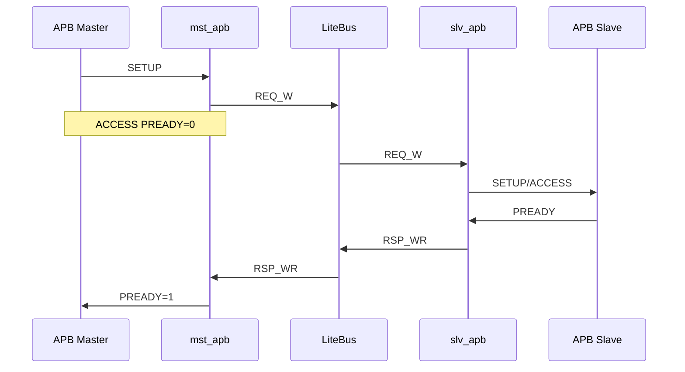

**图 7-3c 说明**

主机在 ACCESS 上看见 `PREADY=0` 直到整条链路 RSP 回来。读路径把 `REQ_W`/`RSP_WR` 换成 `REQ_R`/`PRDATA`/`RSP_RD`。

### 7.4 Power Q-Channel

模块 `adapter_qch`。无独立 QCH 时钟。超时见 7.4.4，整块用宏隔离。

#### 7.4.1 I/O

**Parameters**

| 参数 | 默认 | 说明 |
|------|------|------|
| `HAS_QDENY` | 1 | mst=1，slv=0 |
| `QCH_TO_W` | 16 | 仅 `ADP_QCH_TO`；`qch_to_lim` 与内部计数器位宽 |

**Signals**（基础握手，始终存在）

| Signal | Width | Dir | Description |
|--------|-------|-----|-------------|
| `clk / rst_n` | 1 | in | — |
| `qreqn` | 1 | in | 下电请求（低有效） |
| `reg_qdeny_en` | 1 | in | 允许 DENY |
| `reg_err_en` | 1 | in | QUIESCE 时对新请求 err_mode |
| `busy` | 1 | in | 协议侧“AXI/APB 尚未完成” |
| `qacceptn / qdeny / qactive` | 1 | out | 握手与活性 |
| `lbus_pwrdn` | 1 | out | `st==DOWN` |
| `o_quiesce / o_err_mode` | 1 | out | 给协议 FSM |

**Signals**（仅 `` `ifdef ADP_QCH_TO ``）

| Signal | Width | Dir | Description |
|--------|-------|-----|-------------|
| `qch_to_en` | 1 | in | 超时功能使能 |
| `qch_to_lim` | QCH_TO_W | in | 计数上限 |
| `qch_to_mode` | 1 | in | 0=WAIT，1=ERR |
| `irq_qch_to` | 1 | out | 超时 IRQ |

#### 7.4.2 Function Description

| deny 权限 | busy | 行为 | qdeny | qacceptn |
|-----------|------|------|-------|----------|
| 允许 | 0 | 立即 DOWN | 0 | 拉低 |
| 允许 | 1 | DENY，不 stall 在途 | 拉高 | 保持 1 |
| 禁止 | 0 | 立即 DOWN | 0 | 拉低 |
| 禁止 | 1 | QUIESCE：反压或对新请求本地回错，在途完成后 DOWN | 0 | 完成后拉低 |

立即 DOWN / DENY **不启动**超时计数。超时只可能发生在 QUIESCE。

`reg_err_en` 只改变 QUIESCE 期间 **新请求** 是反压还是 SLVERR/PSLVERR，**不会**结束已经发出去的 LiteBus 事务。要把已在途事务清掉，必须走 7.4.4 的 `qch_to_mode=ERR`（且宏打开、`qch_to_en=1`、计数到限）。

#### 7.4.3 Hardware Description

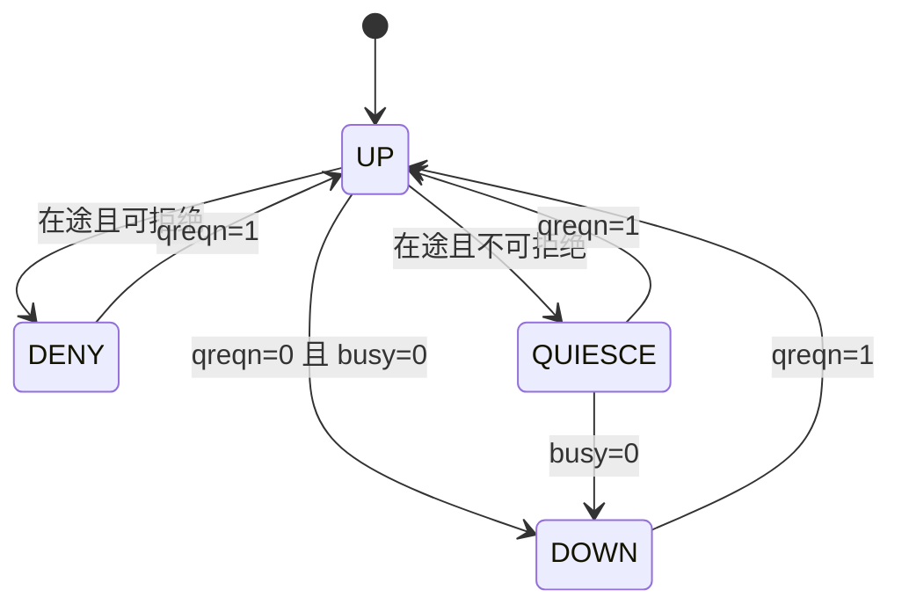

**图 7-4 说明**

1. **UP**：正常工作。`qacceptn=1`，`lbus_pwrdn=0`。
2. **DENY**：仅 mst。告诉 PPU 现在不能下电；AXI/APB 继续。PPU 必须把 `qreqn` 拉回 1 才能离开 DENY。
3. **QUIESCE**：停接新业务（或 `err_mode` 下新请求本地回错）。`o_quiesce = QUIESCE && !reg_err_en`；`o_err_mode = QUIESCE && reg_err_en`。`qactive = busy || QUIESCE`。
4. **DOWN**：`qacceptn=0`，`lbus_pwrdn=1`。只有 `busy=0` 才能进来。超时 ERR 的目的就是创造这个 `busy=0`。
5. 任何状态下 `qreqn` 回到 1 都回 UP（DOWN 时同时清 `lbus_pwrdn`）。

- mst：`HAS_QDENY=1`，`busy` = 读/写槽上“AXI 侧尚未完成”或截断占用或 APB 非 IDLE。
- slv：`HAS_QDENY=0`。`busy` = AXI 读/写 ost 或 APB 非 IDLE。

#### 7.4.4 QCH 超时（独立 feature，`ADP_QCH_TO`）

未定义宏：本节电路不存在，7.4.1 超时端口不出现。

**打开宏之后的运行条件**

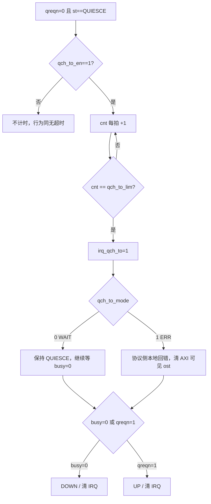

**图 7-4b 说明**

1. 计数器只在 QUIESCE 且 `qch_to_en=1` 时运行。离开 QUIESCE（DOWN 或回到 UP）清零。
2. `qch_to_lim=0`：进入 QUIESCE 的下一拍即视为超时（仍要求 `qch_to_en=1`）。
3. **WAIT 与 ERR 都不改四态图的边**：超时不强制跳 DOWN。WAIT 完全依赖真实在途结束；ERR 通过让协议把 `busy` 拉低，从而走原来的 `QUIESCE→DOWN`。
4. `irq_qch_to` 粘滞：超时置位；DOWN、`qreqn=1` 或 `rst_n` 清除。WAIT 下即使 IRQ 已亮，后来 ost 正常走完仍会 DOWN 并清 IRQ。

**模式 0 — WAIT（继续等待）**

适用：在途可能只是下游慢，软件愿意等，或无法承担“提前 SLVERR”。

- 协议侧无额外动作。
- 软件看到 `irq_qch_to` 后可以：继续等；或把 `qreqn` 拉回 1 放弃下电；或改 `qch_to_mode` **无效**（模式只在超时拍采样，要换模式需先退出 QUIESCE）。

**模式 1 — ERR（本地回错以结束在途）**

适用：在途卡住，希望仍能 DOWN。核心问题：**已经向对侧发出的请求，稍后还可能回来一个真响应**。AXI/APB/LiteBus 都只允许每个事务 **一次** 完成握手，因此本地回错之后，迟到的响应必须 **丢弃**，且该表项在对侧响应到来前 **不能发给新事务**。

每张 ost 表项拆成两个完成位：

| 位 | 含义 |
|----|------|
| `axi_done` | 已经向 AMBA 完成了这次事务（R last / B / PREADY） |
| `lbus_done` | 已经与 LiteBus 完成了对应 `RSP_*`（或 slv 已发出 FAIL RSP） |

正常路径两拍先后置位，槽释放。ERR 超时：**先置 `axi_done` 并立刻向 AMBA 回错**，槽仍占用直到 `lbus_done`（或 DOWN/复位冲表）。

QCH `busy` **只看 `!axi_done` 的槽**（外加 APB FSM、截断发生器）。这样 ERR 后 `busy` 可以变 0，允许 DOWN；LiteBus 迟到响应在后台丢弃。

**mst ERR 之后，LiteBus 又来了 RSP**

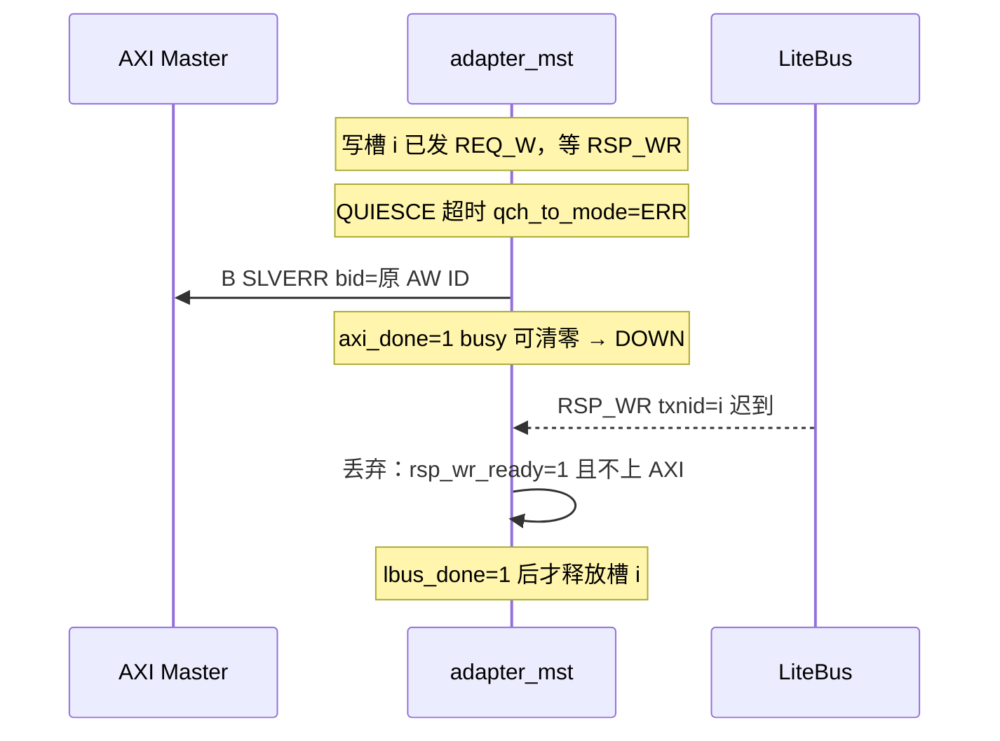

**图 7-4c 说明（mst 迟到写响应）**

1. 主机已经拿到 B，**禁止**再出第二次 B。所以迟到 `RSP_WR` 只握手吃掉。
2. 读同理：补齐剩余 R 拍（`rresp=SLVERR`，最后一拍 `rlast=1`），迟到 `RSP_RD` 丢弃。
3. 若超时发生时 W 还没收完：不再向 LiteBus 发剩余 W，AXI 侧给 B SLVERR；后续 W 拍在 QUIESCE 下 `wready=0` 或在 err 路径吞掉直到主机停（实现须保证不违背 AXI：已接受 AW 必须最终给 B）。推荐：已接受 AW 即保证会出 B；未接受的 W 反压。
4. **槽复用**：`axi_done && !lbus_done` 期间该 txnid 仍算占用。若 PPU 取消下电（回 UP），新 AW/AR 不得拿到这个槽，直到迟到 RSP 到达。否则新事务会吃到旧 RSP。
5. 若接着真正 DOWN：`lbus_pwrdn` 清 BCA 指针，残留 RSP 不再进入本模块，复位/再上电时表清空。

**slv ERR 之后，AXI Slave 又来了 R/B**

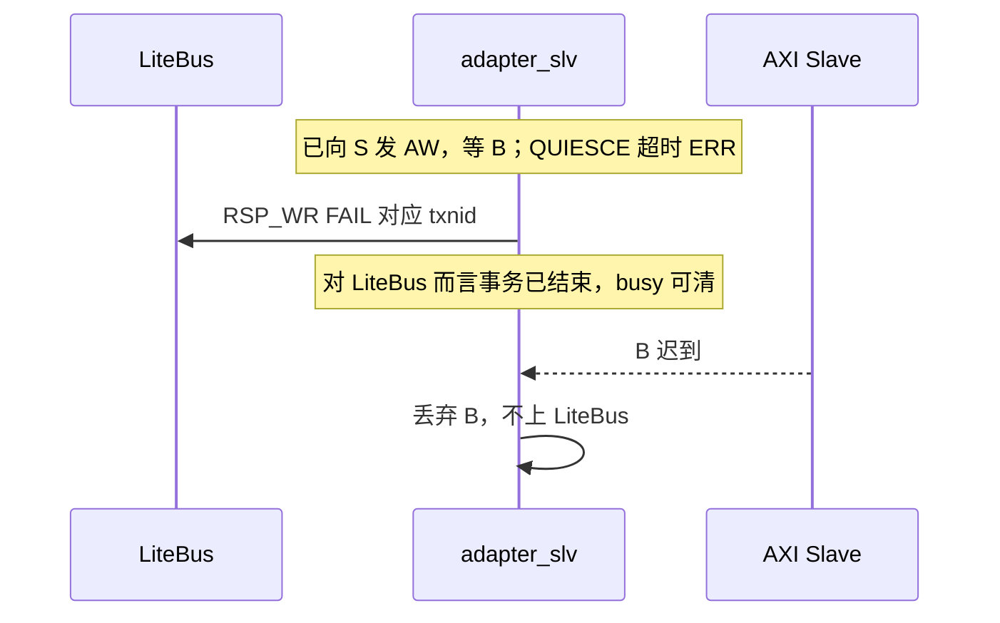

**图 7-4d 说明（slv 迟到 AXI 响应）**

1. slv 是 AXI **master**，无法合法“撤销”已发出的 AR/AW。ERR 的含义是：**放弃等待下游**，立刻向上游 LiteBus 回 FAIL，让系统 ost 能结束并允许从域 DOWN。
2. IP Slave 随后给出的 R/B **丢弃**。若紧接着 DOWN，从域断电，这些 AXI 边沿本身也会消失。
3. 读 burst：向上游补 `RSP_RD`（FAIL + last）再按需要 `RSP_WR`（AXI4 无此组合；AXI5 原子仍先 RD 后 WR）。
4. APB slv：WAIT 中超时则向 LiteBus 回 FAIL，下游 PREADY 迟到则忽略。

**与 `reg_err_en` 的差别**

| | `reg_err_en`（QUIESCE 新请求） | `qch_to_mode=ERR`（超时） |
|--|------------------------------|---------------------------|
| 作用对象 | 尚未接受的新 AR/AW/SETUP | **已经在途** 的 ost |
| 是否等超时 | 否，一进 QUIESCE 就生效 | 要 `qch_to_en` 且计满 `qch_to_lim` |
| 迟到响应 | 无（没发过 LiteBus） | 必须丢弃并锁槽 |

### 7.5 Atomic

模块 `adapter_atomic`。纯组合，无时钟。**仅 `adapter_mst_axi5` 例化**。AXI4 编译单元不得引用本模块。

**Parameters**

| 参数 | 默认 | 说明 |
|------|------|------|
| `MOD_PW` | 3 | `o_mod` 位宽 |

**Signals**

| Signal | Width | Dir | Description |
|--------|-------|-----|-------------|
| `i_awatop` | 5 | in | AXI5 AWATOP |
| `o_opcode` | 4 | out | STORE/LOAD/SWAP/COMPARE |
| `o_need_r` | 1 | out | STORE=0，其余=1 |
| `o_mod` | MOD_PW | out | awatop[4:2] |

| `awatop[1:0]` | opcode | `o_need_r` |
|---------------|--------|------------|
| `00` | STORE `C` | 0 |
| `01` | LOAD `D` | 1 |
| `10` | SWAP `E` | 1 |
| `11` | COMPARE `F` | 1 |

仅 `|awatop!=0` 时 mst 写入原子 opcode；否则 `LB_OP_WR`。

### 7.6 ip_fail

同域同时钟，插在 slv LiteBus 口与协议 FSM 之间。`intercept=lbus_pwrdn`（仅 DOWN 后有效；QUIESCE 期间协议侧停接新 REQ，在途走完）。

**Parameters**（与对接 slv 的打包一致）

| 参数 | 默认 | 说明 |
|------|------|------|
| `ADDR_W` / `DATA_W` / `LEN_W` / `ID_W` | 32 / 64 / 8 / 8 | 与 slv 相同 |
| `QOS_PW` / `USER_CMD_PW` / `USER_RSP_PW` | 1 | CMD / RSP |
| `MOD_PW` | 1 / AXI5 为 3 | 切片 CMD 时跳过 |

I/O：上游/下游各一套 REQ_R、REQ_W、RSP_RD、RSP_WR（与 err_rsp 的 `u_*`/`d_*` 同构，无 `intercept_on`）。

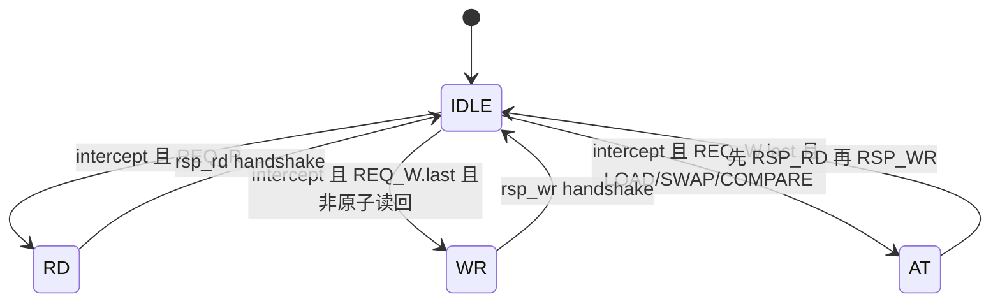

**图 7-6 说明**

1. 透传（`intercept=0`）：`u_*` 直连 `d_*`，FSM 停在 IDLE。
2. 写必须见到 `WD.last` 才进入 WR/AT；中间拍 `ready=1` 吞掉，避免卡 burst。
3. **AT 态只服务 AXI5 opcode C–F**。AXI4 slv 不会发出这些 opcode，因此 axi4 对接时 AT 为死态。
4. 不支持多笔 FAIL 重叠：拦截期间一次只消化一个 REQ。

### 7.7 err_rsp

常上电独立模块，位置见图 1-2。从域断电后的最后一道拦截。

**Parameters**

| 参数 | 默认 | 说明 |
|------|------|------|
| `ADDR_W` / `DATA_W` / `LEN_W` / `ID_W` | 同 slv | 打包宽度 |
| `QOS_PW` / `USER_CMD_PW` / `USER_RSP_PW` / `MOD_PW` | 同 slv | — |
| `SYNC_FF` | 2 | `intercept` 同步级数，≥2 |

**Signals**

| Signal | Dir | Description |
|--------|-----|-------------|
| `intercept` | in | 异步，来自 slv |
| `intercept_on` | out | 同步+自锁后的拦截有效 |
| `u_req_* / u_rsp_*` | * | 上游接 LiteBus |
| `d_req_* / d_rsp_*` | * | 下游接从域 `bca_slv` |

`SYNC_FF` 同步 intercept；latched 自锁；断电悬空不得清锁。FSM 同图 7-6。

---

## 8. Low Power Design

- 可下电域：IP + 适配器 + 该侧 BCA。常上电：对侧 BCA、LiteBus、adapter_err。
- mst：在途回收（或 DENY / 本地回错）后再 DOWN；`lbus_pwrdn` 清主域对侧 `bca_mst`。
- slv：查看 AXI/APB outstanding，完成后再 DOWN；`lbus_pwrdn` 清从域对侧 `bca_slv`，并作 `intercept`。ip_fail 覆盖仍有电窗口；err_rsp 覆盖断电后。
- 定义 `ADP_QCH_TO` 时：QUIESCE 过久拉 `irq_qch_to`。`qch_to_mode=WAIT` 不强制断电；`ERR` 通过本地回错把 `busy` 拉低后再走正常 DOWN。迟到响应当丢弃。
- 无内部自复位清 fifo。

---

## 9. Performance

适配器为同域同步逻辑。跨时钟延迟由 BCA 决定，不在本模块报价。

| 路径 | 量级（不含 BCA） |
|------|------------------|
| AXI 写 AW/W → REQ_W | 握手当拍打包；B 等 RSP_WR |
| AXI 读 AR → REQ_R | AR 后约 1 拍发 REQ_R；R 直通 RSP_RD |
| APB SETUP → REQ | SETUP 当拍发 LiteBus；PREADY 等整条链路 RSP |
| outstanding | 读 ≤ `MAX_RD_OST`（默认 256）+ 写 ≤ `MAX_WR_OST`（默认 256）；无 ROB 重排 |

---

## 10. Cost / Area

相对全功能适配器：无窄带 packer、ROB、SPLIT/SBS、异步 fifo。面积主要是 AXI/APB FSM、ost 表（默认 256+256 项，深度=例化参数）、qch 2-bit。`ADP_QCH_TO` 打开时再加 `QCH_TO_W` 计数器、IRQ、以及 ERR 模式的 `axi_done/lbus_done` 与丢弃通路。未定义宏则超时相关为 0 面积。AXI4 顶层不含 atomic。

合回主树应靠参数关掉窄带/ROB/SPLIT，而不是把本目录“长回”全功能。

---

## 11. DFX

可观测：`qacceptn / qdeny / qactive / lbus_pwrdn`、`o_quiesce / o_err_mode`、`intercept_on`。定义 `ADP_QCH_TO` 时还有 `irq_qch_to`、`qch_to_en`、`qch_to_lim`、`qch_to_mode`。

下电后仍有访问：mst 为 SLVERR 或反压；互联侧为 err_rsp 回 FAIL。未做 QCH 就复位 BCA 可能导致指针不匹配（第 4 章）。`irq_qch_to` 表示 QUIESCE 握手超时：WAIT 时查在途是否卡住；ERR 时查是否已本地回错以及是否仍有 `lbus_done` 未置位的孤儿槽。

---

## 12. Patents

无单独专利项列出。
